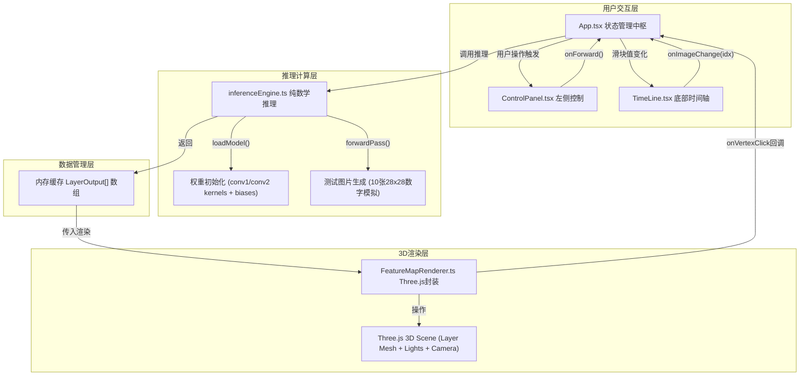
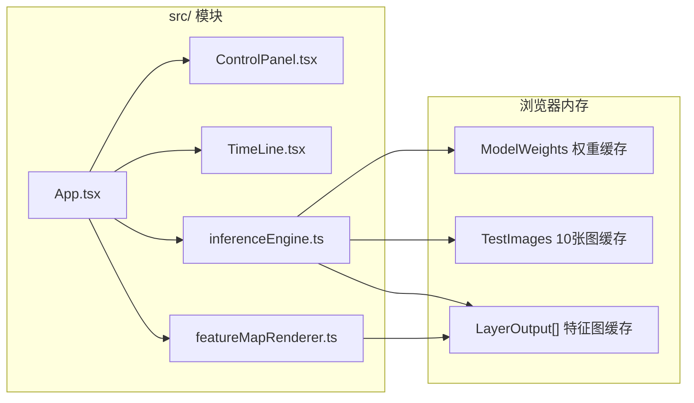

## 1. 架构设计



## 2. 技术说明
- **前端**：React@18 + TypeScript@5 + Vite@5（@vitejs/plugin-react）+ Three.js@0.160 + @types/three
- **初始化工具**：手动搭建文件结构（遵循用户指定的精确文件清单）
- **样式方案**：原生CSS Modules（避免引入Tailwind，减小体积，满足精确定制深色主题）
- **3D渲染**：直接使用Three.js原生API（不引入@react-three/fiber，确保渲染性能与低级控制）
- **推理引擎**：完全手写纯数学运算（无numpy/tensorflow依赖），使用TypedArray（Float32Array）加速卷积计算
- **无后端**：全前端运行，测试图片与模型权重在浏览器内存中动态生成

## 3. 路由定义
| 路由 | 用途 |
|------|------|
| / | 单页面应用，所有功能在主视图内完成 |

## 4. API定义（本地模块接口）

### 4.1 推理引擎接口
```typescript
// src/inferenceEngine.ts

export interface LayerOutput {
  layerIndex: number;           // 0-3
  layerType: 'conv' | 'pool';
  layerName: string;            // "Conv1" / "MaxPool1" / "Conv2" / "MaxPool2"
  channels: number;             // 通道数
  height: number;               // 特征图高
  width: number;                // 特征图宽
  activations: Float32Array[];  // 每个通道的激活值数组 length=H*W
}

export interface ModelWeights {
  conv1: { kernels: Float32Array[]; bias: Float32Array; inCh: number; outCh: number; kSize: number };
  conv2: { kernels: Float32Array[]; bias: Float32Array; inCh: number; outCh: number; kSize: number };
  fc:    { weights: Float32Array; bias: Float32Array };
}

export interface InferenceResult {
  layers: LayerOutput[];
  logits: Float32Array;  // 10类输出
  prediction: number;    // argmax
  confidence: number;    // softmax后的最高概率(0-1)
}

export function loadModel(): ModelWeights;
export function forwardPass(imageData: Float32Array, model: ModelWeights): InferenceResult;
export function generateTestImages(): { images: Float32Array[]; labels: number[] };
```

### 4.2 渲染模块接口
```typescript
// src/featureMapRenderer.ts

export interface VertexInfo {
  layerIndex: number;
  channel: number;
  position: { x: number; y: number };  // (col, row) 特征图坐标
  value: number;                       // 原始激活值 (0-1)
  worldPos: { x: number; y: number; z: number };  // 3D世界坐标
}

export type VertexClickCallback = (info: VertexInfo | null) => void;

export class FeatureMapRenderer {
  constructor(container: HTMLElement);
  renderLayer(layerData: LayerOutput[], layerIndex?: number): void;
  updateLayer(layerIndex: number, newData: LayerOutput): void;
  updateAll(layers: LayerOutput[], animateMs?: number): Promise<void>;
  onVertexClick(callback: VertexClickCallback): void;
  dispose(): void;
}
```

### 4.3 应用状态接口
```typescript
// src/App.tsx 内部状态
interface AppState {
  currentImageIndex: number;
  isInferencing: boolean;
  inferenceResult: InferenceResult | null;
  trueLabel: number;
  selectedVertex: VertexInfo | null;
  testImages: { images: Float32Array[]; labels: number[] };
  model: ModelWeights | null;
}
```

## 5. 模块架构（无后端）



## 6. 数据模型与计算约定

### 6.1 模型架构（LeNet-5简化版）
| 层级 | 类型 | 输入 | 输出 | 核参数 | 激活 |
|------|------|------|------|--------|------|
| 1 | Conv2d | 1×28×28 | 6×24×24 | k=5, s=1, p=0 | ReLU |
| 2 | MaxPool | 6×24×24 | 6×12×12 | 2×2, s=2 | - |
| 3 | Conv2d | 6×12×12 | 16×8×8 | k=5, s=1, p=0 | ReLU |
| 4 | MaxPool | 16×8×8 | 16×4×4 | 2×2, s=2 | - |
| FC | Linear | 256 | 10 | - | Softmax |

### 6.2 权重初始化策略
- Conv核：使用He正态初始化（std=√(2/(k²×inCh))），固定种子确保可复现
- Bias：全部初始化为0.01
- FC层：Xavier初始化

### 6.3 测试图片生成策略
- 10张28×28灰度手写数字（0-9各一张），使用程序生成的合成数字图案（非MNIST真实数据，避免版权问题）
- 每张图随机添加轻微噪声扰动
- 像素值归一化到[0, 1]

### 6.4 颜色映射函数
```
激活值 v ∈ [0, 1]
r = lerp(0x00/255, 0xFF/255, v) → 近似 0 + 255*v
g = lerp(0x33/255, 0x33/255, v) → 固定 51 (中段绿色保持)
b = lerp(0x66/255, 0x00/255, v) → 102 - 102*v
```

### 6.5 性能保障措施
1. 推理时卷积使用4层循环+Float32Array预分配，避免动态数组push
2. 渲染层复用BufferGeometry，更新时仅修改position attribute（不重建Mesh）
3. 顶点插值使用requestAnimationFrame时间戳驱动，避免setInterval堆积
4. 测试图片与模型在应用启动时一次性初始化，后续仅切换索引
5. OrbitControls开启damping=false减少渲染压力，视椎体frustumCulled=true
