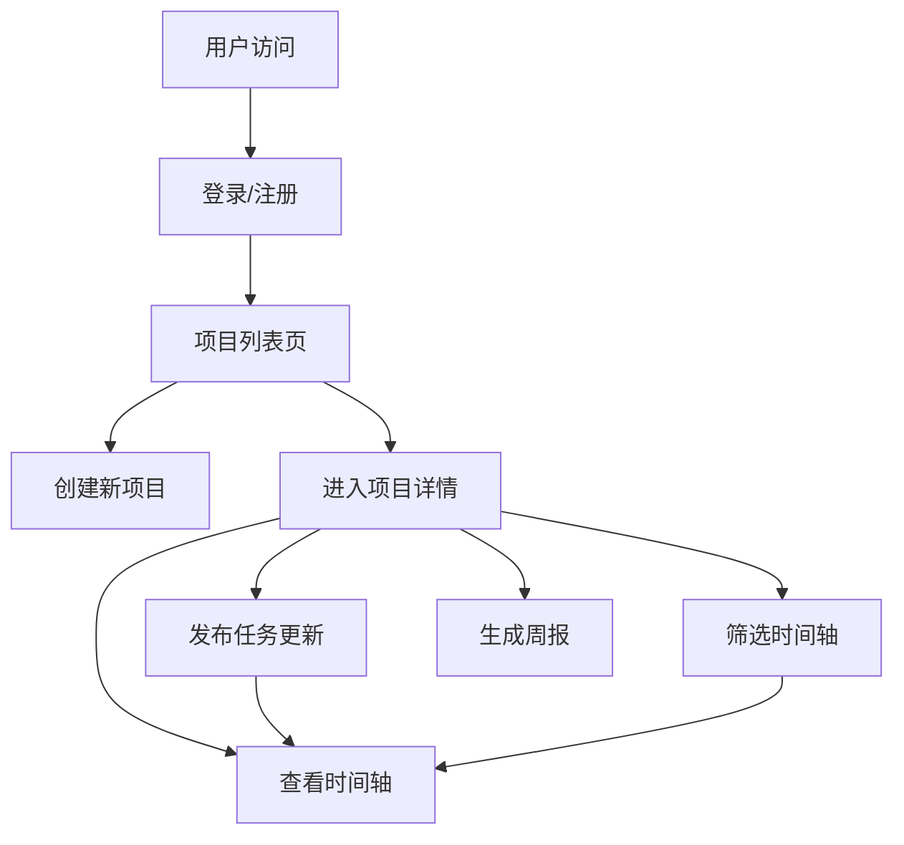

## 1. 产品概述

团队任务进度时间轴播报与回顾应用，帮助小型远程团队以异步、可视化的方式共享工作进度，替代流水账式的每日站立会议。目标用户为远程协作团队，核心价值在于透明化任务进度、减少同步会议开销、支持历史回顾。

## 2. 核心功能

### 2.1 用户角色
| 角色 | 注册方式 | 核心权限 |
|------|----------|----------|
| 普通用户 | 用户名密码注册 | 创建项目、邀请成员、发布任务更新、查看时间轴、生成周报 |

### 2.2 功能模块
1. **登录注册页**：用户注册、登录认证、JWT Token管理
2. **项目列表页**：项目卡片展示、创建新项目、项目入口导航
3. **时间轴详情页**：横向时间轴渲染、任务更新发布、成员/标签筛选、周报生成

### 2.3 页面详情
| 页面名称 | 模块名称 | 功能描述 |
|----------|----------|----------|
| 登录注册页 | 认证模块 | 用户名密码输入、注册/登录切换、表单验证、错误提示 |
| 项目列表页 | 项目管理 | 项目卡片网格、新建项目表单、邀请成员、项目跳转 |
| 时间轴详情页 | 时间轴渲染 | 横向时间轴、任务卡片、状态徽章、相对时间显示 |
| 时间轴详情页 | 筛选模块 | 成员下拉筛选、标签下拉筛选、筛选结果过渡动画 |
| 时间轴详情页 | 任务更新 | 添加更新表单、成员选择、状态选择、备注输入（200字限制） |
| 时间轴详情页 | 周报模块 | 周报生成按钮、成员分组统计、模态框展示、任务数量与备注摘要 |

## 3. 核心流程

用户登录后进入项目列表，可创建新项目或进入已有项目。在项目时间轴页，用户可发布任务更新（选择成员、状态、填写备注），系统自动按时间排序渲染横向时间轴。用户可通过成员或标签筛选器过滤显示内容，点击生成周报按钮可查看本周团队进度统计。

## 4. 用户界面设计

### 4.1 设计风格
- **主色调**：深蓝灰色 #1E293B（侧边栏）、蓝色 #3B82F6（选中/强调）
- **背景色**：#F3F4F6（主背景）、#F9FAFB（时间轴背景）、白色 #FFFFFF（卡片）
- **状态色**：灰色 #9CA3AF（计划中）、蓝色 #3B82F6（进行中）、红色 #EF4444（阻塞）、绿色 #10B981（已完成）
- **文字色**：深灰 #1F2937（主文字）、白色 #FFFFFF（侧边栏文字）
- **圆角**：卡片 8px/12px/16px，按钮统一圆角
- **阴影**：浅灰 #E5E7EB（卡片阴影），悬停时加深
- **字体**：使用 Geist Sans 或其他现代无衬线字体，标题 18-24px，正文 14-16px
- **动画**：卡片淡入 0.3s，状态徽章颜色过渡 0.2s，筛选过渡 0.4s，按钮按下缩放 0.95

### 4.2 页面设计概述
| 页面名称 | 模块名称 | UI元素 |
|----------|----------|--------|
| 登录注册页 | 认证模块 | 居中表单卡片、输入框、切换标签、提交按钮、错误提示 |
| 项目列表页 | 项目管理 | 侧边导航栏（240px宽）、卡片网格（最大1280px居中）、卡片宽320px、悬停上移2px |
| 时间轴详情页 | 时间轴渲染 | 横向滚动容器、左右箭头按钮（毛玻璃效果）、时间轴连线 #374151、卡片宽280px |
| 时间轴详情页 | 筛选模块 | 顶部两个下拉选择器、横向排列 |
| 时间轴详情页 | 任务更新 | 表单弹窗或侧边表单、下拉选择、文本域、提交按钮 |
| 时间轴详情页 | 周报模块 | 模态框（背景半透明 #00000040）、内容宽600px、圆角16px、右上角关闭按钮 |

### 4.3 响应式设计
- **桌面端**（≥768px）：侧边栏固定左侧240px，时间轴横向滚动
- **移动端**（<768px）：侧边栏变为顶部汉堡菜单，时间轴改为垂直布局，卡片宽度100%
- **触摸优化**：按钮最小高度44px，增大点击区域

### 4.4 性能约束
- 时间轴初始加载（50条更新）：从点击进入到完全渲染≤2秒
- 筛选切换：新时间轴渲染和动画≤0.5秒
