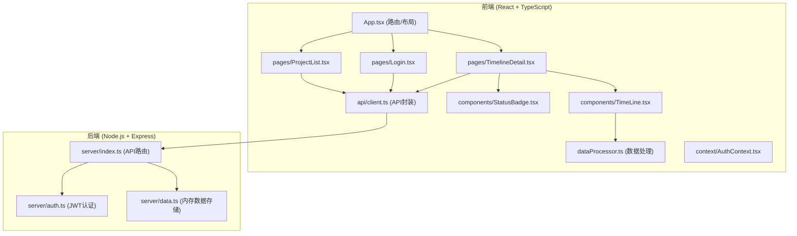
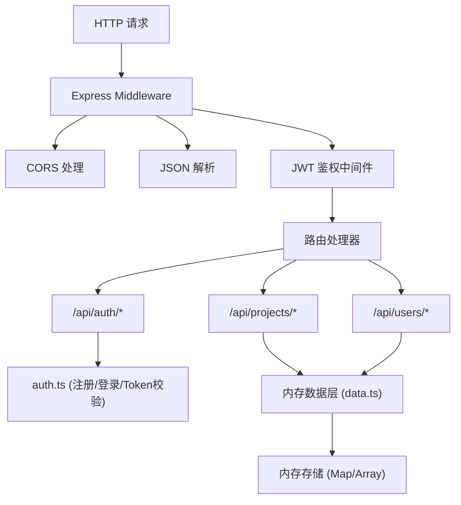
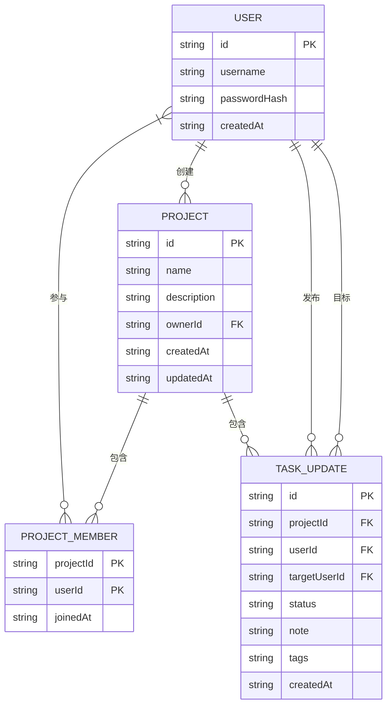

## 1. 架构设计



## 2. 技术栈说明
- **前端**：React 18 + TypeScript 5 + Vite 5 + React Router DOM 6 + Axios + date-fns + uuid
- **后端**：Node.js + Express 4 + cors + jsonwebtoken + bcryptjs
- **构建工具**：Vite 5 + @vitejs/plugin-react
- **数据存储**：内存存储（开发阶段），后续可扩展为SQLite/PostgreSQL

## 3. 路由定义
| 路由 | 用途 | 鉴权要求 |
|------|------|----------|
| /login | 登录注册页 | 否 |
| /projects | 项目列表页 | 是 |
| /projects/:id | 时间轴详情页 | 是 |
| / | 重定向到 /projects 或 /login | - |

## 4. API 定义

### 4.1 TypeScript 类型定义
```typescript
interface User {
  id: string;
  username: string;
  avatar?: string;
}

interface Project {
  id: string;
  name: string;
  description: string;
  ownerId: string;
  memberIds: string[];
  createdAt: string;
  updatedAt: string;
}

type TaskStatus = 'planned' | 'in-progress' | 'blocked' | 'completed';

interface TaskUpdate {
  id: string;
  projectId: string;
  userId: string;
  targetUserId: string;
  status: TaskStatus;
  note: string;
  tags: string[];
  createdAt: string;
}

interface WeeklyReport {
  userId: string;
  username: string;
  completed: number;
  blocked: number;
  inProgress: number;
  notes: string[];
}
```

### 4.2 请求/响应接口
| 方法 | 路径 | 描述 | 请求体 | 响应 |
|------|------|------|--------|------|
| POST | /api/auth/register | 用户注册 | { username, password } | { user, token } |
| POST | /api/auth/login | 用户登录 | { username, password } | { user, token } |
| GET | /api/projects | 获取项目列表 | - | Project[] |
| POST | /api/projects | 创建项目 | { name, description } | Project |
| POST | /api/projects/:id/members | 邀请成员 | { username } | Project |
| GET | /api/projects/:id/updates | 获取任务更新 | - | TaskUpdate[] |
| POST | /api/projects/:id/updates | 发布任务更新 | { targetUserId, status, note, tags } | TaskUpdate |
| GET | /api/projects/:id/weekly-report | 生成周报 | - | WeeklyReport[] |
| GET | /api/users | 获取所有用户 | - | User[] |

## 5. 服务端架构图



## 6. 数据模型

### 6.1 ER 图


### 6.2 文件结构与调用关系
```
项目根目录/
├── package.json          # 依赖配置
├── vite.config.js        # Vite构建配置
├── tsconfig.json         # TypeScript配置
├── index.html            # 前端入口HTML
├── server/
│   ├── index.ts          # Express服务器入口 (调用 auth.ts 和 data.ts)
│   ├── auth.ts           # JWT认证模块 (被 server/index.ts 调用)
│   └── data.ts           # 内存数据存储 (被 server/index.ts 调用)
└── src/
    ├── main.tsx          # React入口 (渲染 App.tsx)
    ├── App.tsx           # 主组件 (路由配置、布局导航，调用子页面)
    ├── api/
    │   └── client.ts     # Axios API封装 (被所有页面调用)
    ├── context/
    │   └── AuthContext.tsx # 认证上下文 (被 App.tsx 和页面调用)
    ├── pages/
    │   ├── Login.tsx         # 登录页 (调用 api/client.ts)
    │   ├── ProjectList.tsx   # 项目列表页 (调用 api/client.ts)
    │   └── TimelineDetail.tsx # 时间轴详情页 (调用 api/client.ts、dataProcessor.ts、组件)
    ├── components/
    │   ├── TimeLine.tsx      # 时间轴组件 (接收 dataProcessor 输出)
    │   ├── StatusBadge.tsx   # 状态徽章组件 (被 TimeLine.tsx 调用)
    │   ├── Sidebar.tsx       # 侧边导航组件 (被 App.tsx 调用)
    │   ├── Modal.tsx         # 模态框组件 (被 TimelineDetail.tsx 调用)
    │   └── FilterBar.tsx     # 筛选栏组件 (被 TimelineDetail.tsx 调用)
    ├── types/
    │   └── index.ts          # 类型定义 (被所有模块引用)
    └── dataProcessor.ts      # 数据处理模块 (被 TimelineDetail.tsx 调用)
```

**数据流向**：
1. 前端页面 → `api/client.ts` → HTTP请求 → `server/index.ts` → `auth.ts`鉴权 → `data.ts`读写
2. 后端响应 → `api/client.ts` → 前端状态 → `dataProcessor.ts`处理 → `TimeLine.tsx`渲染
3. 用户交互 → 页面组件状态更新 → `dataProcessor.ts`重新计算 → 时间轴重新渲染
