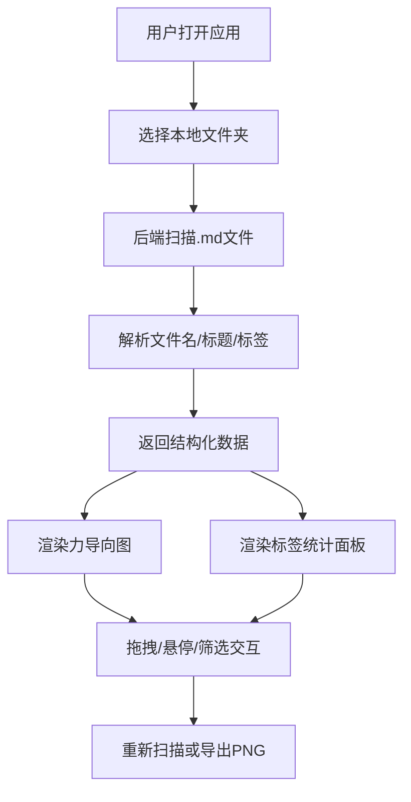

## 1. 产品概述

笔记标签图谱是一款帮助用户快速整理和分析本地Markdown笔记的可视化工具。通过力导向图展示笔记与标签之间的关联网络，帮助用户发现笔记间潜在的主题关联、识别标签冗余和定位孤立笔记。

- **核心问题**：笔记数量增多后，仅靠文件夹和文件名难以发现不同笔记间潜在的主题关联
- **目标用户**：知识工作者、研究人员、学生等使用Markdown进行笔记管理的用户
- **产品价值**：通过可视化关联图谱，快速发现知识网络中的隐藏关系，提升知识管理效率

## 2. 核心功能

### 2.1 功能模块

1. **文件选择与扫描模块**：本地文件夹选择、递归读取.md文件、解析标签
2. **力导向图谱模块**：节点渲染、拖拽交互、悬停信息卡片、筛选高亮
3. **标签统计面板**：标签频率统计、筛选交互
4. **操作栏**：重新扫描、图谱导出PNG

### 2.2 功能详情

| 功能模块 | 子功能 | 功能描述 |
|---------|--------|---------|
| 文件选择 | 文件夹选择器 | 通过浏览器文件选择器选择包含.md文件的本地文件夹 |
| 文件解析 | 内容提取 | 读取文件名、一级标题、#tag标签（支持中英文和数字） |
| 力导向图 | 节点渲染 | 标签节点、笔记节点（不同颜色区分）、连线渲染 |
| 力导向图 | 拖拽交互 | 节点自由拖拽，力模拟自动重新排布 |
| 力导向图 | 悬停卡片 | 半透明磨砂卡片显示笔记详情，fade-in动画 |
| 力导向图 | 筛选高亮 | 选中标签时高亮关联节点，其他节点半透明 |
| 标签面板 | 频率统计 | 按标签出现次数降序排列 |
| 标签面板 | 筛选按钮 | 点击筛选/取消筛选对应标签 |
| 操作栏 | 重新扫描 | 重新读取当前文件夹内容 |
| 操作栏 | 导出图谱 | 将当前视图导出为PNG图片 |

## 3. 核心流程

用户打开应用 → 选择本地Markdown文件夹 → 后端扫描解析文件 → 返回结构化数据 → 前端渲染力导向图和标签面板 → 用户可拖拽节点/悬停查看/筛选标签 → 可重新扫描或导出图谱

## 4. 用户界面设计

### 4.1 设计风格

- **主色调**：深蓝紫渐变 #1E1B4B → #312E81（顶部操作栏）
- **强调色**：#A78BFA（按钮）、#8B5CF6（按钮hover）
- **节点配色**：#6366F1、#EC4899、#F59E0B（笔记节点循环取色）
- **背景色**：#F1F5F9（左侧）、#FFFFFF（右侧）
- **按钮样式**：圆角8px，hover缩放-弹回动画
- **字体**：现代无衬线字体，清晰可读
- **布局风格**：左右分栏布局，桌面端优先
- **特殊效果**：backdrop-filter: blur(8px) 磨砂玻璃卡片效果

### 4.2 页面设计概览

| 区域 | 模块 | UI元素 |
|-----|------|--------|
| 顶部 | 操作栏 | 渐变背景、应用名称、重新扫描按钮、导出按钮 |
| 左侧 | 文件树区 | 固定宽度300px、浅灰背景、文件夹选择按钮 |
| 右侧 | 图谱区 | SVG力导向图、可拖拽节点、悬停信息卡片 |
| 右下 | 标签面板 | 固定高度200px、可滚动、细圆角滚动条、标签列表+筛选按钮 |

### 4.3 响应式设计

- **桌面端（≥768px）**：左右分栏布局，左侧固定300px，右侧自适应
- **移动端（<768px）**：左侧文件树折叠为顶部下拉菜单，图谱区域居中全宽
- **交互适配**：触屏设备支持触控拖拽节点

### 4.4 动画与交互细节

- 节点拖拽：力模拟实时更新其他节点位置
- 悬停卡片：0.2秒fade-in向上弹出
- 按钮点击：0.15秒缩放-弹回动画
- 标签筛选：平滑过渡透明度变化
- 力导向图：布局稳定后节点位置固定
