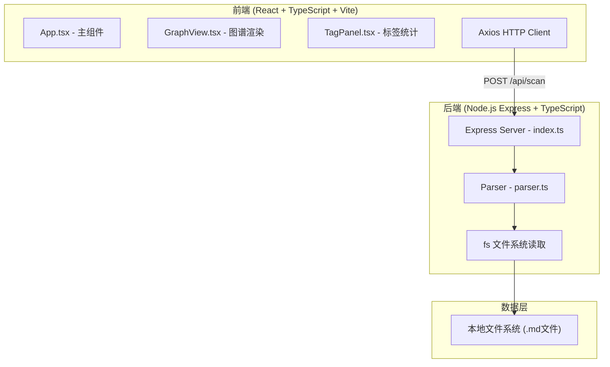
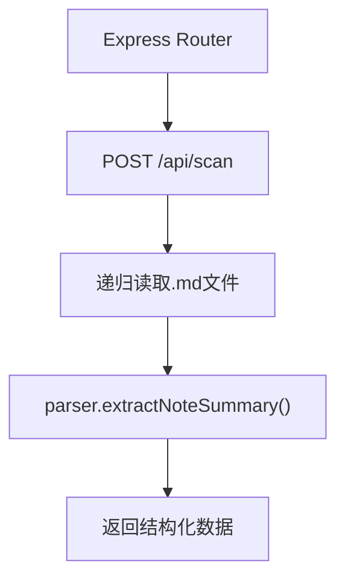

## 1. 架构设计



## 2. 技术选型说明

- **前端框架**：React 18 + TypeScript 5
- **构建工具**：Vite 5 + @vitejs/plugin-react
- **图谱渲染**：d3 + d3-force（力导向布局算法）
- **导出功能**：html2canvas（SVG转PNG）
- **HTTP请求**：axios
- **唯一ID**：uuid
- **后端框架**：Express 4 + TypeScript
- **跨域处理**：cors
- **包管理**：npm
- **启动命令**：`npm run dev`（同时启动前后端）

## 3. 文件结构

```
d:\Pro\tasks\auto149\
├── package.json                    # 根依赖配置
├── tsconfig.json                   # TypeScript配置（严格模式）
├── vite.config.js                  # Vite配置（React插件+代理）
├── index.html                      # 入口页面
├── server/
│   └── src/
│       ├── index.ts                # Express服务入口
│       └── parser.ts               # Markdown解析模块
└── client/
    └── src/
        ├── App.tsx                 # 主应用组件
        ├── GraphView.tsx           # 力导向图谱组件
        └── TagPanel.tsx            # 标签统计面板组件
```

## 4. API定义

### 4.1 类型定义

```typescript
// 笔记摘要
interface NoteSummary {
  id: string;
  fileName: string;
  title: string;
  tags: string[];
}

// 标签频率
interface TagFrequency {
  tag: string;
  count: number;
}

// 扫描响应
interface ScanResponse {
  notes: NoteSummary[];
  tags: TagFrequency[];
}

// 扫描请求
interface ScanRequest {
  folderPath: string;
}
```

### 4.2 接口定义

| 方法 | 路径 | 请求体 | 响应 | 说明 |
|-----|------|--------|------|------|
| POST | /api/scan | `{ folderPath: string }` | `ScanResponse` | 扫描指定文件夹的Markdown文件 |
| GET | /api/health | - | `{ status: 'ok' }` | 健康检查 |

## 5. 后端架构



### 5.1 核心模块职责

- **server/src/index.ts**：Express服务初始化、CORS配置、路由定义、文件递归读取逻辑
- **server/src/parser.ts**：纯函数解析模块，正则提取一级标题和#tag标签

### 5.2 正则表达式

- 一级标题：`/^#\s+(.+)$/m`
- 标签匹配：`/#([a-zA-Z0-9\u4e00-\u9fa5]+)/g`（支持中英文和数字）

## 6. 前端状态与数据流

### 6.1 状态管理（App.tsx）

```typescript
interface AppState {
  notes: NoteSummary[];
  tags: TagFrequency[];
  selectedTag: string | null;
  folderPath: string;
  loading: boolean;
}
```

### 6.2 组件通信

- App.tsx → GraphView.tsx：传递 notes、tags、selectedTag
- App.tsx → TagPanel.tsx：传递 tags、selectedTag、onTagSelect
- TagPanel.tsx → App.tsx：通过回调传递选中的标签
- GraphView.tsx：内部使用d3-force管理力模拟状态

### 6.3 力导向图节点结构

```typescript
// d3-force节点
interface GraphNode extends d3.SimulationNodeDatum {
  id: string;
  type: 'note' | 'tag';
  label: string;
  color: string;
  noteData?: NoteSummary;
}

// 连线
interface GraphLink extends d3.SimulationLinkDatum<GraphNode> {
  source: string | GraphNode;
  target: string | GraphNode;
}
```

## 7. 性能优化策略

- **Web Worker**：d3-force力模拟计算可在worker中执行（可选，针对超大数据集）
- **节流渲染**：力模拟tick事件中使用requestAnimationFrame节流
- **惰性计算**：仅在数据变化时重新构建节点和连线
- **SVG优化**：避免过多DOM节点，使用CSS变换代替重绘
- **帧率目标**：≥30fps，UI阻塞≤2秒（100笔记+500标签场景）
