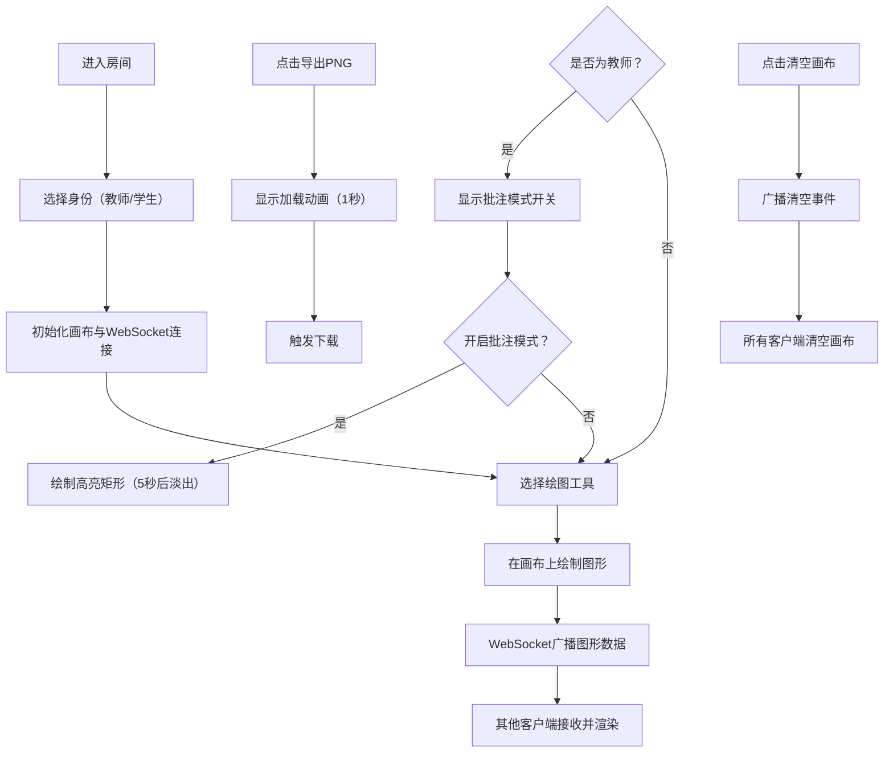

## 1. 产品概述

在线协作白板与教学批注工具，为师生提供实时协作的无限画布，支持图形绘制、文本批注、图片上传和高亮标注，所有操作实时同步，提升远程教学与协作效率。

- 解决远程教学中师生无法实时共享画布、协同标注的痛点
- 目标用户：教师、学生、远程协作团队

## 2. 核心功能

### 2.1 用户角色

| 角色 | 进入方式 | 核心权限 |
|------|----------|----------|
| 教师 | 进入房间时选择教师身份 | 所有绘图功能、批注模式、清空画布、导出PNG |
| 学生 | 进入房间时选择学生身份 | 所有绘图功能、查看实时同步 |

### 2.2 功能模块

1. **工具面板**：房间信息展示、绘图工具选择、颜色选择器、线宽调节、批注模式开关
2. **无限画布**：拖拽平移、滚轮缩放、网格背景、图层渲染
3. **绘图系统**：矩形、圆形、直线、自由画笔、文本、图片
4. **批注系统**：教师专属高亮批注、自动淡出消失
5. **实时同步**：WebSocket消息广播、在线用户列表、图形位置平滑插值
6. **导出与管理**：清空画布、导出为PNG图片

### 2.3 页面详情

| 页面名称 | 模块名称 | 功能描述 |
|----------|----------|----------|
| 主画布页 | 工具面板 | 左侧固定220px宽度，展示房间名、在线人数、绘图工具、颜色选择、线宽滑块、批注开关 |
| 主画布页 | 无限画布 | 中间区域，浅灰网格背景，支持拖拽平移和滚轮缩放（0.25x-4x），响应时间<50ms |
| 主画布页 | 操作按钮 | 画布右上角，红色清空画布按钮和绿色导出PNG按钮 |

## 3. 核心流程

用户进入房间后，选择身份（教师/学生），工具面板展示可用工具。选择绘图工具后在画布上绘制图形，操作通过WebSocket实时同步给其他用户。教师可开启批注模式进行高亮标注，批注5秒后自动淡出。用户可随时清空画布或导出当前画布为PNG图片。

## 4. 用户界面设计

### 4.1 设计风格

- **主色调**：#3B82F6（浅蓝）
- **辅色调**：#8B5CF6（紫色）、#F59E0B（警告黄）
- **背景色**：#F1F5F9（工具面板）、#F8FAFC（画布网格背景）
- **边框色**：#E2E8F0
- **按钮风格**：圆角8px，选中时背景#6366F1，图标白色
- **交互反馈**：hover 0.2秒背景淡入，点击 0.1秒缩放脉冲（0.95→1.0）
- **图标**：SVG内联图标

### 4.2 页面设计概览

| 页面名称 | 模块名称 | UI元素 |
|----------|----------|--------|
| 主画布页 | 工具面板 | 固定宽度220px，右边框#E2E8F0，房间名称+在线人数（缩放弹跳动画0.3s），工具按钮40x40px圆角8px，12色圆点颜色选择器（脉动光晕0.2s），线宽滑块1-10px，底部批注拨动开关（开启时滑块#8B5CF6） |
| 主画布页 | 无限画布 | 浅灰网格背景#F8FAFC+#CBD5E1线条，拖拽平移，滚轮缩放0.25-4倍（平滑过渡0.2s），图形拖拽移动（平滑插值0.15s） |
| 主画布页 | 操作按钮 | 右上角固定，红色#EF4444清空按钮，绿色#10B981导出按钮，圆角8px，导出时显示旋转圆形虚线加载动画1秒 |

### 4.3 响应式设计

- **桌面端**（≥768px）：左侧工具面板竖向排列，宽度220px
- **移动端**（<768px）：工具面板折叠为底部横条，高度60px，工具图标横向排列

### 4.4 性能要求

- 画布操作响应时间低于50ms
- 帧率不低于30fps
- 所有动画使用CSS过渡实现平滑效果
