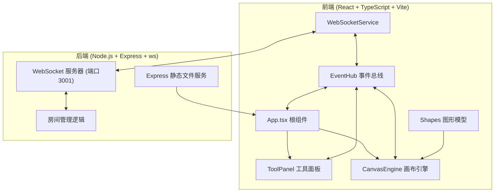
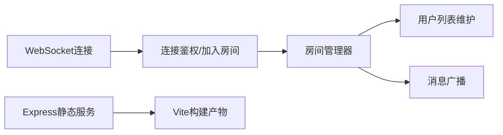
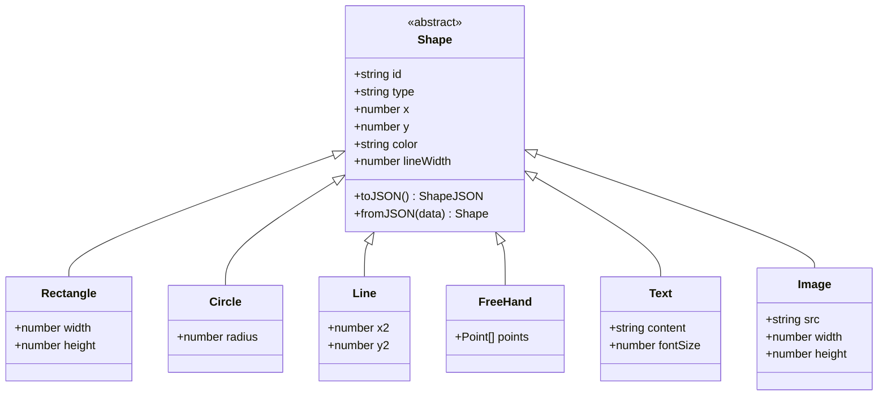

## 1. 架构设计



## 2. 技术选型说明

- **前端框架**：React@18 + TypeScript@5
- **构建工具**：Vite@5 + @vitejs/plugin-react
- **状态管理**：EventHub 单例事件总线（解耦模块通信）
- **图形渲染**：HTML5 Canvas 原生API
- **实时通信**：ws（WebSocket库）
- **后端框架**：Express@4
- **辅助库**：uuid（生成唯一ID）、html2canvas（导出PNG）、file-saver（文件下载）、cors（跨域处理）

## 3. 文件结构与路由

### 3.1 文件结构

```
auto150/
├── package.json
├── vite.config.js
├── tsconfig.json
├── index.html
├── src/
│   ├── App.tsx
│   ├── main.tsx
│   ├── modules/
│   │   ├── core/
│   │   │   └── EventHub.ts
│   │   ├── canvas/
│   │   │   ├── CanvasEngine.ts
│   │   │   └── ToolPanel.tsx
│   │   ├── network/
│   │   │   └── WebSocketService.ts
│   │   └── shapes/
│   │       └── index.ts
│   └── server/
│       └── index.js
```

### 3.2 模块职责

| 文件 | 职责 |
|------|------|
| [EventHub.ts](file:///d:/Pro/tasks/auto150/src/modules/core/EventHub.ts) | 单例事件总线，提供emit/on方法，定义事件类型 |
| [CanvasEngine.ts](file:///d:/Pro/tasks/auto150/src/modules/canvas/CanvasEngine.ts) | 画布渲染引擎，管理图层、缩放平移、绘制图形 |
| [ToolPanel.tsx](file:///d:/Pro/tasks/auto150/src/modules/canvas/ToolPanel.tsx) | 工具面板React组件，绘图工具、颜色、线宽、批注开关 |
| [WebSocketService.ts](file:///d:/Pro/tasks/auto150/src/modules/network/WebSocketService.ts) | WebSocket通信服务，消息收发、在线用户维护 |
| [shapes/index.ts](file:///d:/Pro/tasks/auto150/src/modules/shapes/index.ts) | 图形数据模型（Shape基类及各子类） |
| [App.tsx](file:///d:/Pro/tasks/auto150/src/App.tsx) | 根组件，组装模块、初始化、键盘快捷键 |
| [index.js](file:///d:/Pro/tasks/auto150/src/server/index.js) | Express+WebSocket服务器，房间管理、消息广播 |

## 4. API与消息协议定义

### 4.1 WebSocket消息类型

```typescript
type WSMessage =
  | { type: 'join'; roomId: string; userId: string; role: 'teacher' | 'student' }
  | { type: 'users'; users: Array<{ id: string; role: string }> }
  | { type: 'draw'; shape: ShapeJSON }
  | { type: 'move'; shapeId: string; x: number; y: number }
  | { type: 'clear' }
  | { type: 'sync'; shapes: ShapeJSON[] };
```

### 4.2 事件总线事件类型

```typescript
type EventTypes = {
  DrawAction: { tool: ToolType; color: string; lineWidth: number };
  ShapeCreated: Shape;
  ShapeMoved: { id: string; x: number; y: number };
  CanvasCleared: void;
  ToolChanged: ToolType;
  ColorChanged: string;
  LineWidthChanged: number;
  AnnotationModeChanged: boolean;
  UsersUpdated: number;
};
```

## 5. 服务端架构



服务端端口：3001（WebSocket），同时通过Express提供静态文件服务。

## 6. 数据模型

### 6.1 图形模型ER图



### 6.2 图形序列化接口

```typescript
interface ShapeJSON {
  id: string;
  type: 'rectangle' | 'circle' | 'line' | 'freehand' | 'text' | 'image' | 'highlight';
  x: number;
  y: number;
  color: string;
  lineWidth: number;
  width?: number;
  height?: number;
  radius?: number;
  x2?: number;
  y2?: number;
  points?: Array<{ x: number; y: number }>;
  content?: string;
  fontSize?: number;
  src?: string;
  isTemporary?: boolean;
  createdAt?: number;
}
```
