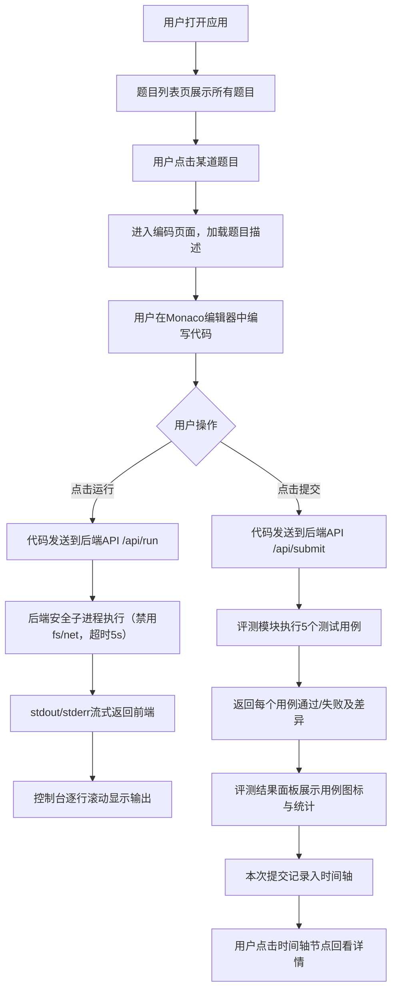

## 1. 产品概述

在线代码沙盒与自动评测平台，为在线教育场景中的学生提供浏览器内的代码编写、运行、调试与自动化测试反馈服务。
- 目标用户：编程学习者、在线教育平台学生
- 核心价值：降低编程学习门槛，提供即时、可交互的代码练习环境与自动评测反馈

## 2. 核心功能

### 2.1 用户角色
| 角色 | 注册方式 | 核心权限 |
|------|----------|----------|
| 学生用户 | 默认登录（模拟） | 浏览题目、编写并运行代码、提交评测、查看提交历史 |

### 2.2 功能模块
1. **题目列表页面**：题目卡片列表、难度标签、通过率展示、跳转入口
2. **代码编辑器页面**：题目描述区、Monaco代码编辑器、运行/提交操作、输出控制台、评测结果面板、提交历史时间轴

### 2.3 页面详情
| 页面名称 | 模块名称 | 功能描述 |
|----------|----------|----------|
| 题目列表页 | 题目卡片 | 显示标题、难度（绿/橙/红三色标签）、通过率，悬停阴影过渡，点击进入编码页 |
| 题目列表页 | 顶部导航 | 平台Logo、用户名展示、全局定位 |
| 编码页 | 题目描述区 | 可收缩，显示题目内容、示例输入输出 |
| 编码页 | 代码编辑器 | Monaco Editor深色主题，语法高亮、自动补全，字体Consolas 14px |
| 编码页 | 操作按钮 | 运行按钮（浅蓝）、提交按钮（深蓝），圆角8px带hover效果 |
| 编码页 | 输出控制台 | 可拖拽调整高度，两标签页：输出（stdout/stderr流式输出）、评测结果（测试用例通过情况） |
| 编码页 | 提交历史时间轴 | 垂直时间轴，通过节点绿色对勾，失败节点红色叉号，点击回看代码与评测详情 |

## 3. 核心流程

用户从题目列表选择题目，进入编码页面后阅读题目描述，在编辑器中编写代码。点击"运行"按钮时，代码发送至后端在安全子进程中执行，标准输出和错误信息流式返回前端并在控制台逐行滚动输出。点击"提交"按钮时，后端使用5个预定义测试用例依次执行对比，返回每个测试用例的通过/失败状态及差异对比，同时记录本次提交历史。用户可点击时间轴节点回看历史提交。

## 4. 用户界面设计

### 4.1 设计风格
- **主色调**：浅灰白背景 #F9FAFB，侧边栏 #F3F4F6，白色卡片与导航栏
- **强调色**：运行按钮浅蓝 #3B82F6（hover #2563EB），提交按钮深蓝 #1D4ED8（hover #1E40AF）
- **难度颜色**：简单绿 #22C55E，中等橙 #F59E0B，困难红 #EF4444
- **通过/失败**：通过 #22C55E，失败 #EF4444
- **辅助灰**：边框 #E5E7EB，时间线 #D1D5DB
- **按钮风格**：圆角8px，纯色填充，带hover颜色过渡0.2s
- **字体**：代码区 Consolas 14px，界面使用系统无衬线字体
- **布局**：左侧固定侧边栏280px，顶部导航栏高56px，编码页左40%右60%分栏
- **图标**：使用 lucide-react 图标库

### 4.2 页面设计概览
| 页面名称 | 模块名称 | UI元素 |
|----------|----------|--------|
| 题目列表 | 题目卡片 | 白底圆角12px，悬停阴影rgba(0,0,0,0.12)过渡0.2s，难度标签彩色圆角 |
| 题目列表 | 侧边栏 | 宽280px，背景#F3F4F6，右侧边框#E5E7EB，题目列表垂直排列 |
| 编码页 | 描述区 | 左侧40%，可收缩，白底，示例输入输出带代码块样式 |
| 编码页 | 编辑器区 | 右侧60%，深色背景#1E1E1E，Monaco编辑器，底部控制台高200px可拖拽 |
| 编码页 | 控制台 | 两个标签页切换，输出区等宽字体，评测结果用例卡片带淡入动画0.3s |
| 编码页 | 时间轴 | 垂直布局，节点直径16px圆点，通过绿色白勾，失败红色白叉，虚线连接 |

### 4.3 响应式
桌面端优先设计，侧边栏固定、双栏布局为核心形式，在窄屏下描述区与编辑器区可改为垂直堆叠。

### 4.4 动效
- 题目卡片悬停：阴影加深，过渡0.2s
- 按钮hover：颜色渐变过渡0.2s
- 测试用例结果显示：淡入动画 opacity 0→1，0.3s
- 控制台输出：逐行滚动追加
