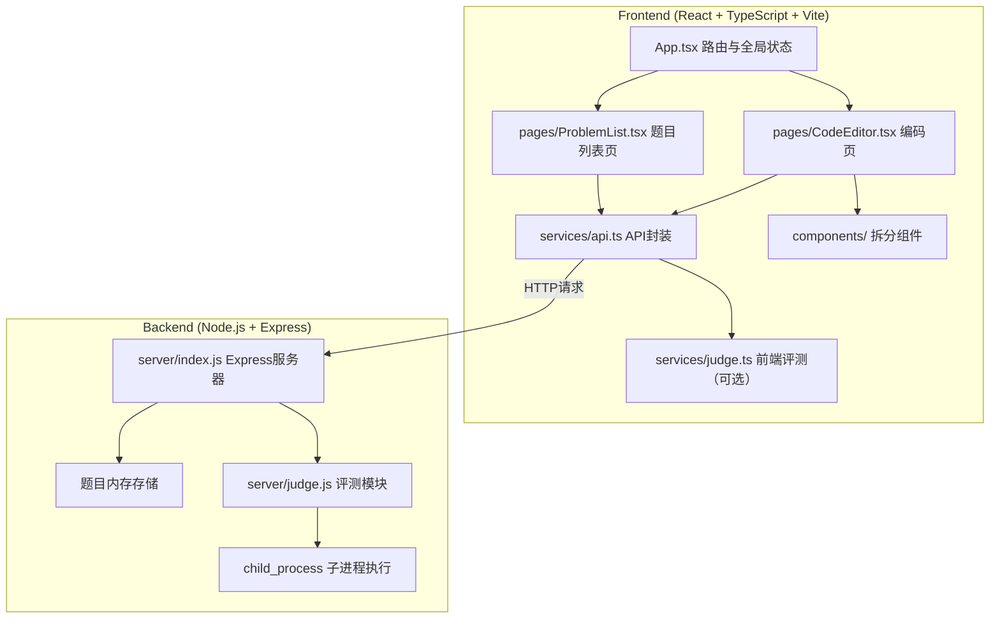
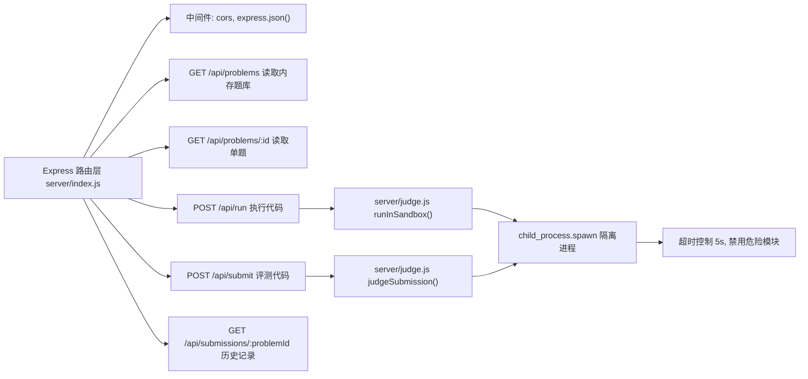
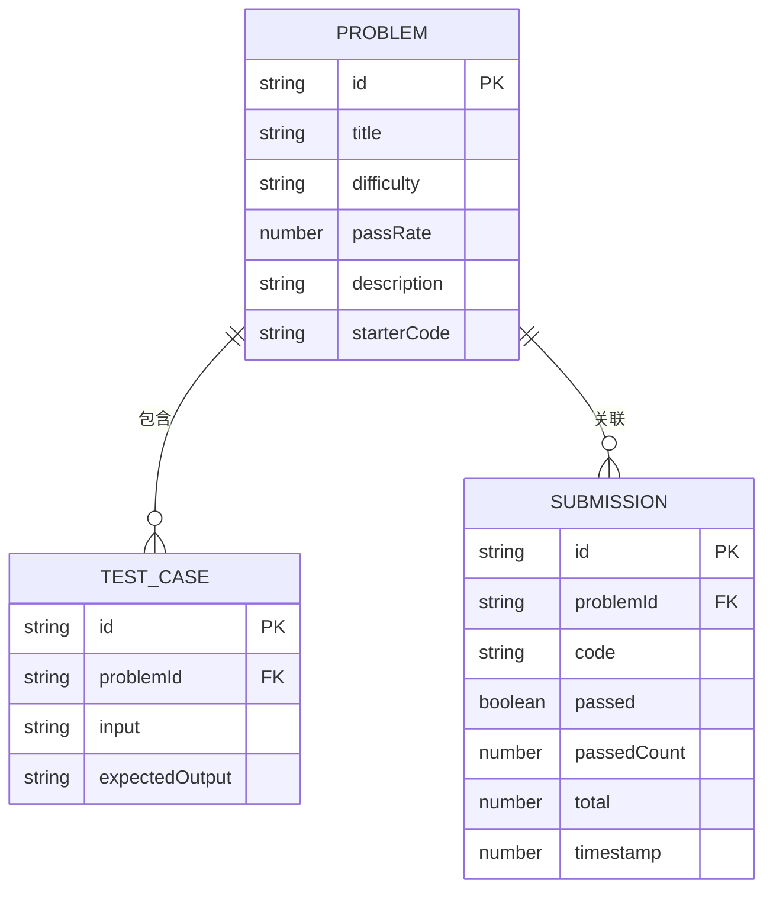

## 1. 架构设计



## 2. 技术说明
- **前端**：React@18 + TypeScript + Vite + @vitejs/plugin-react + monaco-editor + axios + uuid + lucide-react
- **后端**：Express@4 + cors，代码执行通过 Node.js child_process（vm2 隔离执行 JavaScript 代码，禁用 fs/net/process 等危险 API，超时 5s）
- **数据库**：内存存储（Map），无需持久化数据库
- **构建工具**：Vite，dev 模式同时启动前端与后端

## 3. 路由定义
| 路由 | 用途 |
|------|------|
| / | 题目列表页面（首页） |
| /problem/:id | 代码编辑器页面 |

## 4. API 定义

```typescript
// 类型定义
interface Problem {
  id: string;
  title: string;
  difficulty: 'easy' | 'medium' | 'hard';
  passRate: number;
  description: string;
  examples: { input: string; output: string }[];
  testCases: { input: string; expectedOutput: string }[];
  starterCode: string;
}

interface RunCodeRequest {
  code: string;
  stdin?: string;
}

interface RunCodeResponse {
  stdout: string;
  stderr: string;
  exitCode: number;
  timedOut: boolean;
}

interface TestCaseResult {
  passed: boolean;
  input: string;
  expectedOutput: string;
  actualOutput: string;
  stderr?: string;
}

interface SubmitCodeResponse {
  total: number;
  passedCount: number;
  results: TestCaseResult[];
  submissionId: string;
  timestamp: number;
}

interface SubmissionRecord {
  id: string;
  problemId: string;
  code: string;
  passed: boolean;
  passedCount: number;
  total: number;
  results: TestCaseResult[];
  timestamp: number;
}
```

### REST API
| 方法 | 路径 | 描述 |
|------|------|------|
| GET | /api/problems | 获取所有题目（ID,标题,难度,通过率） |
| GET | /api/problems/:id | 获取单题详情（含描述、示例、测试用例、起始代码） |
| POST | /api/run | 运行代码，返回 stdout/stderr |
| POST | /api/submit | 提交代码，返回所有测试用例评测结果 |
| GET | /api/submissions/:problemId | 获取某题的提交历史 |

## 5. 服务器架构



## 6. 数据模型

### 6.1 数据模型定义



### 6.2 初始种子数据
```javascript
// 3 道示例题目
const problems = [
  {
    id: 'sum-of-two',
    title: '两数之和',
    difficulty: 'easy',
    passRate: 85.2,
    description: '给定一个整数数组 nums 和一个整数目标值 target，请你在该数组中找出和为 target 的那两个整数，并返回它们的数组下标。',
    examples: [{ input: 'nums = [2,7,11,15], target = 9', output: '[0,1]' }],
    starterCode: 'function twoSum(nums, target) {\n  // TODO: 实现代码\n  return [];\n}\n',
    testCases: [
      { input: JSON.stringify({ nums: [2,7,11,15], target: 9 }), expectedOutput: '[0,1]' },
      { input: JSON.stringify({ nums: [3,2,4], target: 6 }), expectedOutput: '[1,2]' },
      { input: JSON.stringify({ nums: [3,3], target: 6 }), expectedOutput: '[0,1]' },
      { input: JSON.stringify({ nums: [1,5,3,7], target: 8 }), expectedOutput: '[1,2]' },
      { input: JSON.stringify({ nums: [10,20,30,40], target: 50 }), expectedOutput: '[0,3]' },
    ]
  },
  {
    id: 'reverse-string',
    title: '反转字符串',
    difficulty: 'easy',
    passRate: 92.5,
    description: '编写一个函数，其作用是将输入的字符串反转过来。',
    examples: [{ input: '"hello"', output: '"olleh"' }],
    starterCode: 'function reverseString(s) {\n  // TODO: 实现代码\n  return s;\n}\n',
    testCases: [
      { input: JSON.stringify({ s: 'hello' }), expectedOutput: 'olleh' },
      { input: JSON.stringify({ s: 'abcde' }), expectedOutput: 'edcba' },
      { input: JSON.stringify({ s: 'a' }), expectedOutput: 'a' },
      { input: JSON.stringify({ s: '' }), expectedOutput: '' },
      { input: JSON.stringify({ s: 'racecar' }), expectedOutput: 'racecar' },
    ]
  },
  {
    id: 'valid-parentheses',
    title: '有效的括号',
    difficulty: 'medium',
    passRate: 62.3,
    description: '给定一个只包括 \'(\', \')\', \'{\', \'}\', \'[\', \']\' 的字符串，判断字符串是否有效。',
    examples: [{ input: '"()[]{}"', output: 'true' }],
    starterCode: 'function isValid(s) {\n  // TODO: 实现代码\n  return true;\n}\n',
    testCases: [
      { input: JSON.stringify({ s: '()[]{}' }), expectedOutput: 'true' },
      { input: JSON.stringify({ s: '(]' }), expectedOutput: 'false' },
      { input: JSON.stringify({ s: '([)]' }), expectedOutput: 'false' },
      { input: JSON.stringify({ s: '{[]}' }), expectedOutput: 'true' },
      { input: JSON.stringify({ s: '' }), expectedOutput: 'true' },
    ]
  }
];
```

## 7. 性能约束实现方案
- **首屏加载**：首页直接引入，CodeEditor 使用 `React.lazy` + `Suspense` 懒加载
- **编辑器响应**：Monaco Editor 原生性能满足 <50ms
- **代码运行**：后端使用 child_process 执行，设置 5s 超时，总响应 <6s
- **提交评测**：5 个测试用例逐个执行，每个限制 5s，总响应 <10s
