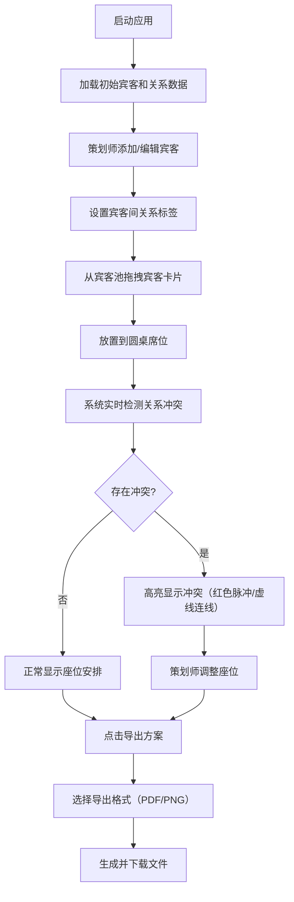

## 1. 产品概述

婚礼宾客座位安排与关系偏好管理系统，为婚礼策划师提供交互式的宾客席位分配工具。通过可视化拖拽操作、关系冲突检测和方案导出功能，帮助策划师高效完成婚礼座位布置方案。

- 核心价值：简化复杂的宾客关系管理，避免座位安排中的尴尬情况
- 目标用户：婚礼策划师、婚庆公司工作人员

## 2. 核心功能

### 2.1 用户角色
| 角色 | 注册方式 | 核心权限 |
|------|----------|----------|
| 婚礼策划师 | 无需注册，本地使用 | 宾客管理、关系设置、座位分配、冲突检测、方案导出 |

### 2.2 功能模块
1. **宾客管理模块**：添加/编辑宾客信息，设置宾客分组和关系标签
2. **拖拽分配模块**：宾客池卡片拖拽到圆桌席位，支持弹性动画
3. **冲突检测模块**：实时检测仇人同桌、情侣拆分等违规安排
4. **方案导出模块**：导出座位图为 PDF 或 PNG 图片
5. **撤销重做模块**：支持最近5步操作的撤销/重做

### 2.3 页面详情
| 页面名称 | 模块名称 | 功能描述 |
|----------|----------|----------|
| 主页面 | 导航栏 | 品牌Logo（呼吸动画）、冲突数量状态栏、导出按钮 |
| 主页面 | 宾客池 | 左侧固定280px宽度，展示未分配宾客卡片列表，支持添加宾客和设置关系 |
| 主页面 | 圆桌区 | 4张圆桌可视化，每桌8席位，支持拖拽放置宾客，高亮冲突标记 |
| 主页面 | 底部工具栏 | 撤销/重做按钮、操作历史展示 |

## 3. 核心流程

## 4. 用户界面设计

### 4.1 设计风格
- **主色调**：#DB2777（粉色）
- **次色调**：#8B5CF6（紫色）
- **背景色**：#F9FAFB（浅灰）
- **冲突色**：#EC4899（粉紫虚线）、红色脉冲边框
- **按钮风格**：圆角、粉紫渐变背景、悬停缩放效果
- **字体**：优雅的无衬线字体，标题使用装饰性字体
- **布局风格**：左右分栏布局，顶部导航栏，底部工具栏
- **动画**：呼吸动画、弹性缩放、脉冲高亮、平滑过渡

### 4.2 页面设计概述
| 页面名称 | 模块名称 | UI元素 |
|----------|----------|--------|
| 主页面 | 导航栏 | 56px高度，粉紫渐变背景，白色文字，左侧Logo呼吸动画（2秒周期，透明度0.8-1.0），冲突计数徽章 |
| 主页面 | 宾客池 | 280px固定宽度，#FDF2F8背景，宾客卡片（白色、圆角12px、阴影），添加宾客按钮，关系设置面板 |
| 主页面 | 圆桌区 | 4张圆桌均匀分布，圆形桌面，桌号居中，8个席位圆环分布，空席位浅灰虚线圆，已放置粉紫渐变卡片（圆角50%），仇人同桌红色脉冲边框（0.5秒循环），情侣拆分#EC4899虚线连接 |
| 主页面 | 底部工具栏 | 撤销/重做按钮（支持Ctrl+Z/Ctrl+Y），操作历史时间线 |

### 4.3 响应式设计
- 桌面端：左右分栏布局，宾客池固定280px宽度
- 移动端（<768px）：宾客池折叠为底部抽屉，圆桌区自适应

### 4.4 性能要求
- 拖拽操作帧率不低于50fps
- 冲突检测在50ms内完成（支持100个宾客规模）
