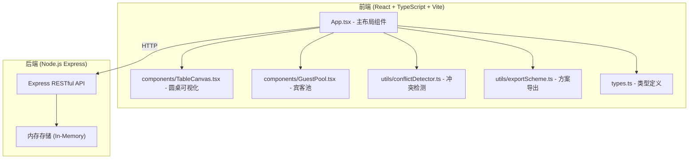
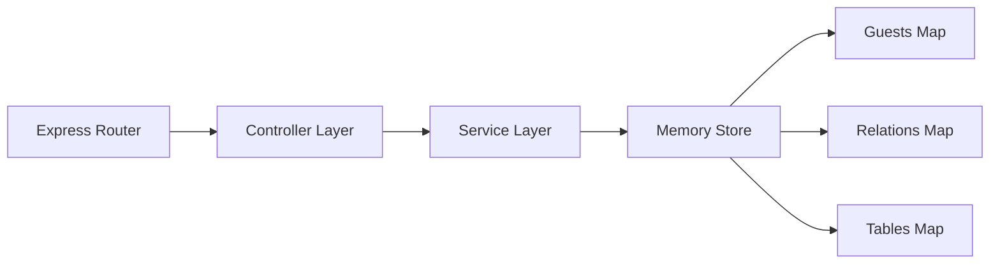
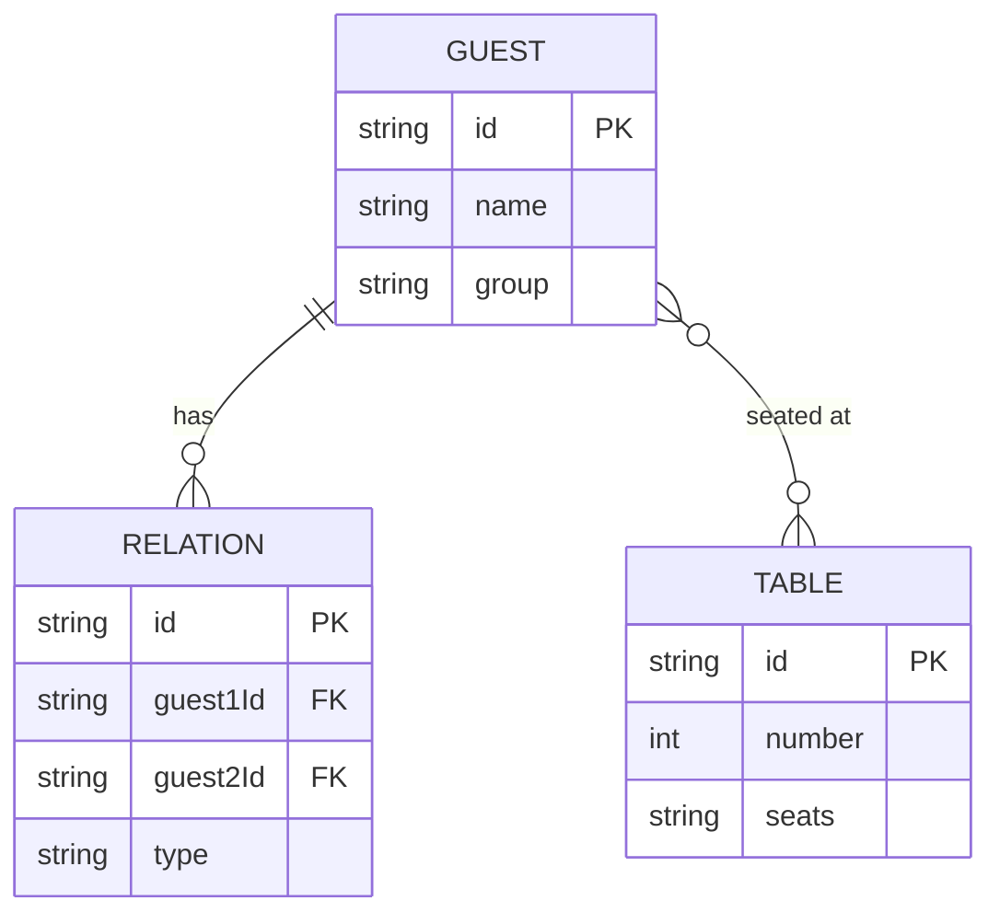

## 1. 架构设计



## 2. 技术描述

- **前端框架**: React 18 + TypeScript
- **构建工具**: Vite + @vitejs/plugin-react
- **样式方案**: 内联CSS样式 + CSS动画
- **状态管理**: React useState/useReducer（无需额外状态库）
- **拖拽实现**: HTML5 原生 Drag and Drop API
- **后端框架**: Express.js
- **数据存储**: 内存存储（运行时）
- **HTTP客户端**: axios
- **ID生成**: uuid
- **PDF导出**: jspdf
- **图片导出**: html2canvas

## 3. 项目结构

```
├── package.json
├── vite.config.js
├── tsconfig.json
├── index.html
├── src/
│   ├── main.tsx              # 应用入口
│   ├── App.tsx               # 主布局组件
│   ├── components/
│   │   ├── TableCanvas.tsx   # 圆桌可视化组件
│   │   └── GuestPool.tsx     # 宾客池组件
│   ├── utils/
│   │   ├── conflictDetector.ts  # 冲突检测模块
│   │   └── exportScheme.ts      # 方案导出模块
│   └── types.ts              # 类型定义
└── server/
    └── index.ts              # Express 后端服务
```

## 4. API 定义

### 4.1 类型定义

```typescript
// 宾客分组
type GuestGroup = 'family' | 'colleague' | 'friend';

// 关系类型
type RelationType = 'family' | 'couple' | 'enemy';

// 宾客接口
interface Guest {
  id: string;
  name: string;
  group: GuestGroup;
}

// 关系接口
interface Relation {
  id: string;
  guest1Id: string;
  guest2Id: string;
  type: RelationType;
}

// 圆桌接口
interface Table {
  id: string;
  number: number;
  seats: (string | null)[]; // 宾客ID数组，null表示空席位
}

// 冲突类型
type ConflictType = 'enemy_same_table' | 'couple_separated';

// 冲突接口
interface Conflict {
  id: string;
  type: ConflictType;
  guestIds: string[];
  tableIds: string[];
  message: string;
}

// 应用状态快照（用于撤销/重做）
interface AppStateSnapshot {
  guests: Guest[];
  relations: Relation[];
  tables: Table[];
}
```

### 4.2 REST API 端点

| 方法 | 路由 | 用途 | 请求体 | 响应 |
|------|------|------|--------|------|
| GET | /api/guests | 获取所有宾客 | - | Guest[] |
| POST | /api/guests | 添加宾客 | {name, group} | Guest |
| PUT | /api/guests/:id | 更新宾客 | {name, group} | Guest |
| DELETE | /api/guests/:id | 删除宾客 | - | {success: true} |
| GET | /api/relations | 获取所有关系 | - | Relation[] |
| POST | /api/relations | 添加关系 | {guest1Id, guest2Id, type} | Relation |
| DELETE | /api/relations/:id | 删除关系 | - | {success: true} |
| GET | /api/tables | 获取所有圆桌 | - | Table[] |
| PUT | /api/tables | 更新所有圆桌 | Table[] | Table[] |

## 5. 后端服务架构



## 6. 数据模型

### 6.1 实体关系图



### 6.2 初始数据

- 10个预设宾客（涵盖家人、同事、朋友分组）
- 3组关系预设（1对家人、1对情侣、1对仇人）
- 4张圆桌，每张8个空席位
