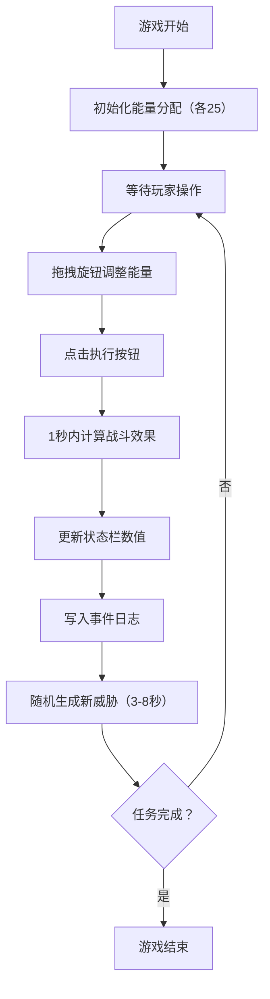

## 1. 产品概述

一款星舰能量分配与战斗决策的迷你策略游戏，玩家通过调整星舰各系统的能量分配来应对随机威胁，完成存活任务。

- 主要目的：提供沉浸式的太空策略体验，玩家需要平衡护盾、武器、引擎、生命维持四大系统的能量分配
- 目标用户：喜欢策略游戏、太空科幻爱好者

## 2. 核心功能

### 2.1 用户角色

不适用（单人游戏）

### 2.2 功能模块

1. **主界面**：深空背景、星舰六边形示意图、四大系统能量旋钮
2. **能量分配系统**：拖拽旋钮调整能量占比，执行按钮触发结算
3. **威胁事件系统**：随机生成威胁（小行星带、敌舰、能源泄漏）
4. **事件日志面板**：实时显示战况信息
5. **状态栏**：各系统实时数值与状态反馈

### 2.3 页面详情

| 页面名称 | 模块名称 | 功能描述 |
|-----------|-------------|---------------------|
| 主界面 | 星舰示意图 | 六边形网格布局，4个系统节点（护盾、武器、引擎、生命维持），每个节点配SVG图标 |
| 主界面 | 能量旋钮 | 圆形旋钮（直径50px），拖拽旋转0-300度，背景红→绿渐变显示能量 |
| 主界面 | 执行按钮 | 圆角10px，主色#45A29E，hover#66FCF1，点击缩放0.15s反馈 |
| 主界面 | 事件日志面板 | 右侧固定280px，实时威胁列表，淡入动画，红色警告图标 |
| 主界面 | 底部状态栏 | 4个进度条，宽度150px，各系统颜色区分，低能量抖动警告 |

## 3. 核心流程

玩家进入游戏 → 观察当前威胁日志 → 拖拽各系统旋钮分配能量（总能量100，各系统最低10）→ 点击"执行"按钮 → 系统1秒内计算效果 → 状态栏更新 → 新威胁随机生成（3-8秒间隔）→ 循环直至任务完成/游戏结束

## 4. 用户界面设计

### 4.1 设计风格

- **主色调**：深空背景 #0B0C10 到 #1F2833 径向渐变
- **强调色**：青绿 #45A29E、亮蓝 #66FCF1
- **系统颜色**：护盾蓝色 #66FCF1、武器红色 #F33535、引擎绿色 #45A29E、生命维持紫色 #9457EB
- **按钮样式**：圆角 8-12px，hover/点击动画反馈
- **图标风格**：简洁SVG图形（盾牌、炮管、火焰、心形）
- **整体风格**：深色科幻风，紧凑布局，960x640视口

### 4.2 页面设计概述

| 页面名称 | 模块名称 | UI 元素 |
|-----------|-------------|-------------|
| 主界面 | 深空背景 | 径向渐变 #0B0C10→#1F2833，营造深空氛围 |
| 主界面 | 六边形星舰 | 中央六边形网格，4个角放置系统图标 |
| 主界面 | 能量旋钮 | 圆形拖拽控件，旋转角度对应能量值，渐变颜色反馈 |
| 主界面 | 执行按钮 | 主色调按钮，悬停变色，点击缩放动画 |
| 主界面 | 事件日志 | 右侧半透明面板，列表式日志，淡入动画，警告图标闪烁 |
| 主界面 | 状态栏 | 底部进度条，平滑过渡动画，低能量抖动+半透明 |

### 4.3 响应式设计

- 桌面优先，固定视口 960x640

### 4.4 动画与性能

- 能量旋钮：拖拽实时旋转（0-300度）
- 状态栏数值变化：0.3s ease-out 平滑过渡
- 事件日志：0.3s 淡入动画
- 低能量系统：每1.5秒抖动0.2秒+半透明
- 执行按钮：0.15s 缩放反馈
- 威胁警告图标：闪烁动画
- 目标帧率：稳定60FPS
