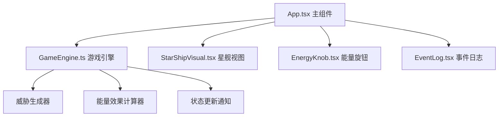

## 1. 架构设计



## 2. 技术选型说明

- **前端框架**：React@18 + TypeScript@5
- **构建工具**：Vite@5 + @vitejs/plugin-react
- **状态管理**：React Hooks (useState, useEffect, useRef, useCallback)
- **唯一ID**：uuid
- **样式方案**：原生 CSS + CSS 变量，内联样式动画
- **初始化方式**：手动配置 Vite + React + TS 项目结构

## 3. 目录结构

```
auto156/
├── package.json
├── index.html
├── vite.config.js
├── tsconfig.json
└── src/
│   ├── App.tsx              # 主组件，布局与游戏状态管理
│   ├── GameEngine.ts       # 游戏逻辑引擎
│   ├── EnergyKnob.tsx       # 能量旋钮组件
│   ├── EventLog.tsx         # 事件日志组件
│   └── StarShipVisual.tsx    # 星舰示意图组件
```

## 4. 核心数据模型

### 4.1 系统类型

```typescript
type SystemType = 'shield' | 'weapon' | 'engine' | 'lifeSupport';

interface EnergyAllocation {
  shield: number;      // 护盾能量 10-70
  weapon: number;        // 武器能量 10-70
  engine: number;       // 引擎能量 10-70
  lifeSupport: number;   // 生命维持能量 10-70
}

interface SystemStatus {
  shield: number;        // 护盾当前值 0-100
  weapon: number;        // 武器当前值 0-100
  engine: number;        // 引擎当前值 0-100
  lifeSupport: number;    // 生命维持当前值 0-100
}

interface ThreatEvent {
  id: string;
  type: 'asteroid' | 'enemy' | 'leak' | 'pirate' | 'solarFlare';
  name: string;
  description: string;
  damage: {
    shield?: number;    // 对护盾的伤害
    weapon?: number;  // 对武器的伤害
    engine?: number;  // 对引擎的伤害
    lifeSupport?: number; // 对生命维持的伤害
  };
  timestamp: number;
}

interface LogEntry {
  id: string;
  type: 'threat' | 'effect' | 'system' | 'warning';
  message: string;
  timestamp: number;
}

type GamePhase = 'playing' | 'victory' | 'defeat';
```

### 4.2 GameEngine 接口

```typescript
class GameEngine {
  // 订阅状态变化回调
  onStatusChange: (status: SystemStatus) => void;
  onLogEntry: (entry: LogEntry) => void;
  onPhaseChange: (phase: GamePhase) => void;
  onThreatGenerated: (threat: ThreatEvent) => void;
  
  // 核心方法
  start(): void;                              // 启动游戏
  stop(): void;                               // 停止游戏
  executeTurn(allocation: EnergyAllocation): void; // 执行回合
  getCurrentStatus(): SystemStatus;           // 获取当前状态
}
```

## 5. 游戏规则

- 总能量池：100 单位，每个系统最低 10 单位
- 威胁生成间隔：3-8 秒随机
- 能量效果计算：
  - 护盾能量 → 减伤比例 = 护盾能量%，最高减伤 70%
  - 武器能量 → 反击伤害 = 武器能量%，可摧毁部分威胁
  - 引擎能量 → 闪避率 = 引擎能量 * 0.5%，最高 35%
  - 生命维持 → 每回合恢复 = 生命维持 * 0.3
- 胜利条件：存活 10 个威胁事件 或 累计击退 5 个威胁
- 失败条件：任意系统值降为 0

## 6. 性能优化策略

- 使用 CSS transform/opacity 实现动画，避免重排重绘
- 旋钮拖拽使用 requestAnimationFrame 确保 60FPS
- 游戏计算使用 setTimeout 避免阻塞 UI
- 状态更新批量处理，减少 React 重渲染
