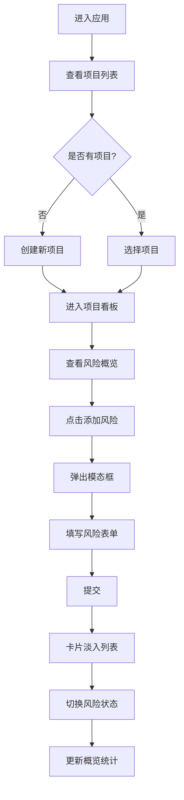

## 1. 产品概述
风险追踪应用（Risk Tracker）是一款面向小型创业团队的项目风险管理工具，帮助团队在项目启动阶段快速进行风险识别、评估与应对措施追踪。

- **核心问题**：团队头脑风暴风险时缺乏结构化记录、应对措施无法追踪执行、事后复盘缺乏历史数据
- **目标用户**：小型创业团队、项目经理、产品负责人
- **产品价值**：提供结构化的风险记录流程，可视化的风险状态追踪，支持数据持久化存储，帮助团队系统性管理项目风险

## 2. 核心功能

### 2.1 用户角色
| 角色 | 注册方式 | 核心权限 |
|------|----------|----------|
| 普通用户 | 无需注册，本地使用 | 创建项目、添加风险、修改状态、查看概览 |

### 2.2 功能模块
1. **项目管理**：项目创建、项目列表、项目切换
2. **风险看板**：风险卡片列表、风险状态管理、风险详情展示
3. **风险录入**：模态框表单、字段验证、动画提交
4. **概览统计**：进度环可视化、等级分类统计、完成比例展示
5. **数据持久化**：后端内存存储 + 本地缓存模拟

### 2.3 页面详情
| 页面名称 | 模块名称 | 功能描述 |
|---------|----------|----------|
| 主页面 | 左侧项目侧边栏 | 项目列表展示、项目切换、创建新项目入口 |
| 主页面 | 顶部概览条 | 三个圆形进度环展示各等级风险数量和完成比例 |
| 主页面 | 风险卡片列表 | 卡片形式展示所有风险，支持状态切换、悬停效果 |
| 主页面 | 添加风险模态框 | 半透明遮罩、表单录入、动画提交 |

## 3. 核心流程

### 主工作流程
用户进入应用 → 查看/创建项目 → 进入项目看板 → 查看风险概览 → 添加新风险（点击按钮 → 弹出模态框 → 填写表单 → 提交）→ 管理风险状态（待处理/处理中/已完成）→ 实时更新概览统计

## 4. 用户界面设计

### 4.1 设计风格
- **主色调**：深灰蓝主题，主背景 `#1E293B`，侧边栏 `#0F172A`，卡片背景 `#334155`
- **强调色**：紫色 `#6366F1`（按钮、交互元素）
- **风险等级色**：高 `#EF4444`，中 `#F59E0B`，低 `#22C55E`
- **文字颜色**：浅灰白色 `#E2E8F0`
- **按钮样式**：圆角 8px，hover 变色 `#4F46E5`，带向上弹跳动画 0.2s
- **字体**：现代无衬线字体，层级清晰
- **布局风格**：左右分栏布局，卡片式设计，左侧固定侧边栏 280px
- **动效风格**：平滑过渡、弹性动画、淡入效果，过渡时间 0.2s-0.4s

### 4.2 页面设计概述
| 页面名称 | 模块名称 | UI 元素 |
|---------|----------|---------|
| 主页面 | 项目侧边栏 | 深色背景、项目名称列表、点击高亮、创建项目按钮 |
| 主页面 | 概览统计条 | 三个圆形进度环、等级颜色标识、数量显示、加载动画 1s |
| 主页面 | 风险卡片列表 | 网格布局、卡片间距 16px、左侧彩色竖条、圆角 12px |
| 主页面 | 风险卡片 | 标题、描述、等级徽章、概率、影响程度、应对措施、负责人、状态复选框 |
| 主页面 | 添加风险按钮 | 紫色背景、圆角 8px、弹跳动画 |
| 主页面 | 模态框 | 半透明遮罩 `rgba(0,0,0,0.4)`、表单字段、提交按钮 |

### 4.3 响应式设计
- **桌面端**（≥768px）：左右分栏布局，左侧固定 280px 侧边栏
- **移动端**（<768px）：侧边栏收起为汉堡菜单，点击展开，主内容区域自适应
- **触摸优化**：按钮最小点击区域 44px，状态切换支持触摸操作

## 5. 性能要求
- DOM 重排重绘延迟 ≤ 50ms（添加风险、切换状态时）
- 进度环动画帧率 ≥ 30fps
- 页面加载时间 ≤ 2s
- 动画流畅无卡顿
