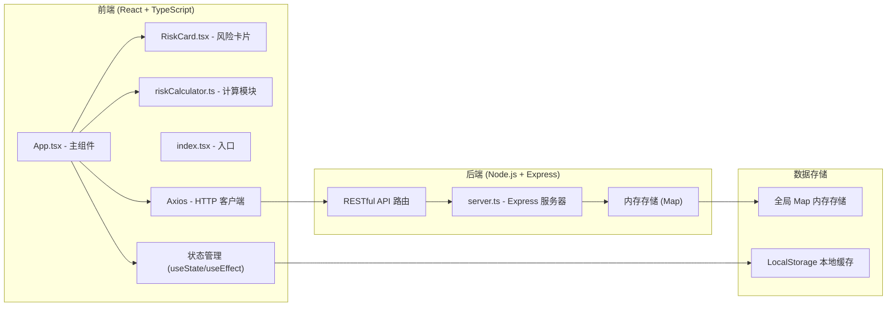
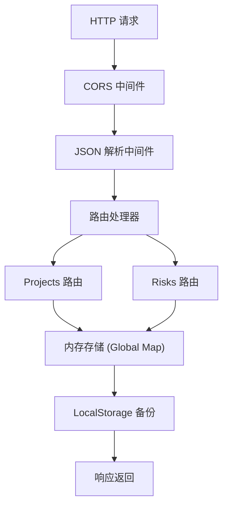
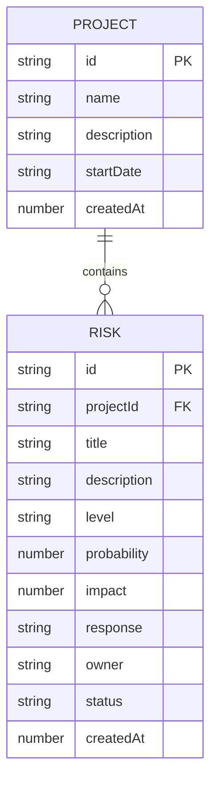

## 1. 架构设计



## 2. 技术描述

- **前端**：React 18 + TypeScript + Vite
- **样式方案**：CSS-in-JS / 内联样式实现动画效果
- **后端**：Express 4.x
- **HTTP 客户端**：Axios
- **唯一 ID**：uuid
- **跨域处理**：cors 中间件
- **数据存储**：后端内存 Map + 浏览器 LocalStorage 模拟持久化

## 3. 项目文件结构

```
├── package.json
├── vite.config.js
├── tsconfig.json
├── index.html
└── src/
    ├── server.ts          # Express 后端服务器
    ├── App.tsx            # React 主组件
    ├── RiskCard.tsx       # 风险卡片组件
    ├── riskCalculator.ts  # 风险计算工具模块
    └── index.tsx          # React 入口
```

## 4. API 定义

### 类型定义
```typescript
interface Project {
  id: string;
  name: string;
  description: string;
  startDate: string;
  createdAt: number;
}

interface Risk {
  id: string;
  projectId: string;
  title: string;
  description: string;
  level: 'high' | 'medium' | 'low';
  probability: number; // 0-100
  impact: number; // 1-5
  response: string;
  owner: string;
  status: 'pending' | 'processing' | 'completed';
  createdAt: number;
}

interface RiskProgress {
  high: { count: number; completed: number; ratio: number };
  medium: { count: number; completed: number; ratio: number };
  low: { count: number; completed: number; ratio: number };
}
```

### RESTful API 端点
| 方法 | 路径 | 用途 | 请求体 | 响应 |
|------|------|------|--------|------|
| GET | `/api/projects` | 获取所有项目 | - | `Project[]` |
| POST | `/api/projects` | 创建新项目 | `{ name, description, startDate }` | `Project` |
| GET | `/api/projects/:id/risks` | 获取项目下所有风险 | - | `Risk[]` |
| POST | `/api/projects/:id/risks` | 为项目添加风险 | `Risk` (不含 id, projectId, status, createdAt) | `Risk` |
| PATCH | `/api/risks/:id/status` | 更新风险状态 | `{ status: 'pending' \| 'processing' \| 'completed' }` | `Risk` |

## 5. 服务器架构



## 6. 数据模型

### 6.1 ER 图


### 6.2 内存数据结构
```typescript
// 全局内存存储
const stores = {
  projects: new Map<string, Project>(),
  risks: new Map<string, Risk>(),
};

// 数据持久化键
const STORAGE_KEY = 'risk-tracker-data';
```

## 7. 核心模块说明

### 7.1 riskCalculator.ts
- **导出函数**：`calculateRiskProgress(risks: Risk[]): RiskProgress`
- **功能**：输入风险列表，按等级分组统计数量和完成比例
- **用途**：供 App.tsx 渲染概览进度环

### 7.2 RiskCard.tsx
- **Props**：`{ risk: Risk, onStatusChange: (id: string, status: Risk['status']) => void }`
- **功能**：渲染风险卡片、状态切换、动画效果
- **动画**：背景色过渡、复选框弹性缩放、卡片悬停效果

### 7.3 App.tsx
- **状态管理**：项目列表、当前项目、风险列表、模态框显示状态
- **副作用**：初始化加载数据、项目切换时加载风险、数据变更时同步到本地缓存
- **布局**：左右分栏、响应式处理

## 8. 性能优化策略

1. **React 优化**：使用 `React.memo` 包裹 RiskCard，避免不必要重渲染
2. **动画优化**：使用 CSS transform 和 opacity 动画，避免触发重排
3. **批量更新**：状态更新合并，减少渲染次数
4. **本地缓存**：使用 LocalStorage 模拟持久化，避免页面刷新数据丢失
5. **帧率控制**：进度环动画使用 `requestAnimationFrame` 确保流畅
