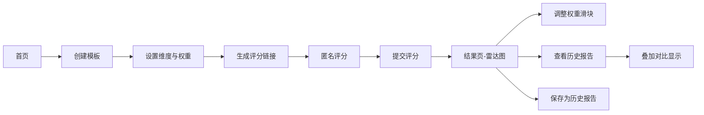

# 敏捷复盘反馈应用 - 产品需求文档

## 1. 产品概述

敏捷复盘反馈应用是一款帮助团队高效进行项目复盘的工具，支持自定义复盘模板、匿名打分和动态权重雷达图报告，解决传统问卷统计滞后、维度权重难以灵活调整的痛点，提升团队复盘效率。

- 核心价值：快速收集成员多维度反馈，实时生成可视化报告，支持权重灵活调整
- 目标用户：敏捷团队、项目管理人员、团队负责人
- 应用场景：Sprint复盘、项目结项复盘、团队效能评估

## 2. 核心功能

### 2.1 用户角色

| 角色 | 使用方式 | 核心权限 |
|------|----------|----------|
| 团队成员 | 通过链接访问 | 匿名提交评分、查看结果 |
| 复盘组织者 | 首页操作 | 创建模板、管理历史报告、查看详细数据 |

### 2.2 功能模块

1. **首页模板列表**：展示所有复盘模板卡片，支持创建新模板、进入评分页、查看历史报告
2. **模板创建**：自定义评分维度（名称、初始权重），支持增删维度
3. **匿名评分表单**：卡片式星标评分，提交后锁定，防止重复提交
4. **雷达图结果页**：实时渲染雷达图，支持权重滑块动态调整，展示平均分
5. **历史报告对比**：查看历史会议数据，支持与当前报告叠加对比，显示差异指标

### 2.3 页面详情

| 页面名称 | 模块名称 | 功能描述 |
|----------|----------|----------|
| 首页 | 模板卡片网格 | 展示所有复盘模板，支持点击进入评分页，悬停动效 |
| 首页 | 创建模板按钮 | 弹出模板创建表单，添加/删除维度，设置初始权重 |
| 评分页 | 维度评分卡片 | 每个维度一张卡片，星标评分器，1-10分 |
| 评分页 | 提交按钮 | 提交评分数据，跳转到结果页 |
| 结果页 | 雷达图区域 | 展示各维度平均分雷达图，动画过渡500ms |
| 结果页 | 权重控制面板 | 右侧滑块调整各维度权重（0.5-2倍），实时更新图表 |
| 结果页 | 历史报告列表 | 可展开的历史条目，点击叠加对比显示 |
| 结果页 | 差异指标展示 | 显示当前与历史报告的关键指标差异 |

## 3. 核心流程

### 3.1 主流程描述

用户在首页创建复盘模板，设置维度和初始权重；团队成员通过链接访问评分页面，匿名对各维度进行星标打分并提交；提交后自动跳转到结果页，实时渲染雷达图，用户可通过滑块调整权重查看不同权重下的结果；同时可查看历史报告并进行叠加对比。

### 3.2 流程图

## 4. 用户界面设计

### 4.1 设计风格

- **主题色彩**：深蓝+青绿渐变主题，主色调 #0a1628（深蓝），辅助色 #10b981（青绿）
- **卡片风格**：半透明磨砂玻璃效果（backdrop-filter: blur），边框微透明白色
- **动效风格**：细腻平滑的过渡动画，悬停微交互，图表缓动过渡
- **字体方向**：现代无衬线字体，标题加粗，正文清晰易读
- **布局风格**：卡片网格布局，响应式适配，小屏两列，大屏四列

### 4.2 页面设计概览

| 页面名称 | 模块名称 | UI元素 |
|----------|----------|--------|
| 首页 | 顶部标题区 | 渐变文字标题，副标题，创建模板按钮 |
| 首页 | 模板卡片网格 | 玻璃态卡片，标题、维度数、创建时间，悬停上移阴影 |
| 模板创建弹窗 | 表单区域 | 维度输入框、权重选择器、添加/删除按钮 |
| 评分页 | 评分卡片组 | 玻璃态卡片网格，维度名、星标评分器（10颗星） |
| 评分页 | 提交区 | 提交按钮，提交成功反馈 |
| 结果页 | 雷达图区域 | 大尺寸雷达图，淡灰网格线，径向渐变背景 |
| 结果页 | 权重滑块区 | 青绿渐变滑轨，气泡数值显示，各维度权重调节 |
| 结果页 | 历史列表 | 可折叠展开的历史条目，高度过渡动画 |

### 4.3 响应式设计

- **设计原则**：桌面端优先，自适应移动端
- **断点设计**：
  - 大屏（≥1280px）：首页卡片4列
  - 中屏（≥768px）：首页卡片3列
  - 小屏（<768px）：首页卡片2列，权重滑块移至下方
- **触控优化**：移动端按钮最小44px点击区域，滑块拖拽区域放大

### 4.4 微交互细节

- **卡片悬停**：0.2s ease-out 上移2px，阴影加深
- **星星评分**：悬停时由灰转金，点击后逐颗高亮（50ms延迟）
- **权重滑块**：拖拽时数值气泡跟随，青绿渐变滑轨
- **历史列表**：展开时高度从0过渡到自适应，平滑动画
- **雷达图**：数据变化时500ms缓动过渡动画
