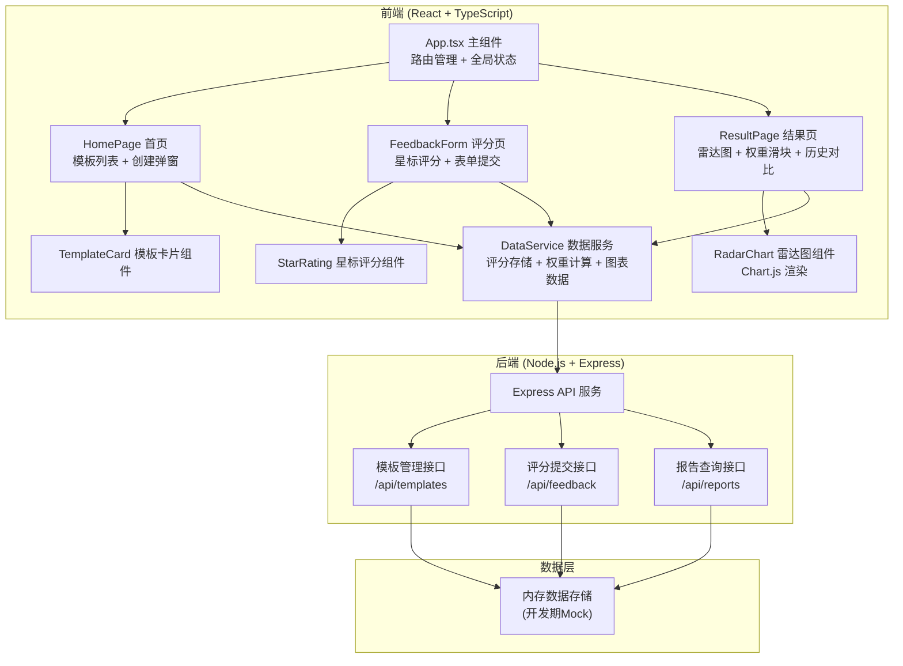
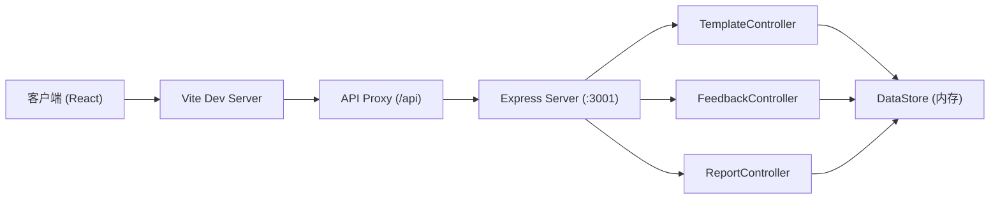
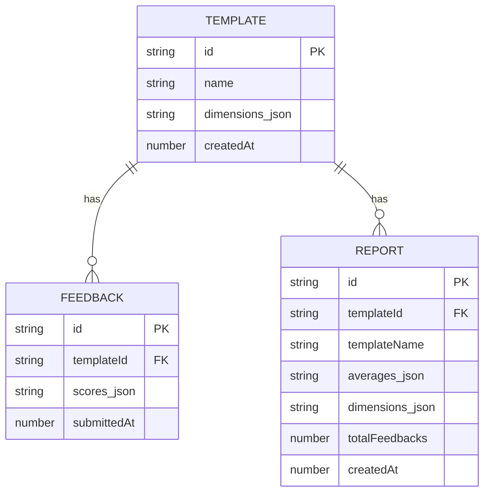

# 敏捷复盘反馈应用 - 技术架构文档

## 1. 架构设计



## 2. 技术栈说明

- **前端框架**：React 18 + TypeScript 5
- **构建工具**：Vite 5 + @vitejs/plugin-react
- **图表库**：Chart.js 4 + react-chartjs-2 5
- **样式方案**：原生 CSS + CSS Variables（渐变主题、玻璃态效果）
- **路由管理**：React Router DOM 6
- **状态管理**：React useState/useEffect + DataService 单例
- **后端框架**：Express 4 + CORS
- **唯一ID生成**：uuid 9
- **开发模式**：前后端分离，Vite 代理 API 请求到 Express

## 3. 路由定义

| 路由路径 | 页面 | 说明 |
|----------|------|------|
| / | 首页 | 模板列表、创建模板入口 |
| /template/:id/feedback | 评分页 | 匿名评分表单 |
| /template/:id/result | 结果页 | 雷达图、权重调整、历史对比 |

## 4. API 接口定义

### 4.1 类型定义

```typescript
// 评分维度
interface Dimension {
  id: string;
  name: string;
  weight: number; // 初始权重 1-5
}

// 复盘模板
interface Template {
  id: string;
  name: string;
  dimensions: Dimension[];
  createdAt: number;
}

// 单条评分记录
interface FeedbackRecord {
  id: string;
  templateId: string;
  scores: Record<string, number>; // dimensionId -> score (1-10)
  submittedAt: number;
}

// 报告数据
interface ReportData {
  templateId: string;
  templateName: string;
  averages: Record<string, number>; // 各维度平均分
  weightedAverages: Record<string, number>; // 加权平均分
  totalFeedbacks: number;
  dimensions: Dimension[];
  createdAt: number;
  id: string;
}
```

### 4.2 接口列表

| 方法 | 路径 | 请求体 | 响应 | 说明 |
|------|------|--------|------|------|
| GET | /api/templates | - | Template[] | 获取所有模板列表 |
| POST | /api/templates | { name, dimensions } | Template | 创建新模板 |
| DELETE | /api/templates/:id | - | { success: boolean } | 删除模板 |
| POST | /api/feedback | { templateId, scores } | FeedbackRecord | 提交评分 |
| GET | /api/templates/:id/result | - | ReportData | 获取模板的报告数据 |
| GET | /api/templates/:id/history | - | ReportData[] | 获取模板的历史报告列表 |
| POST | /api/templates/:id/save-report | - | ReportData | 保存当前为历史报告 |

## 5. 服务器架构



### 5.1 文件结构（后端）

```
api/
  server.ts           # Express 服务器入口
  controllers/
    templateController.ts
    feedbackController.ts
    reportController.ts
  store/
    dataStore.ts      # 内存数据存储
  types/
    index.ts          # 类型定义
```

### 5.2 文件结构（前端）

```
src/
  App.tsx             # 主组件，路由与全局状态
  DataService.ts      # 数据管理模块
  components/
    RadarChart.tsx    # 雷达图组件
    FeedbackForm.tsx  # 评分表单组件
    StarRating.tsx    # 星标评分器
    TemplateCard.tsx  # 模板卡片
    WeightSlider.tsx  # 权重滑块
    HistoryList.tsx   # 历史报告列表
    CreateTemplateModal.tsx
  pages/
    HomePage.tsx
    FeedbackPage.tsx
    ResultPage.tsx
  types/
    index.ts
  utils/
    calculator.ts     # 权重计算工具
```

## 6. 数据模型

### 6.1 ER 图



### 6.2 数据流向说明

1. **模板创建**：用户在首页填写模板信息 → App调用DataService → DataService发送POST /api/templates → 后端存储 → 返回数据并更新前端状态

2. **评分提交**：用户在评分页填写分数 → FeedbackForm调用DataService.submitFeedback() → 发送POST /api/feedback → 后端存储评分记录 → 返回成功 → 跳转结果页

3. **雷达图数据**：ResultPage加载时 → DataService获取报告数据 → 计算加权平均分 → 传递给RadarChart组件 → Chart.js渲染

4. **权重调整**：用户拖动权重滑块 → 更新本地权重倍率 → DataService实时重新计算加权分数 → RadarChart重新渲染（200ms内响应）

5. **历史对比**：用户点击历史报告 → DataService加载历史数据 → RadarChart叠加显示两条数据集 → 计算并展示差异指标

## 7. 性能优化策略

- **雷达图优化**：使用Chart.js动画配置，数据更新时仅重绘不重建实例
- **表单性能**：评分状态使用React useState局部管理，避免全局重渲染
- **列表渲染**：模板列表使用React.memo优化，10个模板渲染控制在100ms内
- **防抖处理**：权重滑块使用防抖（50ms），避免频繁计算和渲染
- **页面切换**：使用React Router的导航，预加载结果页组件，控制跳转在300ms内
