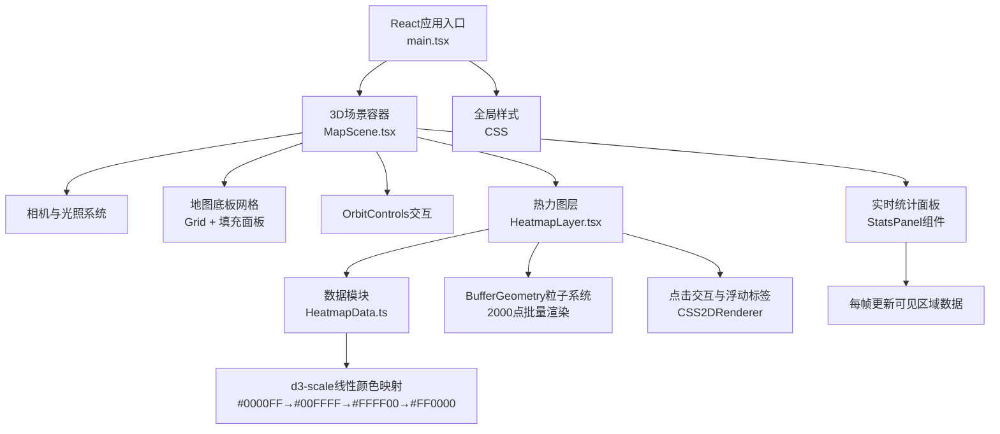

## 1. 架构设计
纯前端3D可视化应用，无后端服务。采用React + TypeScript + Vite为基础栈，配合React Three Fiber生态进行3D场景渲染。



## 2. 技术说明
- **前端框架**：React@18 + TypeScript@5 + Vite@5
- **3D渲染**：three@0.160 + @react-three/fiber@8 + @react-three/drei@9
- **颜色映射**：d3-scale@4 多段线性渐变
- **构建工具**：Vite@5，配置@vitejs/plugin-react
- **路径别名**：@ 映射到 ./src

## 3. 路由定义
单页面应用，无路由系统。

## 4. 数据模型

### 4.1 密度采样点类型
```typescript
interface DensityPoint {
  x: number;      // X坐标，范围 -25 ~ 25
  y: number;      // Y坐标（3D场景Z轴），范围 -25 ~ 25
  density: number; // 密度值，范围 0 ~ 100
}
```

### 4.2 统计数据类型
```typescript
interface DensityStats {
  average: number;
  maximum: number;
  minimum: number;
  count: number;
}
```

## 5. 性能优化方案

### 5.1 粒子渲染性能
- **BufferGeometry批量绘制**：所有粒子共享同一个BufferGeometry，通过attributes存储position、color、size，一次性提交GPU
- **InstancedMesh备选**：使用THREE.InstancedMesh实现硬件实例化，2000粒子绘制调用降为1次
- **ShaderMaterial自定义渲染**：顶点着色器传递size/color，片元着色器计算径向渐变与呼吸光晕

### 5.2 动画性能
- 呼吸动画通过uniform time变量在shader中计算，避免JS层遍历2000个粒子
- 统计数据计算使用视锥体剔除（Frustum Culling），仅处理可见粒子
- 使用useFrame钩子但避免每帧创建新对象，对象池复用

### 5.3 内存管理
- 复用TypedArray，避免频繁GC
- 事件监听及时清理，useEffect返回销毁函数

## 6. 核心模块说明

| 模块 | 文件 | 职责 |
|------|------|------|
| 应用入口 | src/main.tsx | React DOM挂载，全局样式 |
| 场景组件 | src/MapScene.tsx | Canvas、相机、光照、底板、控制器、图层组合 |
| 数据模块 | src/HeatmapData.ts | 生成2000个模拟密度点，坐标映射 |
| 热力图层 | src/HeatmapLayer.tsx | 粒子渲染、颜色映射、点击交互、光晕动画 |
| 统计面板 | 内嵌于MapScene | 右下角实时密度统计，每帧更新 |

## 7. 文件结构
```
auto160/
├── package.json
├── index.html
├── tsconfig.json
├── vite.config.js
└── src/
    ├── main.tsx
    ├── MapScene.tsx
    ├── HeatmapData.ts
    └── HeatmapLayer.tsx
```
