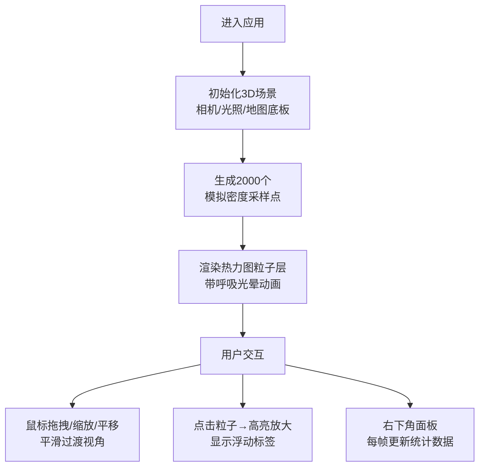

## 1. 产品概述
3D地理数据热力图可视化应用，用于展示城市内不同区域的实时人口密度分布。通过交互式3D场景，让用户直观感知城市各区域的人口聚集情况，支持视角自由切换与数据点详情查看。

- 主要用途：城市人口密度分布的可视化分析与展示
- 目标用户：城市规划人员、数据分析师、科研人员、公众信息查询者
- 产品价值：将抽象的密度数据转化为直观可交互的3D视觉信息，提升数据理解效率

## 2. 核心特性

### 2.1 功能模块
1. **3D地图场景**：方格网格模拟城市街区底板，支持交互式视角控制
2. **热力图粒子系统**：2000个径向渐变粒子群，颜色/大小映射密度值
3. **粒子交互**：点击粒子高亮放大并显示浮动标签
4. **实时统计面板**：可见区域内密度统计（平均/最大/最小值）

### 2.2 页面详情
| 页面名称 | 模块名称 | 功能描述 |
|-----------|-------------|---------------------|
| 主页面 | 3D地图底板 | 50x50单位范围，每格2单位，颜色#1A1A2E，半透明白色网格线 |
| 主页面 | 热力图粒子层 | 2000个粒子，颜色蓝→青→黄→红渐变，大小0.5~2单位，呼吸光晕动画 |
| 主页面 | 相机控制系统 | OrbitControls，左键旋转、滚轮缩放、右键平移，0.3秒平滑过渡 |
| 主页面 | 粒子点击交互 | 高亮放大1.5倍，浮动标签显示密度值与坐标，2秒后消失 |
| 主页面 | 密度统计面板 | 右下角固定定位，每帧更新可见区域平均/最大/最小密度值 |

## 3. 核心流程
用户打开应用后，默认加载城市中心区域地图与热力粒子。通过鼠标拖拽旋转视角、滚轮缩放、右键平移浏览场景。点击任意粒子查看详细信息，右下角面板实时展示当前视角下的统计数据。

## 4. 用户界面设计

### 4.1 设计风格
- **主背景色**：深空色 #0B0C10
- **地图底板色**：#1A1A2E，网格线浅蓝灰 #8892B0
- **粒子渐变色**：蓝色#0000FF → 青色#00FFFF → 黄色#FFFF00 → 红色#FF0000
- **统计面板**：背景#0F172A透明度0.8，发光边框box-shadow 0 0 10px #6366F1，圆角12px
- **浮动标签**：白色字体#FFFFFF，半透明黑背景#00000080，圆角8px
- **设计理念**：深空科技风，高对比度粒子系统，微弱发光效果营造科技感

### 4.2 页面设计概述
| 页面名称 | 模块名称 | UI元素 |
|-----------|-------------|-------------|
| 主页面 | 全局布局 | 全屏Canvas渲染容器，深空背景色 |
| 主页面 | 3D场景 | 俯角45度初始视角，距离50单位，网格底板居中 |
| 主页面 | 粒子系统 | 径向渐变球体，半透明光晕从中心0.6到边缘0线性衰减 |
| 主页面 | 统计面板 | 右下角固定260px宽，三项统计指标卡片式布局 |
| 主页面 | 浮动标签 | CSS2DRenderer叠加，跟随粒子位置，2秒自动消失 |

### 4.3 响应性
- 桌面端优先，Canvas自适应窗口大小
- 统计面板固定定位不随窗口缩放改变相对位置
- 交互方式针对鼠标操作优化

### 4.4 3D场景指南
- **环境**：深空背景，无HDRI，深色基调营造聚焦效果
- **光照**：环境光+方向光组合，保证粒子与底板有足够对比度
- **相机设置**：PerspectiveCamera，初始位置俯角45度，距离50，OrbitControls.enableDamping=true，dampingFactor=0.05
- **构图**：地图底板居中，粒子群在底板范围内分布，视觉重心在场景中心
- **交互动画**：相机操作0.3秒平滑过渡，粒子持续呼吸光晕动画，点击粒子1.5倍放大高亮
- **性能预算**：2000粒子通过BufferGeometry批量渲染，目标帧率≥55FPS
