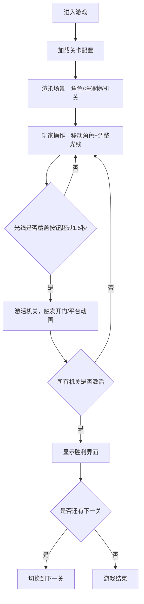

## 1. 产品概述
本项目是一款以光与影为核心玩法的2D解谜游戏，玩家操纵手持手电筒的角色，通过调整光线角度和位置照亮机关按钮来解锁关卡。
- 目标用户：独立游戏爱好者、解谜游戏玩家
- 核心价值：利用光影物理机制创造独特的解谜体验，考验玩家的空间思维和精确操作能力

## 2. 核心功能

### 2.1 功能模块
1. **游戏主界面**：Canvas游戏画布、HUD信息层、操作提示
2. **角色控制系统**：角色移动、手电筒角度调整、拖尾粒子效果
3. **光影渲染系统**：锥形光束、障碍物阴影实时计算、羽化边缘效果
4. **机关交互系统**：按钮检测、门/平台动画、关卡胜利判定
5. **电量管理系统**：电量消耗、低电闪烁、电量补给包
6. **关卡系统**：3个递增难度关卡、关卡切换过渡、胜利界面
7. **后端数据服务**：关卡配置API、通关记录存储、最快时间查询

### 2.2 页面详情
| 页面名称 | 模块名称 | 功能描述 |
|-----------|-------------|---------------------|
| 游戏主界面 | Canvas渲染层 | 使用Konva绘制角色、光线、障碍物、机关、阴影 |
| 游戏主界面 | HUD信息层 | 显示当前关卡、电量条、最快通关时间 |
| 游戏主界面 | 操作提示层 | 左下角显示鼠标/键盘操作提示图标和文字 |
| 胜利界面 | 通关弹窗 | 显示关卡通过文字、下一关按钮，带缩放切入动画 |

## 3. 核心流程
玩家进入游戏 → 角色位于关卡起点 → 使用鼠标拖拽移动角色，滚轮/Q/E调整手电筒角度 → 光线照亮机关按钮超过1.5秒触发机关 → 所有机关激活后出现出口或开启门 → 到达出口进入胜利界面 → 点击下一关或游戏结束

## 4. 用户界面设计
### 4.1 设计风格
- **主色调**：深灰背景#1A1A2E，金色角色#FFD700，白色光线#FFFED4，亮灰障碍物#AAAAAA，暗红机关#8B0000，亮绿激活#00FF00
- **字体**：Press Start 2P像素感字体（Google Fonts加载）
- **特效**：发光边缘drop-shadow、暗角径向渐变、屏幕震动、淡入淡出过渡
- **布局**：Canvas全屏居中，HUD固定在左上角，操作提示固定左下角

### 4.2 页面设计概述
| 页面名称 | 模块名称 | UI元素 |
|-----------|-------------|-------------|
| 游戏主界面 | Canvas层 | 深灰背景、暗角渐变、发光角色、锥形光束、羽化边缘、实时阴影、脉动机关按钮 |
| 游戏主界面 | HUD层 | 关卡编号（白色18px）、电量条（宽150px高10px，绿到红渐变，0.3秒过渡）、本关最快时间 |
| 游戏主界面 | 操作提示 | SVG鼠标/键盘图标，12px灰色#AAAAAA文字 |
| 胜利界面 | 弹窗 | 半透明黑色背景、绿色#22C55E文字"关卡通过"（0.5秒缩放切入）、下一关按钮 |

### 4.3 响应式
- 桌面优先设计，游戏Canvas始终占满视口
- 视口宽度低于768px时，UI元素缩小为80%并改为垂直排列

## 5. 性能要求
- 光影渲染帧率不低于30fps（单帧≤33ms）
- 5个障碍物场景无明显卡顿
- 操作响应延迟≤100ms
