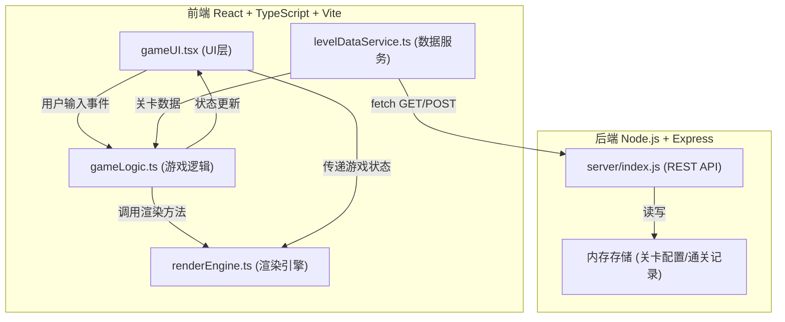
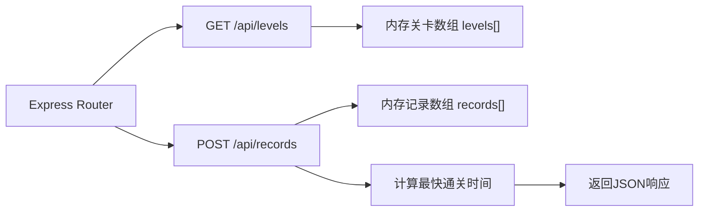

## 1. 架构设计



## 2. 技术描述
- **前端**：React@18 + TypeScript@5 + Vite@5 + react-konva@18 + konva@9 + uuid@9
- **构建工具**：Vite，开发端口5173
- **后端**：Express@4 + cors@2，内存存储
- **状态管理**：React useState/useRef + 自定义Hook
- **渲染**：Konva 2D Canvas库，支持高性能图形绘制和动画

## 3. 目录结构与文件职责
```
project-root/
├── package.json              # 项目依赖与脚本配置
├── vite.config.js            # Vite配置（React插件，端口5173）
├── tsconfig.json             # TypeScript配置（严格模式，ESNext）
├── index.html                # 全屏入口HTML
├── server/
│   └── index.js              # Express后端，RESTful API
└── src/
    ├── renderEngine.ts       # 光影渲染引擎（Konva绘制、光锥计算、阴影生成）
    ├── levelDataService.ts   # 关卡数据服务（前后端通信）
    ├── gameLogic.ts          # 游戏逻辑（机关检测、输入处理、状态管理）
    ├── gameUI.tsx            # React UI组件（HUD、胜利界面、电量条）
    └── main.tsx              # React入口
```

### 文件调用关系与数据流向：
1. **gameUI.tsx** → 监听用户鼠标/键盘输入 → 传递事件给 **gameLogic.ts**
2. **gameLogic.ts** → 更新玩家位置/手电筒角度 → 调用 **renderEngine.ts** 重绘
3. **gameLogic.ts** → 检测光锥与机关覆盖 → 更新机关状态 → 通知 **gameUI.ts** 更新HUD
4. **levelDataService.ts** → 从 **server/index.js** GET获取关卡配置 → 传递给 **gameLogic.ts**
5. **gameLogic.ts** → 通关后 → 调用 **levelDataService.ts** POST记录 → **server/index.js** 存储并返回最快时间 → **gameUI.tsx** 显示

## 4. API定义

### GET /api/levels
返回所有关卡配置数组。

**响应示例：**
```typescript
interface Level {
  id: number;
  playerStart: { x: number; y: number };
  obstacles: Obstacle[];
  buttons: Button[];
  doors?: Door[];
  platforms?: Platform[];
  exit: { x: number; y: number; width: number; height: number };
}

interface Obstacle {
  id: string;
  type: 'rect' | 'triangle' | 'polygon';
  x: number; y: number;
  width?: number; height?: number;
  points?: number[];
}

interface Button {
  id: string;
  x: number; y: number;
  radius: number;
  activated: boolean;
  triggerDoorId?: string;
  triggerPlatformId?: string;
}
```

### POST /api/records
保存玩家通关记录，返回该关卡最快通关时间。

**请求体：**
```typescript
interface Record {
  playerId: string;        // UUID
  levelId: number;
  duration: number;        // 通关用时（秒）
  timestamp: number;
}
```

**响应：**
```typescript
interface RecordResponse {
  success: boolean;
  fastestTime: number;     // 该关卡最快时间（秒）
}
```

## 5. 后端服务架构



## 6. 核心数据模型

### 6.1 游戏状态
```typescript
interface GameState {
  currentLevel: number;
  player: {
    x: number;
    y: number;
    targetX: number;
    targetY: number;
    radius: number;
  };
  flashlight: {
    angle: number;           // 角度制
    targetAngle: number;
    range: number;           // 300px
    coneAngle: number;       // 60度
    battery: number;         // 0-100
    isFlickering: boolean;
  };
  buttons: ButtonState[];
  doors: DoorState[];
  platforms: PlatformState[];
  particles: Particle[];
  batteryPacks: BatteryPack[];
  levelStartTime: number;
  fastestTime: number | null;
  isLevelComplete: boolean;
  isTransitioning: boolean;
}
```

### 6.2 光影计算核心接口
```typescript
// renderEngine.ts
interface LightCone {
  origin: { x: number; y: number };
  angle: number;
  halfConeAngle: number;
  range: number;
}

interface ShadowPolygon {
  points: number[];  // [x1,y1,x2,y2,...]
}

// 计算光锥与障碍物产生的阴影区域
function computeShadows(light: LightCone, obstacles: Obstacle[]): ShadowPolygon[];

// 检测点是否在光锥中心区域（30度内）且不在阴影中
function isPointInActiveLight(
  point: { x: number; y: number },
  light: LightCone,
  shadows: ShadowPolygon[]
): boolean;
```
