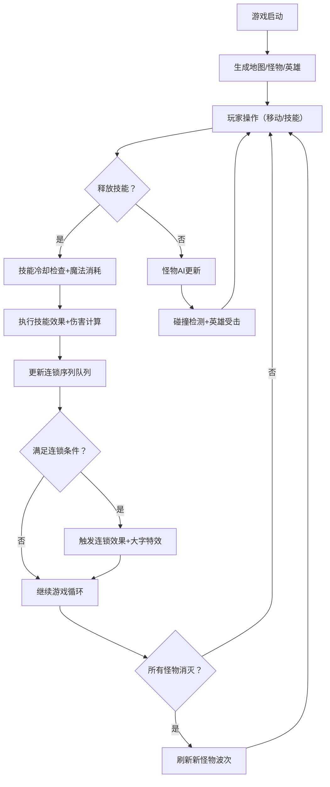

## 1. 产品概述

像素风格Roguelike实时技能冷却与连锁反应模拟应用，让玩家以俯视视角控制像素英雄，使用四个主动技能战斗并探索技能连锁系统。

- 主要目的：提供一个即时战斗体验的像素风格小游戏，核心玩法围绕技能释放、冷却管理和连锁反应组合
- 目标用户：像素游戏爱好者、Roguelike玩家、对技能系统和连锁机制感兴趣的玩家
- 产品价值：通过可视化的冷却条、华丽的连锁特效和深度的技能组合系统，提供沉浸式的战斗体验

## 2. 核心功能

### 2.1 功能模块

1. **游戏主场景**：45x45像素网格俯视地图，随机生成障碍物和怪物，英雄移动控制
2. **技能系统**：四个主动技能（火球术、冰冻术、闪电链、暗影爆发），独立冷却条和圆形冷却进度动画
3. **连锁反应系统**：检测技能释放顺序，触发"元素连击"和"暗影灼烧"两大连锁效果，含屏幕大字特效
4. **战斗系统**：英雄与怪物碰撞检测、伤害计算、技能命中判定、受击动画
5. **怪物AI系统**：漫游/追击/攻击三状态切换，减速和眩晕状态效果
6. **资源系统**：英雄血量条、魔法值条及自动回复机制
7. **UI界面**：左侧技能面板、右上角连锁序列进度、右下角杀敌计数

### 2.2 功能细节

| 页面/模块 | 子模块 | 功能描述 |
|-----------|--------|----------|
| 游戏主场景 | 地图生成 | 45x45网格，随机灰色障碍物砖块，支持碰撞检测 |
| 游戏主场景 | 英雄控制 | 方向键移动（16像素/帧），遇怪物/障碍物停止 |
| 游戏主场景 | 怪物系统 | 5-8个8x8像素怪物，红蓝配色，随机生成与重生 |
| 技能系统 | 火球术(1) | 冷却3秒，伤害20，消耗魔法值 |
| 技能系统 | 冰冻术(2) | 冷却5秒，伤害15，减速50%持续2秒 |
| 技能系统 | 闪电链(3) | 冷却7秒，伤害30，弹射2个附近目标 |
| 技能系统 | 暗影爆发(4) | 冷却10秒，伤害50，3x3范围AOE |
| 连锁系统 | 元素连击 | 1→2→3顺序触发，全体40伤害+眩晕3秒，冷却15秒 |
| 连锁系统 | 暗影灼烧 | 4→1→4顺序触发，全屏20/秒持续伤害5秒，冷却15秒 |
| UI系统 | 技能面板 | 左侧200px深色半透明面板，4个80x80技能按钮竖排 |
| UI系统 | 连锁进度 | 右上角4槽位序列，金色填充，3秒超时清空 |
| UI系统 | 状态显示 | 顶部血量(红渐变200px)、魔法(蓝渐变)、右下杀敌数(脉冲动画) |
| 特效系统 | 连锁特效 | 金色文字缩放+光晕+1.5秒消失 |
| 特效系统 | 受击动画 | 白色闪烁0.1秒 |
| 特效系统 | 冷却动画 | 圆形扫掠进度条 |

## 3. 核心流程

### 主游戏流程
玩家进入游戏后，控制像素英雄在俯视地图中移动。通过数字键1-4释放技能攻击怪物，系统实时检测技能释放顺序。当满足连锁条件时触发连锁特效和额外效果。怪物根据与英雄距离切换漫游、追击和攻击状态。所有怪物消灭后自动刷新新一波怪物。

## 4. 用户界面设计

### 4.1 设计风格
- **主色调**：深色背景 #0A0A14，技能主题色（火球红#FF4444、冰冻蓝#44AAFF、闪电黄#FFDD44、暗影紫#8844FF）
- **点缀色**：连锁金#FFD700、血量红渐变、魔法蓝渐变
- **字体**：像素风格等宽字体（Press Start 2P 或类似字体），搭配现代无衬线字体作为辅助
- **按钮风格**：方形80x80像素块，渐变背景，带像素边框质感
- **布局风格**：Canvas居中全屏，左侧固定技能面板，顶部状态栏，右上角连锁槽，右下角计数
- **整体感觉**：复古像素+现代霓虹发光效果，深色赛博地牢氛围

### 4.2 页面设计

| 模块 | 元素 | 设计细节 |
|------|------|----------|
| Canvas主画布 | 地图渲染 | 45x45网格，深色地板+灰色障碍物砖 |
| Canvas主画布 | 英雄精灵 | 16x16像素，绿金配色，朝向指示 |
| Canvas主画布 | 怪物精灵 | 8x8像素，红蓝相间，简单像素眼睛 |
| Canvas主画布 | 技能特效 | 粒子效果、AOE范围指示圈、弹道轨迹 |
| 左侧技能面板 | 技能按钮 | 80x80带技能主题色背景，名称文字居中，冷却扫掠遮罩 |
| 顶部状态栏 | 血量条 | 200px红色渐变背景+白色边框+数值 |
| 顶部状态栏 | 魔法条 | 200px蓝色渐变背景+白色边框+数值 |
| 右上角连锁区 | 序列槽 | 四个方形槽位，金色#FFD700填充，未激活为灰色描边 |
| 右下计数区 | 杀敌数 | 白色粗体数字+脉冲缩放动画 |
| 屏幕中央 | 连锁特效 | 金色大字缩放+光晕扩散+1.5秒淡出 |

### 4.3 响应式
- 桌面端优先设计
- Canvas容器自适应屏幕尺寸，保持像素清晰度
- 技能面板固定宽度200px不随窗口缩放
- 状态条等UI元素使用固定像素尺寸

### 4.4 性能优化
- Canvas渲染锁定60FPS
- 游戏逻辑每帧更新控制在8ms内
- 碰撞检测使用空间哈希（Spatial Hash）优化
- 技能连锁检测使用滑动窗口队列
- 对象池复用粒子和特效对象
