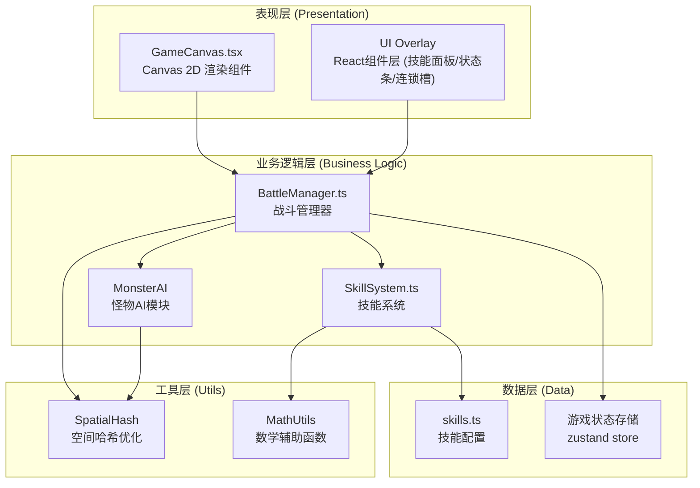

## 1. 架构设计



## 2. 技术选型

- **前端框架**：React 18 + TypeScript 5
- **构建工具**：Vite 5 + @vitejs/plugin-react
- **渲染引擎**：Canvas 2D API
- **状态管理**：React Hooks (useRef/useState/useEffect) + 自定义GameLoop
- **字体方案**：Google Fonts - Press Start 2P (像素字体)

## 3. 项目文件结构

```
d:\Pro\tasks\auto167\
├── package.json                     # 依赖配置
├── index.html                       # HTML入口，含全屏Canvas容器
├── tsconfig.json                    # TypeScript严格模式配置
├── vite.config.ts                   # Vite React构建配置
└── src/
    ├── main.tsx                     # React入口，挂载主组件
    ├── components/
    │   └── GameCanvas.tsx           # Canvas渲染主组件(60FPS游戏循环)
    ├── core/
    │   ├── SkillSystem.ts           # 技能冷却+连锁检测模块
    │   └── BattleManager.ts         # 战斗逻辑+碰撞检测模块
    ├── config/
    │   └── skills.ts                # 技能配置数据定义
    └── types/
        └── game.ts                  # 全局类型定义(可选内联)
```

## 4. 核心模块设计

### 4.1 数据模型定义

```typescript
// ============ 实体类型 ============
interface Vec2 { x: number; y: number }

interface Hero {
  pos: Vec2;
  hp: number;
  maxHp: number;
  mp: number;
  maxMp: number;
  speed: number;      // 16 px/frame
  facing: Vec2;
  invincibleTimer: number;
}

interface Monster {
  id: string;
  pos: Vec2;
  hp: number;
  maxHp: number;
  speed: number;      // 英雄速度的70%
  state: 'wander' | 'chase' | 'attack';
  wanderDir: Vec2;
  wanderTimer: number;
  attackCooldown: number;
  hitFlashTimer: number;
  slowTimer: number;          // 冰冻减速剩余时间
  slowFactor: number;         // 减速比例 0.5 = 50%
  stunTimer: number;          // 眩晕剩余时间
  burnDps: number;            // 灼烧每秒伤害
  burnTimer: number;          // 灼烧剩余时间
}

type TileType = 'floor' | 'wall';
type GameMap = TileType[][];  // 45x45

// ============ 技能类型 ============
interface SkillConfig {
  id: 1 | 2 | 3 | 4;
  name: string;
  cooldown: number;       // 秒
  baseDamage: number;
  manaCost: number;
  range: number;          // 像素
  color: string;
  description: string;
  effect: SkillEffect;
}

type SkillEffect =
  | { type: 'projectile'; speed: number; size: number }                    // 火球
  | { type: 'aoe_cone'; radius: number; slowDuration: number; slowPct: number }  // 冰冻
  | { type: 'chain'; bounceCount: number; bounceRange: number }             // 闪电链
  | { type: 'aoe_3x3'; tileRadius: number };                                // 暗影爆发

interface SkillCooldownState {
  skillId: number;
  currentCooldown: number;  // 当前剩余冷却秒
  totalCooldown: number;    // 总冷却秒
  isReady: boolean;
}

// ============ 连锁类型 ============
interface ComboConfig {
  id: string;
  name: string;               // "元素连击" / "暗影灼烧"
  sequence: number[];         // [1,2,3] / [4,1,4]
  cooldown: number;           // 15秒
  effect: ComboEffect;
}

type ComboEffect =
  | { type: 'elemental_combo'; extraDamage: number; stunDuration: number }
  | { type: 'shadow_burn'; dps: number; duration: number };

interface ComboState {
  comboId: string;
  currentCooldown: number;
  isAvailable: boolean;
}

// ============ 特效类型 ============
interface FloatingText {
  id: string;
  text: string;
  pos: Vec2;
  color: string;
  life: number;
  maxLife: number;
  scale: number;
}

interface ChainTextEffect {
  text: string;
  life: number;
  maxLife: number;
  scale: number;
  glow: number;
}

interface Projectile {
  id: string;
  pos: Vec2;
  vel: Vec2;
  damage: number;
  color: string;
  size: number;
  life: number;
  skillId: number;
}
```

### 4.2 SkillSystem 模块接口

```typescript
class SkillSystem {
  // 技能冷却状态
  private cooldowns: Map<number, SkillCooldownState>;
  // 连锁冷却状态
  private comboCooldowns: Map<string, ComboState>;
  // 技能释放序列队列（带时间戳）
  private skillSequence: { skillId: number; timestamp: number }[];
  // 序列超时窗口
  private readonly SEQUENCE_WINDOW = 3000; // ms

  constructor(skills: SkillConfig[], combos: ComboConfig[]);

  // 每帧更新冷却
  update(deltaTime: number): void;

  // 尝试释放技能，返回是否成功
  tryCastSkill(skillId: number, currentMp: number): {
    success: boolean;
    manaCost: number;
    skill: SkillConfig | null;
  };

  // 登记技能释放（用于连锁检测），返回触发的连锁
  registerSkillCast(skillId: number): ComboConfig | null;

  // 获取冷却进度 0~1
  getCooldownProgress(skillId: number): number;

  // 获取技能是否就绪
  isSkillReady(skillId: number): boolean;

  // 获取当前连锁序列（最近4个技能ID，含超时检查）
  getCurrentSequence(): number[];

  // 获取连锁可用状态
  isComboAvailable(comboId: string): boolean;

  // 获取连锁冷却进度
  getComboCooldownProgress(comboId: string): number;
}
```

### 4.3 BattleManager 模块接口

```typescript
class BattleManager {
  private skillSystem: SkillSystem;
  private spatialHash: SpatialHash;
  private hero: Hero;
  private monsters: Monster[];
  private map: GameMap;
  private projectiles: Projectile[];
  private floatingTexts: FloatingText[];
  private chainTextEffect: ChainTextEffect | null;
  private killCount: number;
  private mpRegenTimer: number;

  constructor();

  // 每帧更新
  update(deltaTime: number, input: InputState): void;

  // 渲染到Canvas
  render(ctx: CanvasRenderingContext2D): void;

  // 生成新地图
  generateMap(): void;

  // 生成怪物
  spawnMonsters(count: number): void;

  // 碰撞检测：英雄位置是否合法
  canHeroMoveTo(pos: Vec2): boolean;

  // 处理技能释放
  private handleSkillCast(skillId: number): void;

  // 执行技能效果
  private applySkillEffect(skill: SkillConfig, origin: Vec2): void;

  // 对单体造成伤害
  private damageMonster(monster: Monster, damage: number, effectText?: string): void;

  // 触发连锁效果
  private triggerCombo(combo: ComboConfig): void;

  // 空间哈希查询半径内的怪物
  private queryMonstersInRadius(pos: Vec2, radius: number): Monster[];

  // 获取UI状态（供React组件消费）
  getUIState(): UIState;
}
```

## 5. 性能优化方案

### 5.1 空间哈希 (SpatialHash)
用于加速碰撞检测和范围查询：
- 单元格大小：45px（1格）
- 插入：英雄、怪物、弹道
- 查询：O(k) 复杂度，k为命中单元格数量
- 每帧重建索引

### 5.2 Canvas渲染优化
- 离屏Canvas预渲染地图瓦片
- 只渲染视口内元素
- 批量绘制同色像素（减少fillStyle切换）
- 使用整数坐标避免抗锯齿开销

### 5.3 游戏循环
- 使用 requestAnimationFrame + deltaTime
- 固定逻辑步长：60FPS / 16.67ms
- 渲染与逻辑分离，支持逻辑跳帧

## 6. 关键算法

### 6.1 连锁序列检测算法
滑动窗口匹配，允许穿插：
```
1. 每次释放技能，将 (skillId, timestamp) 加入序列队列
2. 清理超过3秒的过期记录
3. 对每个连锁配置的目标序列 [s1,s2,s3]：
   - 在队列中找第一个s1，其后找s2，其后找s3
   - 全部找到且总间隔≤3秒 → 触发连锁
   - 触发后将匹配到的三个记录标记为已消费（避免重复匹配）
4. 连锁自身有15秒独立冷却
```

### 6.2 闪电链弹射算法
最近邻贪心选择：
```
1. 找到范围内最近的怪物作为目标1，造成伤害
2. 从目标1出发，找范围内（未被命中的）最近怪物→目标2
3. 从目标2出发，同理→目标3（bounceCount=2: 初始+2弹射=3目标）
4. 绘制折线特效
```
