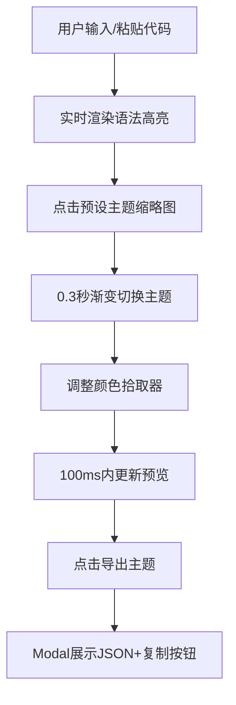

## 1. 产品概述

代码高亮主题预览与定制工具，帮助博客写作者在撰写技术文章时直观对比多种语法高亮配色方案，并快速自定义代码块样式。解决写作时无法预览代码高亮效果、手动调整配色效率低的痛点，提升技术博客的排版质量和创作效率。

## 2. 核心功能

### 2.1 用户角色
无需登录，所有用户均可使用全部功能。

### 2.2 功能模块
1. **代码编辑区**：支持输入/粘贴代码片段，实时预览语法高亮效果
2. **主题切换区**：6款预设主题缩略图，点击即时切换预览
3. **自定义配色面板**：调整关键字、字符串、注释、背景色
4. **主题导出功能**：导出当前配色为JSON格式，支持一键复制

### 2.3 页面详情
| 页面名称 | 模块名称 | 功能描述 |
|-----------|-------------|---------------------|
| 主页面 | 代码编辑区 | textarea模拟编辑器，#1E1E2E背景，Cascadia Code 14px等宽字体，默认提供HTML/CSS/JS混合示例代码 |
| 主页面 | 主题缩略图栏 | 6个48x32px主题按钮，展示当前主题背景和关键字色，2px圆角边框，选中时2px#6366F1描边+scale 1.05放大 |
| 主页面 | 预览渲染区 | 实时渲染语法高亮代码块，0.3秒渐变动画切换主题 |
| 主页面 | 自定义配色面板 | 4个圆形颜色拾取器（32px直径），hover放大1.15倍，调整即时更新预览 |
| 主页面 | 导出主题弹窗 | Modal展示格式化JSON，附带复制按钮 |

## 3. 核心流程

用户输入代码 → 选择预设主题或自定义配色 → 实时预览高亮效果 → 满意后导出主题JSON → 应用到博客系统

## 4. 用户界面设计

### 4.1 设计风格
- **主色调**：#6366F1（靛蓝）作为交互强调色
- **背景色**：#F8FAFC（浅灰白）整体背景
- **卡片风格**：圆角12px，box-shadow: 0 1px 3px rgba(0,0,0,0.1)
- **字体**：等宽字体Cascadia Code用于代码区域，界面文本使用现代无衬线字体
- **动画**：0.2-0.3秒平滑过渡，micro-interaction精致细腻

### 4.2 页面设计概述
| 页面名称 | 模块名称 | UI Elements |
|-----------|-------------|-------------|
| 主页面 | 整体布局 | 左右两栏（左45%/右55%），窄屏上下堆叠，最大宽度约束 |
| 主页面 | 代码编辑区 | #1E1E2E深色背景，14px等宽字体，内边距16px，滚动条美化 |
| 主页面 | 主题缩略图 | 横向滚动容器，48x32px按钮，间距8px，选中态描边+缩放 |
| 主页面 | 颜色拾取器 | 圆形32px，无边框，hover放大1.15倍+亮度提升 |
| 主页面 | Modal弹窗 | 半透明遮罩，居中卡片，JSON代码块等宽字体显示 |

### 4.3 响应式
- 桌面端（≥1024px）：左右两栏布局，左45%右55%
- 平板端（768-1023px）：保持两栏，调整比例为50%/50%
- 移动端（360-767px）：上下堆叠，编辑器在上预览在下，全宽显示
- 触控优化：按钮最小点击区域44x44px，颜色拾取器增大触控热区

### 4.4 性能指标
- 主题切换渲染：≤50ms
- 自定义颜色更新：≤100ms
- 首屏加载：无明显卡顿
