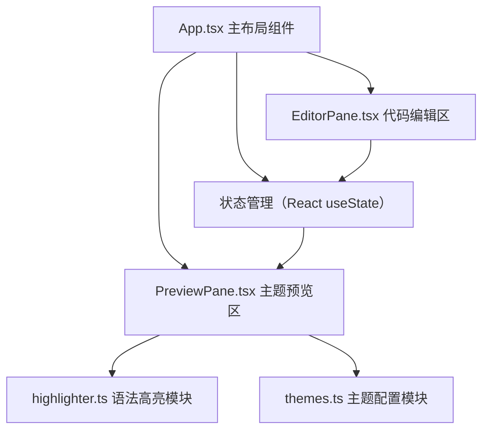

## 1. 架构设计



## 2. 技术描述

- **前端框架**：React 18 + TypeScript
- **构建工具**：Vite 5 + @vitejs/plugin-react
- **语法高亮**：自定义正则匹配实现轻量级高亮器，无需第三方库
- **样式方案**：CSS Modules + CSS Variables 实现主题切换动画
- **状态管理**：React Hooks (useState, useEffect, useCallback) 本地状态管理

## 3. 目录结构

```
auto168/
├── package.json
├── index.html
├── tsconfig.json
├── vite.config.js
├── src/
│   ├── App.tsx          # 主布局组件，管理全局状态
│   ├── EditorPane.tsx   # 左侧代码输入区
│   ├── PreviewPane.tsx  # 右侧预览区+缩略图+自定义面板
│   ├── themes.ts        # 主题配置数据与操作函数
│   ├── highlighter.ts   # 语法高亮渲染引擎
│   └── index.css        # 全局样式与CSS变量
```

## 4. 模块设计

### 4.1 themes.ts 主题模块
- 导出6个预设主题配置对象（Monokai, Dracula, Solarized Light, One Dark, GitHub Light, Nord）
- 主题接口定义：`{ name, background, keyword, string, comment, text }`
- 导出工具函数：`createCustomTheme()`, `exportThemeToJSON()`

### 4.2 highlighter.ts 高亮模块
- 基于正则表达式的轻量级token分类器
- 支持识别：关键字、字符串、注释、数字、函数名
- 核心函数：`highlight(code: string, theme: Theme): string` 返回带class的HTML字符串
- 性能优化：缓存最近一次渲染结果，代码未变化时直接复用

### 4.3 状态管理（App.tsx）
- `code: string` - 当前编辑的代码
- `currentTheme: Theme` - 当前应用的主题
- `isModalOpen: boolean` - 导出弹窗状态
- 使用 `useCallback` 包装事件处理函数避免不必要重渲染

## 5. 性能优化策略

1. **memo优化**：EditorPane和PreviewPane使用React.memo包裹
2. **防抖处理**：颜色拾取器调整使用16ms防抖（约1帧）
3. **CSS变量动画**：主题切换通过transition实现CSS变量过渡，避免JS重渲染
4. **HTML字符串渲染**：使用dangerouslySetInnerHTML而非React.createElement树，减少虚拟DOM开销
5. **正则缓存**：highlighter中预编译正则表达式，避免重复编译

## 6. 关键实现细节

### 6.1 主题渐变动画
通过CSS变量+transition实现0.3秒颜色平滑过渡：
```css
.code-preview {
  --bg: var(--theme-bg);
  --keyword: var(--theme-keyword);
  transition: all 0.3s ease;
}
```

### 6.2 缩略图渲染
每个主题按钮内联style展示背景色和关键字色，无需额外图片资源。

### 6.3 颜色拾取器样式
原生input[type=color]通过appearance:none自定义为圆形，隐藏默认下拉箭头。

### 6.4 JSON导出与复制
使用`JSON.stringify(theme, null, 2)`格式化输出，`navigator.clipboard.writeText()`实现复制。
