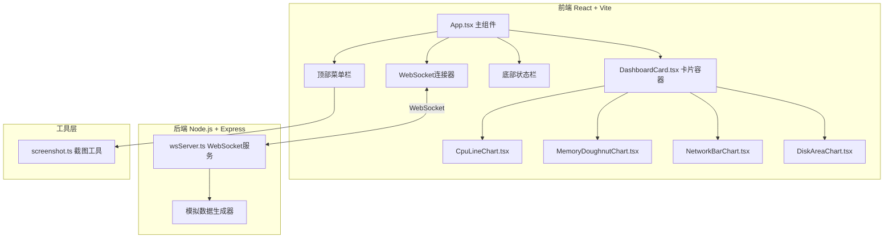

## 1. 架构设计



## 2. 技术说明

- **前端**：React@18 + TypeScript + Vite + TailwindCSS
- **初始化工具**：vite-init (react-express-ts模板)
- **图表库**：chart.js + react-chartjs-2
- **拖拽**：HTML5 Drag and Drop API + CSS transition
- **截图**：html2canvas
- **状态管理**：zustand
- **后端**：Express@4 + ws + cors
- **数据**：模拟数据，每秒广播一次

## 3. 路由定义

| 路由 | 用途 |
|------|------|
| / | 仪表盘主页 |

## 4. API定义

### WebSocket消息格式

```typescript
interface ServerMetrics {
  cpu: number;
  memory: number;
  networkIn: number;
  networkOut: number;
  diskRead: number;
  diskWrite: number;
  timestamp: number;
}

interface WsMessage {
  type: 'metrics' | 'ping' | 'pong';
  data?: ServerMetrics;
  timestamp?: number;
}
```

### 客户端→服务端
- `ping`: 心跳检测

### 服务端→客户端
- `metrics`: 服务器指标数据（每秒一次）
- `pong`: 心跳响应

## 5. 服务端架构

```mermaid
flowchart LR
    "Express HTTP服务" --> "WebSocket服务"
    "WebSocket服务" --> "模拟数据生成器"
    "模拟数据生成器" --> "setInterval(1s)"
    "setInterval(1s)" --> "广播ServerMetrics"
```

## 6. 文件结构

```
├── package.json
├── vite.config.ts
├── tsconfig.json
├── index.html
├── src/
│   ├── App.tsx                    # 主组件
│   ├── main.tsx                   # 入口
│   ├── index.css                  # 全局样式
│   ├── components/
│   │   ├── DashboardCard.tsx      # 卡片容器
│   │   ├── StatusBar.tsx          # 底部状态栏
│   │   ├── TopMenu.tsx            # 顶部菜单栏
│   │   ├── WsConnector.tsx        # WebSocket连接器
│   │   └── charts/
│   │       ├── CpuLineChart.tsx   # CPU折线图
│   │       ├── MemoryDoughnutChart.tsx # 内存环形图
│   │       ├── NetworkBarChart.tsx     # 网络双轴柱状图
│   │       └── DiskAreaChart.tsx       # 磁盘面积图
│   ├── hooks/
│   │   └── useWebSocket.ts        # WebSocket自定义Hook
│   ├── store/
│   │   └── useDashboardStore.ts   # zustand状态管理
│   ├── server/
│   │   └── wsServer.ts            # WebSocket服务端
│   └── utils/
│       └── screenshot.ts          # 截图工具
└── api/
    └── server.ts                  # Express入口
```
