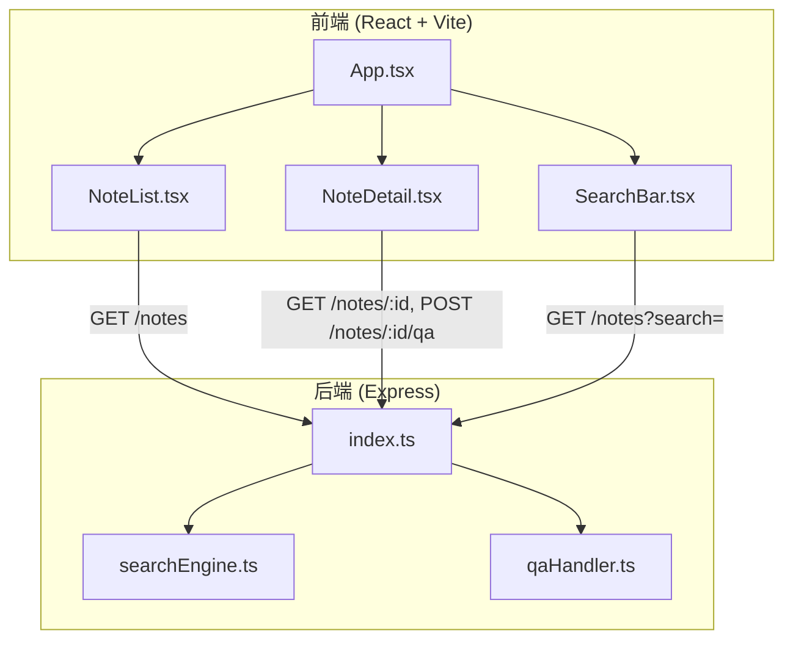
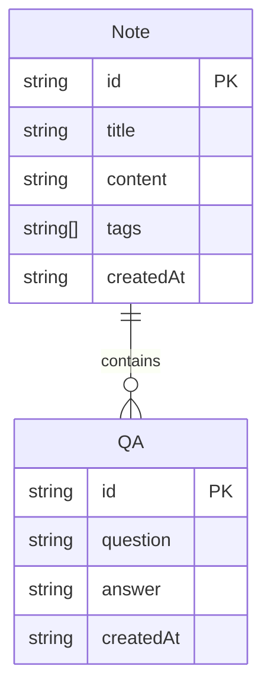

## 1. 架构设计



## 2. 技术说明

- 前端：React 18 + TypeScript + Vite + Tailwind CSS + Zustand
- 初始化工具：vite-init（react-express-ts 模板）
- 后端：Express 4 + TypeScript（ESM 格式）
- 数据库：内存存储（数组）

## 3. 路由定义

| 路由 | 用途 |
|------|------|
| `/` | 主页面，三栏布局展示所有功能 |

## 4. API 定义

### 数据类型

```typescript
interface QA {
  id: string;
  question: string;
  answer: string;
  createdAt: string;
}

interface Note {
  id: string;
  title: string;
  content: string;
  tags: string[];
  createdAt: string;
  qa: QA[];
}
```

### 接口定义

| 方法 | 路径 | 请求参数 | 响应 | 用途 |
|------|------|----------|------|------|
| GET | /notes | `?tag=xxx&search=xxx` | `Note[]` | 获取笔记列表，支持标签筛选和全文搜索 |
| GET | /notes/:id | - | `Note` | 获取单篇笔记详情 |
| POST | /notes/:id/qa | `{ question: string }` | `QA` | 为笔记添加提问 |

## 5. 服务端架构

```mermaid
flowchart LR
    "Controller (index.ts)" --> "searchEngine.ts"
    "Controller (index.ts)" --> "qaHandler.ts"
    "searchEngine.ts" --> "内存数据 (notes[])"
    "qaHandler.ts" --> "内存数据 (notes[])"
```

### searchEngine.ts

- `searchNotes(notes: Note[], keyword: string): Note[]`：全文搜索，匹配标题和内容
- `aggregateByTag(notes: Note[]): Record<string, number>`：标签聚合统计

### qaHandler.ts

- `addQA(note: Note, question: string): QA`：添加提问
- `getSortedQA(note: Note): QA[]`：按时间倒序获取问答列表

## 6. 数据模型

### 6.1 数据模型定义



### 6.2 数据定义语言

使用内存数组存储，初始化时注入种子数据（约10篇笔记，涵盖 React、TypeScript、性能优化等标签），每篇笔记附带1-2条示例问答。
