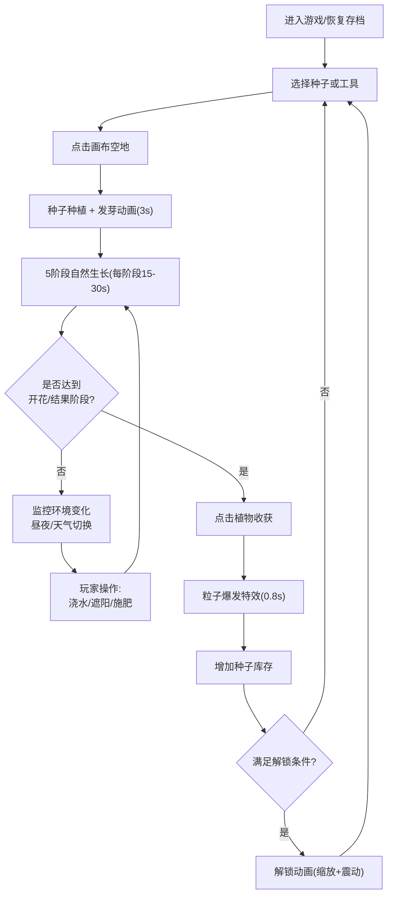

## 1. 产品概述

植物生长与生态模拟点击放置类游戏，玩家在虚拟土地上种植不同种类的植物，根据实时环境数据进行浇水、遮阳、施肥等操作，管理植物的生长周期，最终收获果实以解锁更多物种。

- 核心玩法：种植→照料→收获→解锁的正向循环，结合实时环境模拟系统
- 目标用户：喜欢休闲放置、策略模拟、生态主题的各年龄段玩家
- 产品价值：提供沉浸式的自然生态体验，寓教于乐地传递植物生长知识

## 2. 核心功能

### 2.1 功能模块

1. **主游戏界面**：工具栏、Canvas主画布、状态侧边栏
2. **种子种植系统**：选择种子→点击空地种植→5阶段生长动画
3. **环境模拟系统**：昼夜循环、天气系统、光照与湿度模拟
4. **植物状态管理**：水分值、光照满意度、生命值监控与操作
5. **收获与解锁系统**：开花/结果阶段收获→粒子特效→解锁新物种
6. **自动化辅助**：自动灌溉仪放置与管理
7. **数据持久化**：localStorage保存游戏状态、离线时间计算

### 2.2 页面详情

| 页面名称 | 模块名称 | 功能描述 |
|---------|---------|---------|
| 主游戏页面 | 顶部工具栏 | 种子选择（40x40圆角图标，不同背景色）、自动灌溉仪工具、重置按钮 |
| 主游戏页面 | Canvas主画布 | 土黄色带噪点土地背景、植物渲染（5阶段）、天气效果、粒子特效、脏矩形重绘 |
| 主游戏页面 | 右侧状态面板 | 320px宽，时间显示、天气图标、植物状态列表（生命值/水分/光照/操作按钮） |
| 主游戏页面 | 解锁提示弹窗 | 屏幕中央放大动画图标+屏幕震动 |
| 主游戏页面 | 自动化提醒弹窗 | 半透明遮罩+白色圆角卡片，推荐放置自动灌溉仪 |
| 主游戏页面 | 移动端适配面板 | <768px时底部上滑面板（高度200px） |

## 3. 核心流程

### 3.1 主游戏流程

玩家进入游戏→从工具栏选择种子→点击画布空地种植→植物开始5阶段生长→根据侧栏状态和环境变化手动浇水/遮阳/施肥→植物成熟开花→点击收获获得种子库存→积累数量解锁新物种→解锁≥2种后可放置自动灌溉仪→数据自动保存至localStorage

### 3.2 流程图

## 4. 用户界面设计

### 4.1 设计风格

**色彩方案（暖色自然主题）：**
- 主画布土地背景：土黄色 `#D4A373` + 噪点纹理
- 向日葵种子/主题色：`#FBBF24`（金黄）
- 仙人掌种子/主题色：`#34D399`（翠绿）
- 蒲公英种子/主题色：`#A78BFA`（淡紫）
- 侧栏背景：线性渐变 `#F0FDF4` → `#DCFCE7`（浅绿）
- 白天光源色温：暖黄 `#FFD700`，夜晚：冷蓝 `#1E3A5F`
- 生命值进度条：绿色→红色渐变，<30%闪烁
- 水分水滴图标：<20%由蓝变红
- 自动灌溉仪：蓝色水龙头图标
- 遮罩层：半透明黑色 `rgba(0,0,0,0.6)`

**交互样式：**
- 按钮/图标最小点击区域：48x48px（触摸友好）
- 颜色过渡：0.3s ease，位移过渡：0.2s ease-out
- 按钮hover：背景色变化0.2s
- 卡片圆角：16px

**字体与排版：**
- 字体：系统默认 sans-serif
- 时间显示：24小时制，带秒数更新

### 4.2 页面设计概览

| 页面区域 | 模块名称 | UI元素与动效 |
|---------|---------|-------------|
| 左侧主画布 | 土地背景 | #D4A373 + 噪点纹理，根据昼夜/天气调整亮度滤镜 |
| 左侧主画布 | 植物渲染 | 5阶段形态逐帧绘制(30FPS)，种子期播撒动画，发芽期摇摆 |
| 左侧主画布 | 天气特效 | 顶部飘入天气图标，雨滴/云朵/闪电粒子动画 |
| 左侧主画布 | 收获粒子 | 植物位置爆发30个彩色粒子，向四周扩散0.8秒 |
| 左侧主画布 | 水波扩散 | 自动灌溉仪浇水时淡蓝色圆环扩散动画 |
| 顶部工具栏 | 种子图标 | 3个40x40px圆角方块，不同背景色，选中态外发光 |
| 顶部工具栏 | 灌溉仪 | 蓝色水龙头图标，最多同时放置3个 |
| 右侧面板(320px) | 顶部信息卡 | 大号时间显示 + 天气描述 + 动态天气图标 |
| 右侧面板 | 植物列表项 | 左侧24x24植物图标 + 名称，下方三行：生命条/水滴%/星数+操作按钮 |
| 中央弹窗 | 解锁提示 | 大图标缩放动画(0→150px→正常，1s)，屏幕震动效果 |
| 中央弹窗 | 自动化提醒 | 半透明遮罩 + 白色圆角卡片 + 两个操作按钮 |

### 4.3 响应式设计

- **Desktop优先（≥768px）**：主画布占满左侧，右侧固定320px宽状态面板
- **Mobile适配（<768px）**：
  - 右侧面板收起到屏幕底部，高度200px
  - 面板可上滑展开至屏幕60%高度
  - 主画布占满剩余全部空间
  - 工具栏图标保持48px最小点击区域

### 4.4 Canvas渲染性能

- 游戏循环目标：≥50FPS
- 重绘策略：脏矩形（Dirty Rectangle）技术，仅更新变化区域
- 性能指标：<50株植物时无卡顿
- localStorage读写：≤1次/秒
