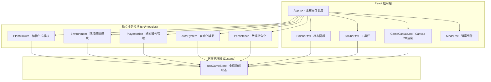

## 1. 架构设计



## 2. 技术描述

- **前端框架**：React 18 + TypeScript 5（严格模式）
- **构建工具**：Vite 5 + @vitejs/plugin-react
- **状态管理**：Zustand（轻量级，适合高频游戏循环更新）
- **渲染引擎**：Canvas 2D Context（原生API，脏矩形优化）
- **样式方案**：原生 CSS（CSS Variables + Flexbox/Grid，无Tailwind）
- **数据持久化**：localStorage（节流写入，≤1次/秒）
- **模块管理**：ES Modules（import/export），target ES2020

## 3. 文件结构定义

```
auto178/
├── package.json
├── index.html                 (16:9比例，全屏无滚动条)
├── vite.config.js             (React插件配置)
├── tsconfig.json              (严格模式，ES2020，ES模块)
└── src/
    ├── main.tsx               (React入口，挂载App)
    ├── App.tsx                (游戏主组件，布局+模块调度)
    ├── GameCanvas.tsx         (Canvas渲染组件)
    ├── index.css              (全局样式，CSS Variables)
    ├── components/
    │   ├── Sidebar.tsx        (右侧状态面板)
    │   ├── Toolbar.tsx        (顶部工具栏)
    │   ├── PlantListItem.tsx  (植物状态列表项)
    │   ├── UnlockModal.tsx    (解锁弹窗动画)
    │   ├── AutoIrrigationModal.tsx (自动化提醒弹窗)
    │   └── BottomSheet.tsx    (移动端底部抽屉面板)
    ├── modules/
    │   ├── PlantGrowth.ts     (植物生长：光合/吸水/衰老)
    │   ├── Environment.ts     (环境：昼夜/天气/光照/湿度)
    │   ├── PlayerAction.ts    (玩家操作：浇水/遮阳/施肥/种植)
    │   ├── AutoSystem.ts      (自动灌溉仪系统)
    │   ├── ParticleSystem.ts  (粒子系统：收获/水波/天气)
    │   └── Persistence.ts     (localStorage读写+离线计算)
    ├── hooks/
    │   ├── useGameLoop.ts     (游戏循环Hook，requestAnimationFrame)
    │   └── useThrottle.ts     (节流Hook，用于持久化)
    ├── store/
    │   └── useGameStore.ts    (Zustand全局状态)
    ├── types/
    │   └── index.ts           (所有TypeScript类型定义)
    └── utils/
        ├── canvas.ts          (Canvas绘图工具函数)
        ├── color.ts           (颜色渐变/插值工具)
        └── random.ts          (随机数/种子工具)
```

## 4. 数据模型与类型定义

### 4.1 核心类型

```typescript
// 植物种类
type PlantSpecies = 'sunflower' | 'cactus' | 'dandelion';

// 植物生长阶段
type GrowthStage = 'seed' | 'sprout' | 'seedling' | 'mature' | 'flowering';

// 天气类型
type WeatherType = 'sunny' | 'cloudy' | 'rain' | 'thunderstorm' | 'drought';

// 单个植物实例
interface Plant {
  id: string;
  species: PlantSpecies;
  stage: GrowthStage;
  stageProgress: number; // 0~1 当前阶段完成度
  position: { x: number; y: number }; // 画布坐标
  health: number;       // 0~100 生命值
  water: number;        // 0~100 水分值
  lightSatisfaction: 1 | 2 | 3 | 4 | 5; // 光照满意度
  isShaded: boolean;    // 是否被遮阳
  isFertilized: boolean; // 是否施肥(本阶段有效)
  isDormant: boolean;   // 是否休眠(野化)
  plantTime: number;    // 种植时间戳
  lastWaterTime: number;
}

// 自动灌溉仪
interface AutoIrrigator {
  id: string;
  position: { x: number; y: number };
  radius: number; // 80px
  lastWaterTime: number;
}

// 粒子
interface Particle {
  id: string;
  x: number;
  y: number;
  vx: number;
  vy: number;
  life: number;    // 剩余生命(秒)
  maxLife: number;
  color: string;
  size: number;
  type: 'harvest' | 'ripple' | 'raindrop' | 'cloud';
}

// 植物物种配置
interface SpeciesConfig {
  name: string;
  color: string;      // 种子/主题色
  waterNeedPerSec: number; // 每秒水分消耗
  optimalLight: number;    // 最适光照 0.2~1.0
  optimalTemp: number;     // 最适温度
  stageDurations: Record<GrowthStage, [number, number]>; // 每阶段最短~最长秒数
  harvestReward: Partial<Record<PlantSpecies, number>>; // 收获获得的种子
  unlockRequirement: { species: PlantSpecies; count: number } | null;
}

// 天气配置
interface WeatherConfig {
  name: string;
  lightMultiplier: number; // 光照倍率
  humidityChangePerSec: number; // 土壤湿度变化
  precipitation: 'none' | 'light' | 'heavy'; // 降水
  duration: [number, number]; // 持续秒数范围
  icon: string;
}

// 全局游戏状态
interface GameState {
  plants: Plant[];
  irrigators: AutoIrrigator[];
  particles: Particle[];
  seedInventory: Record<PlantSpecies, number>;
  unlockedSpecies: PlantSpecies[];
  currentWeather: WeatherType;
  weatherProgress: number; // 当前天气已持续秒数
  dayNightCycle: number;   // 0~1 全天进度
  brightness: number;      // 0.3~1.0 场景亮度
  soilMoisture: number;    // 0~100 全局土壤湿度基准
  selectedTool: 'none' | PlantSpecies | 'irrigator';
  screenShake: { intensity: number; duration: number };
  showAutoIrrigationHint: boolean;
  pendingUnlock: PlantSpecies | null;
  lastSaveTime: number;
  lastTickTime: number;
}
```

## 5. 核心算法与逻辑

### 5.1 植物生长模块 (PlantGrowth)

| 函数 | 输入 | 输出 | 说明 |
|-----|------|------|------|
| `calculatePhotosynthesis(plant, env)` | 植物实例 + 环境状态 | 光合速率值 | 基于光照满意度、温度、CO2计算能量产出 |
| `consumeWater(plant, dt, env)` | 植物+时间增量+环境 | 水分新值 | 基础消耗×温度倍率×天气倍率 |
| `updateGrowthStage(plant, dt)` | 植物+时间增量 | 更新stage和progress | 阶段过渡+平滑帧插值 |
| `computeHealthDelta(plant, env)` | 植物+环境 | 生命值变化 | 水分不足/光照不适导致生命值下降 |
| `isReadyToHarvest(plant)` | 植物 | boolean | 是否处于开花/结果阶段 |

### 5.2 环境模拟模块 (Environment)

| 函数 | 输入 | 输出 | 说明 |
|-----|------|------|------|
| `updateDayNight(dt)` | 时间增量 | 亮度/色温 | 60秒周期，白天1.0→夜晚0.3，过渡5秒 |
| `interpolateColorTemp(progress)` | 0~1循环进度 | `{r,g,b}` | 暖黄#FFD700↔冷蓝#1E3A5F线性插值 |
| `updateWeather(dt)` | 时间增量 | 新天气+进度 | 30~60秒随机切换，状态转移表 |
| `calculateLightIntensity(env)` | 环境快照 | 0~1光照强度 | 昼夜倍率×天气倍率×云量 |
| `updateSoilMoisture(dt, env)` | 增量+天气 | 0~100湿度值 | 降水增加、蒸发减少、植物吸收 |

### 5.3 渲染优化 (脏矩形技术)

```
算法：
1. 维护 dirtyRects: Rect[] 列表（每帧收集）
2. 植物位置/阶段变化 → 标记外接矩形(含动画margin)为dirty
3. 粒子系统更新 → 标记粒子包围盒为dirty
4. 天气特效移动 → 标记顶部条带区域为dirty
5. 渲染步骤：
   a. 将dirtyRects合并为最少数量的不重叠矩形
   b. 对每个dirtyRect：
      - 剪切(clip)到该矩形
      - 清屏→绘制土地背景→绘制相交植物→绘制相交粒子
   c. 非dirty区域直接skip
```

## 6. 数据持久化策略

- **保存时机**：每500ms检查一次状态哈希，有变化则写入（throttle≤1次/秒）
- **保存内容**：`{ state: GameStateSnapshot, timestamp: number, version: 1 }`
- **离线时间处理**：
  - 计算 `offlineSeconds = now - savedTimestamp`
  - 若 `offlineSeconds ≤ 120`：直接调用 `simulateGrowth(state, offlineSeconds)` 一次性补算
  - 若 `offlineSeconds > 120`：所有植物 `isDormant = true`，显示"野化"标记，水分/生命值按最大120秒消耗后冻结
- **恢复流程**：App.tsx挂载→检测localStorage→有存档→离线计算→注入Zustand store

## 7. 性能预算

| 指标 | 目标值 | 测量方式 |
|-----|-------|---------|
| 游戏循环帧率 | ≥50 FPS | `requestAnimationFrame` 间隔统计 |
| 单帧渲染耗时 | ≤18 ms | `performance.now()` 测量render函数 |
| 50株植物内存占用 | ≤50 MB | Chrome DevTools Memory |
| localStorage写入频率 | ≤1次/秒 | 时间戳对比 |
| 首屏可交互时间 | ≤3s (Dev) | LCP指标 |
