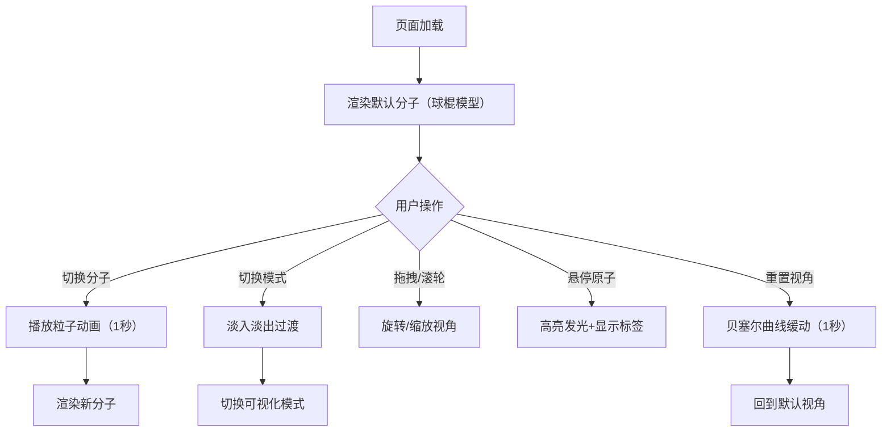

## 1. 产品概述

交互式3D分子结构查看器，用于教育和科研领域直观地观察分子三维结构。用户可加载预设分子模型，切换可视化模式，通过交互操作全方位了解分子组成。

- **目标用户**：化学教育工作者、学生、科研人员
- **核心价值**：将抽象的分子结构具象化，提升学习和研究效率

## 2. 核心特性

### 2.1 用户角色

| 角色 | 注册方式 | 核心权限 |
|------|----------|----------|
| 访客用户 | 无需注册 | 浏览所有功能，切换分子和可视化模式 |

### 2.2 功能模块

1. **主界面**：3D分子渲染区 + 控制面板
2. **分子渲染模块**：球棍模型 / 空间填充模型渲染
3. **交互控制模块**：视角旋转、缩放、原子悬停高亮
4. **控制面板模块**：分子选择、模式切换、视角重置

### 2.3 页面详情

| 页面名称 | 模块名称 | 功能描述 |
|----------|----------|----------|
| 主界面 | 3D渲染区 | 实时渲染分子3D模型，支持鼠标交互 |
| 主界面 | 控制面板 | 分子选择下拉框、可视化模式切换、重置视角按钮 |
| 主界面 | 信息标签 | 鼠标悬停原子时显示元素符号和原子名称 |

## 3. 核心流程

用户进入应用后，默认加载第一个分子（咖啡因），呈现球棍模型。用户可通过控制面板切换分子（触发粒子消散聚合动画）、切换可视化模式（触发淡入淡出过渡）、旋转缩放视角观察分子结构，点击重置视角按钮恢复默认观察角度。

## 4. 用户界面设计

### 4.1 设计风格

- **主色调**：深蓝色渐变背景（#0a0a2e → #1a1a4e）
- **强调色**：霓虹蓝边框（#4488ff），用于选中态高亮
- **原子配色**：遵循CPK标准（碳-灰、氧-红、氮-蓝、氢-白等）
- **按钮风格**：圆角设计，悬停放大1.05倍并投射阴影
- **字体**：使用现代无衬线字体，提升科技感
- **毛玻璃效果**：控制面板使用backdrop-filter: blur(10px)
- **脉冲光效**：选中按钮带微弱呼吸脉冲动画

### 4.2 页面设计概览

| 页面名称 | 模块名称 | UI元素 |
|----------|----------|--------|
| 主界面 | 3D渲染区 | 全屏Canvas，环境光+定向冷光照明，原子球体/圆柱体键 |
| 主界面 | 控制面板（桌面端） | 左侧悬浮，深色半透明毛玻璃背景 |
| 主界面 | 控制面板（移动端） | 底部抽屉，汉堡图标展开/收起 |
| 主界面 | 分子选择下拉框 | 每个选项带分子缩略图图标 |
| 主界面 | 模式切换按钮组 | 两个按钮，选中态霓虹蓝边框+脉冲光效 |
| 主界面 | 重置视角按钮 | 独立操作按钮 |
| 主界面 | 悬浮信息标签 | 原子悬停时弹出，显示元素符号+名称 |

### 4.3 响应式设计

- **桌面端（≥768px）**：控制面板固定在左侧
- **移动端（<768px）**：控制面板折叠为底部滑动抽屉，通过汉堡图标展开
- **触摸优化**：支持触摸手势旋转和缩放

### 4.4 3D场景指南

- **环境与氛围**：深色太空感背景，营造科研探索氛围
- **光照设置**：环境光强度0.4 + 定向冷色光（#4488ff）
- **相机设置**：初始视角正对分子中心，支持360°水平旋转、180°垂直旋转
- **视角运动**：平滑阻尼系数0.85，缩放范围（原子平均半径5倍 ~ 分子整体尺寸3倍）
- **交互与动画**：
  - 分子切换：粒子消散聚合动画（1秒）
  - 模式切换：整体淡入淡出过渡
  - 视角重置：贝塞尔曲线缓动（1秒）
  - 原子悬停：外发光效果（0.2单位半径）
- **性能预算**：≤200原子时保证60fps，最低不低于30fps
