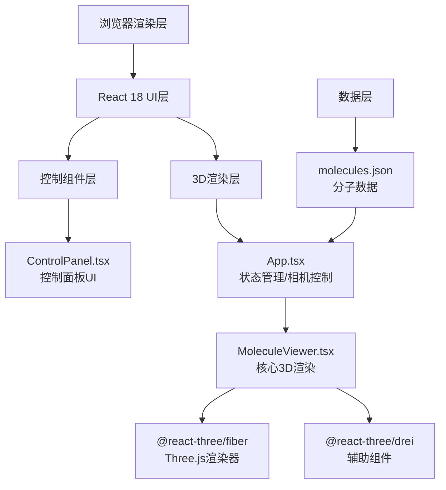
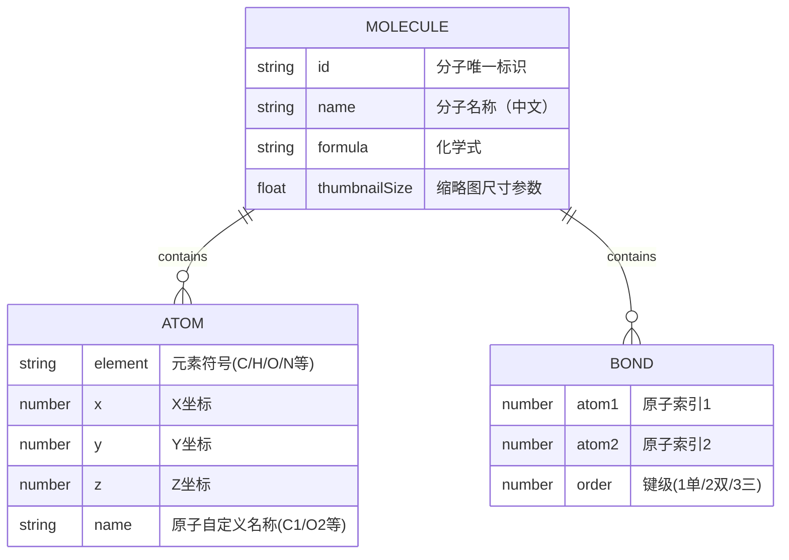

## 1. 架构设计

## 2. 技术说明

- **前端框架**：React 18 + TypeScript
- **3D渲染**：Three.js + @react-three/fiber + @react-three/drei
- **构建工具**：Vite + @vitejs/plugin-react
- **样式方案**：内联样式 + CSS（styled-components风格通过style属性实现）
- **数据来源**：本地JSON文件（molecules.json），含咖啡因、水杨酸、胆固醇

## 3. 文件结构与职责

| 文件路径 | 职责说明 |
|----------|----------|
| package.json | 项目依赖与启动脚本配置 |
| vite.config.ts | Vite构建配置，配置@路径别名指向src |
| tsconfig.json | TypeScript严格模式配置 |
| index.html | 应用入口HTML页面 |
| src/App.tsx | 主组件，管理分子切换状态、可视化模式状态、相机控制与重置逻辑 |
| src/MoleculeViewer.tsx | 核心3D渲染组件，解析分子数据，实现球棍模型/空间填充模型渲染、粒子动画、原子高亮 |
| src/ControlPanel.tsx | UI控制面板，分子选择下拉框、模式切换按钮组、重置视角按钮，移动端适配 |
| src/data/molecules.json | 预设分子数据，包含原子坐标[x,y,z]、元素类型、键连接信息（原子索引对） |

## 4. 数据模型

### 4.1 分子数据结构

### 4.2 CPK配色表

| 元素 | 颜色值 |
|------|--------|
| H (氢) | #FFFFFF |
| C (碳) | #909090 |
| N (氮) | #3050F8 |
| O (氧) | #FF0D0D |
| F (氟) | #90E050 |
| Cl (氯) | #1FF01F |
| Br (溴) | #A62929 |
| S (硫) | #FFFF30 |
| P (磷) | #FF8000 |

### 4.3 原子半径表（用于可视化）

| 元素 | 球棍模型半径 | 空间填充半径 |
|------|-------------|-------------|
| H | 0.15 | 0.31 |
| C | 0.35 | 0.76 |
| N | 0.32 | 0.71 |
| O | 0.30 | 0.66 |
| F | 0.28 | 0.57 |
| Cl | 0.45 | 1.02 |
| Br | 0.50 | 1.20 |
| S | 0.45 | 1.05 |
| P | 0.48 | 1.11 |

## 5. 核心算法与实现要点

### 5.1 分子切换粒子动画
- 使用useTransition/useFrame驱动每个原子的位置插值
- 旧分子：当前位置 → 随机散开位置（opacity 1→0）
- 新分子：随机散开位置 → 目标位置（opacity 0→1）
- 总时长1秒，使用缓动函数easeInOutCubic

### 5.2 可视化模式切换
- 球棍→空间填充：原子半径线性插值放大，键透明度1→0
- 空间填充→球棍：原子半径线性插值缩小，键透明度0→1
- 模型整体opacity配合实现淡入淡出

### 5.3 相机控制
- 使用drei的OrbitControls，enableDamping=true，dampingFactor=0.85
- minDistance = 5 × 原子平均半径
- maxDistance = 3 × 分子整体尺寸
- 水平旋转无限制，垂直极角限制[0, π]

### 5.4 视角重置动画
- 记录初始相机position和target
- 使用自定义Bezier缓动曲线，在1秒内从当前位置插值到初始位置
- 通过useRef直接操作Three.js相机对象实现

### 5.5 原子悬停高亮
- 利用drei的PointerLockControls/或原生onPointerOver事件
- 对hovered原子添加emissive发光材质，emissiveIntensity控制发光强度
- 通过CSS2DRenderer或HTML位置计算实现悬浮信息标签

### 5.6 性能优化
- 使用InstancedMesh批量渲染同元素原子球体
- 键圆柱体使用CylinderGeometry的复用策略
- 动画仅在transitioning状态下启用useFrame计算
- 鼠标移动事件使用节流处理
