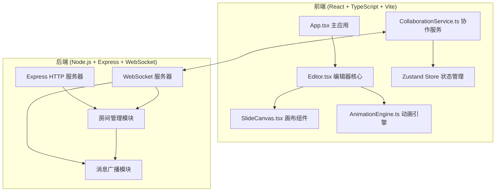
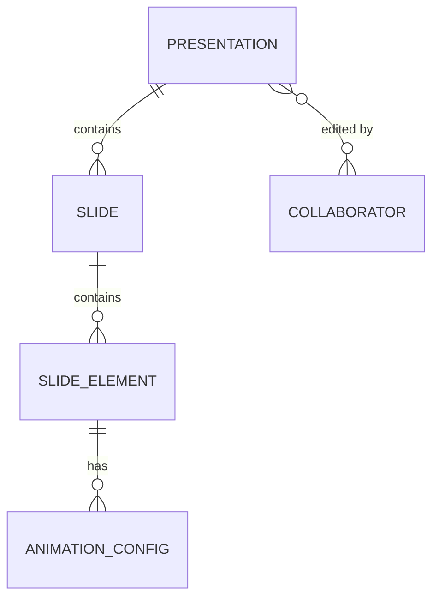

## 1. 架构设计



## 2. 技术描述
- **前端**：React 18 + TypeScript + Vite + Zustand（状态管理）
- **构建工具**：Vite（配置React插件和WebSocket代理）
- **后端**：Express 4 + ws（WebSocket库）+ uuid
- **通信协议**：WebSocket 实时双向通信
- **数据存储**：内存存储（演示用）

## 3. 目录结构
```
.
├── package.json
├── vite.config.js
├── tsconfig.json
├── index.html
├── src/
│   ├── main.tsx
│   ├── App.tsx
│   ├── components/
│   │   ├── Editor.tsx
│   │   └── SlideCanvas.tsx
│   ├── engine/
│   │   └── AnimationEngine.ts
│   ├── services/
│   │   └── CollaborationService.ts
│   └── types/
│       └── index.ts
└── server/
    └── index.ts
```

## 4. 数据模型

### 4.1 核心类型定义
```typescript
// 元素类型
type ElementType = 'text' | 'image' | 'shape';
type ShapeType = 'rectangle' | 'circle' | 'triangle';

// 动画类型
type AnimationType = 'fadeIn' | 'fadeOut' | 'flip' | 'zoom' | 'slideInLeft' | 'slideInRight' | 'slideInUp' | 'slideInDown';
type AnimationPhase = 'entrance' | 'exit';

// 动画配置
interface AnimationConfig {
  id: string;
  type: AnimationType;
  phase: AnimationPhase;
  duration: number; // ms
  delay: number; // ms
}

// 幻灯片元素
interface SlideElement {
  id: string;
  type: ElementType;
  x: number;
  y: number;
  width: number;
  height: number;
  rotation: number;
  content?: string; // text content or image src
  shapeType?: ShapeType;
  animations: AnimationConfig[];
}

// 幻灯片
interface Slide {
  id: string;
  elements: SlideElement[];
  backgroundColor: string;
}

// 协作者
interface Collaborator {
  id: string;
  name: string;
  color: string;
  selectedElementId: string | null;
}

// 演示文稿
interface Presentation {
  id: string;
  slides: Slide[];
  currentSlideId: string;
}

// WebSocket 消息
interface WSMessage {
  type: 'join' | 'leave' | 'addElement' | 'updateElement' | 'deleteElement' | 'selectElement' | 'addSlide' | 'updateSlide';
  payload: any;
  senderId: string;
  timestamp: number;
}
```

### 4.2 ER 图


## 5. API 定义（WebSocket 消息）

| 消息类型 | 方向 | Payload 描述 |
|---------|------|-------------|
| join | Client→Server | { presentationId, userName } |
| join-ack | Server→Client | { collaboratorId, presentation, collaborators[] } |
| collaborator-join | Server→Client | { collaborator } |
| collaborator-leave | Server→Client | { collaboratorId } |
| addElement | Client↔Server | { slideId, element } |
| updateElement | Client↔Server | { slideId, elementId, updates } |
| deleteElement | Client↔Server | { slideId, elementId } |
| selectElement | Client↔Server | { elementId } |
| addSlide | Client↔Server | { slide } |

## 6. 动画引擎设计

### 6.1 AnimationEngine 职责
- 解析 AnimationConfig 配置
- 生成 CSS keyframes 或使用 requestAnimationFrame
- 管理动画播放/暂停/重置
- 支持入场/退场动画序列
- 保持 60fps 流畅运行

### 6.2 支持的动画类型
- fadeIn / fadeOut：淡入淡出
- flip：翻转
- zoom：缩放
- slideInLeft / slideInRight / slideInUp / slideInDown：滑入

## 7. 协作服务设计

### 7.1 CollaborationService 职责
- 管理 WebSocket 连接生命周期
- 消息序列化与反序列化
- 本地操作广播
- 接收远程操作并更新本地状态
- 协作者状态追踪（选中元素、颜色分配）
- 确保消息延迟 < 200ms
