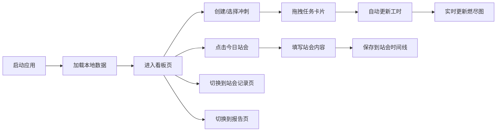

## 1. 产品概述

SprintBoard 是一款面向个人和小团队的轻量级冲刺看板应用，旨在解决传统看板工具缺乏冲刺进度量化追踪、每日站会记录分散难以回溯的问题。通过四列看板、每日站会时间线和实时燃尽图，帮助团队高效管理任务积压、追踪进度并可视化冲刺目标。

- **目标用户**：个人开发者、小团队（3-10人）、敏捷开发团队
- **核心价值**：轻量化、零配置、数据本地持久化、即时可视化进度

## 2. 核心功能

### 2.1 用户角色

| 角色 | 注册方式 | 核心权限 |
|------|----------|----------|
| 普通用户 | 无需注册，本地使用 | 创建/编辑冲刺、管理任务、记录站会、查看报告 |

### 2.2 功能模块

1. **看板页面**：四列拖拽看板（Backlog / 进行中 / 测试中 / 已完成），任务卡片按优先级排序
2. **站会记录页面**：每日站会时间线，记录昨天完成、今天计划、阻塞问题
3. **报告页面**：燃尽图可视化，展示理想进度与实际进度对比

### 2.3 页面详情

| 页面名称 | 模块名称 | 功能描述 |
|---------|----------|----------|
| 看板页 | 冲刺头部 | 显示冲刺名称、日期范围、进度条 |
| 看板页 | 四列看板 | Backlog/进行中/测试中/已完成，支持拖拽排序和列切换 |
| 看板页 | 任务卡片 | 标题、优先级圆点、负责人、预估工时、编辑功能 |
| 看板页 | 燃尽图 | Canvas绘制，实时更新，理想线vs实际线 |
| 站会记录页 | 站会时间线 | 按日期倒序排列，淡蓝色卡片展示站会内容 |
| 站会记录页 | 站会录入 | 右下角浮动按钮，模态框填写站会内容 |
| 报告页 | 燃尽图详情 | 更大尺寸的燃尽图，数据统计 |

## 3. 核心流程

### 3.1 主要用户流程

用户打开应用 → 创建/选择冲刺 → 在看板中管理任务（拖拽、编辑） → 每日站会记录进度 → 查看燃尽图追踪冲刺进度

### 3.2 流程图

## 4. 用户界面设计

### 4.1 设计风格

- **主色调**：灰蓝色系，深色侧边栏（#1E293B）+ 浅色主区域（#F8FAFC）
- **强调色**：
  - 高优先级：红色 #EF4444
  - 中优先级：橙色 #F59E0B
  - 低优先级：绿色 #22C55E
  - 理想线：红色虚线 #EF4444
  - 实际线：蓝色实线 #3B82F6
  - 站会按钮：紫色 #6366F1（hover #4F46E5）
- **字体**：Inter（Google Fonts）
- **卡片样式**：白色背景、8px圆角、阴影 0 1px 3px rgba(0,0,0,0.1)
- **动画**：所有交互 0.2s 平滑过渡
- **布局**：左侧固定侧边栏 + 右侧主区域双栏布局

### 4.2 页面设计概览

| 页面名称 | 模块名称 | UI元素 |
|---------|----------|--------|
| 看板页 | 侧边栏 | 深色背景、应用名称、三个导航Tab（看板/站会记录/报告） |
| 看板页 | 冲刺头部 | 冲刺名称、日期、进度条 |
| 看板页 | 看板列 | 四列等宽、间距16px、列标题带任务数量徽章 |
| 看板页 | 任务卡片 | 优先级圆点、标题、负责人、预估工时、时钟图标 |
| 看板页 | 燃尽图 | Canvas图表、X轴D1/D2...、Y轴剩余工时、双折线 |
| 站会记录页 | 时间线 | 日期标题、淡蓝色圆角卡片（#DBEAFE）、倒序排列 |
| 全站 | 浮动按钮 | 右下角圆形按钮（48px）、紫色背景、站会图标 |

### 4.3 响应式设计

- **桌面端**（≥768px）：四列水平排列的看板
- **移动端**（<768px）：四列垂直堆叠
- 自定义滚动条：宽8px，thumb颜色 #CBD5E1

### 4.4 交互与动画

- 拖拽时卡片半透明 + 阴影跟随
- 列切换时卡片淡入淡出
- 所有按钮和卡片 hover 状态 0.2s 过渡
- 燃尽图实时更新（延迟 ≤100ms）
- 拖拽操作 FPS ≥30

## 5. 数据持久化

- 使用 LocalStorage 存储所有数据
- 数据键名：`sprintData`（冲刺和任务数据）、`standupLog`（站会记录）
- 刷新页面后数据不丢失
- 每日午夜自动记录燃尽图快照
