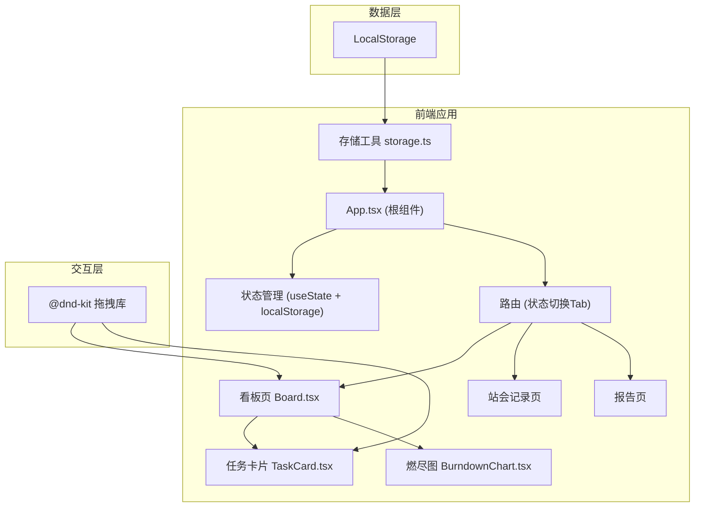

## 1. 架构设计



## 2. 技术描述

- **前端框架**：React 18 + TypeScript
- **构建工具**：Vite
- **状态管理**：React useState + useReducer + LocalStorage 持久化
- **拖拽库**：@dnd-kit/core + @dnd-kit/sortable
- **ID生成**：uuid
- **样式方案**：原生 CSS（CSS Variables + 模块化）
- **图表绘制**：Canvas 2D API
- **字体**：Inter（Google Fonts）

## 3. 页面/视图定义

| 视图 | 对应组件 | 说明 |
|------|----------|------|
| 看板视图 | Board.tsx | 默认视图，四列看板 + 燃尽图 |
| 站会记录视图 | StandupLog.tsx | 站会时间线展示 |
| 报告视图 | Report.tsx | 详细燃尽图和统计 |

## 4. 数据模型

### 4.1 核心类型定义

```typescript
// 优先级
type Priority = 'high' | 'medium' | 'low';

// 任务状态列
type TaskColumn = 'backlog' | 'in-progress' | 'testing' | 'done';

// 任务卡片
interface Task {
  id: string;
  title: string;
  description: string;
  estimateHours: number; // 1-8
  priority: Priority;
  assignee: string;
  column: TaskColumn;
  order: number;
  actualHours: number;
  createdAt: string;
}

// 冲刺
interface Sprint {
  id: string;
  name: string;
  startDate: string;
  endDate: string;
  tasks: Task[];
  dailySnapshots: DailySnapshot[];
}

// 每日快照
interface DailySnapshot {
  date: string;
  remainingHours: number;
}

// 站会记录
interface StandupEntry {
  id: string;
  date: string;
  yesterday: string;
  today: string;
  blockers: string;
}

// 应用数据
interface SprintData {
  sprints: Sprint[];
  activeSprintId: string | null;
}
```

### 4.2 LocalStorage 数据结构

- **sprintData**: 包含所有冲刺和任务数据
- **standupLog**: 站会记录数组

## 5. 项目目录结构

```
src/
├── App.tsx              # 根组件，状态管理，路由切换
├── components/
│   ├── Board.tsx        # 看板主体，四列拖拽
│   ├── TaskCard.tsx     # 可拖拽任务卡片
│   ├── BurndownChart.tsx # Canvas 燃尽图
│   ├── Sidebar.tsx      # 侧边导航
│   ├── SprintHeader.tsx # 冲刺头部信息
│   ├── StandupModal.tsx # 站会录入模态框
│   └── StandupLog.tsx   # 站会记录时间线
├── utils/
│   └── storage.ts       # LocalStorage 封装
├── types/
│   └── index.ts         # TypeScript 类型定义
└── styles/
    └── index.css        # 全局样式
```

## 6. 关键技术实现

### 6.1 拖拽实现

- 使用 @dnd-kit/core 的 DndContext 包裹整个看板
- 使用 @dnd-kit/sortable 的 SortableContext 和 useSortable
- 支持同列排序和跨列拖拽
- 拖拽时设置透明度和阴影效果

### 6.2 燃尽图绘制

- 使用 Canvas 2D API
- 实时计算剩余工时并绘制折线
- 理想线：从总工时线性衰减到0
- 实际线：根据每日快照绘制
- 响应式：监听容器尺寸变化重绘

### 6.3 数据持久化

- 封装 storage.ts 工具类
- 提供 get/set/append 操作
- 数据变更时自动同步到 LocalStorage
- 应用启动时从 LocalStorage 加载

### 6.4 工时计算

- 任务从未完成列移动到已完成列时，记录实际工时
- 未手动输入时按 1 小时基准计算
- 每日午夜自动记录当日快照
