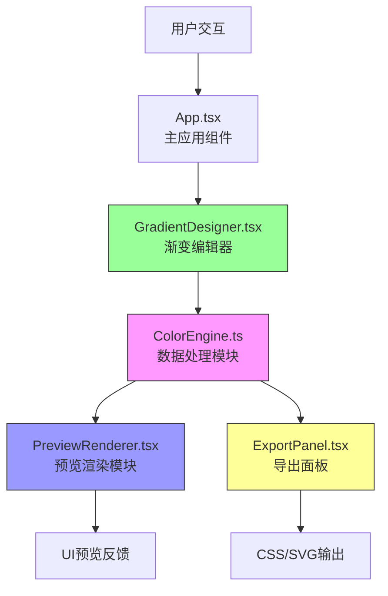

## 1. 架构设计



**数据流向：**
用户交互 → GradientDesigner（收集色标、类型、参数）→ ColorEngine（纯函数计算渐变字符串）→ PreviewRenderer / ExportPanel（渲染UI和导出代码）

## 2. 技术描述

- **前端框架**：React@18 + TypeScript@5
- **构建工具**：Vite@5 + @vitejs/plugin-react
- **样式方案**：TailwindCSS@3 + PostCSS + Autoprefixer
- **状态管理**：React useState/useCallback（轻量场景，无需额外状态库）
- **图标库**：lucide-react
- **项目初始化**：使用 vite-init react-ts 模板

## 3. 项目文件结构

```
d:\Pro\tasks\auto188\
├── package.json              # 项目依赖与脚本
├── index.html                # 入口HTML
├── tsconfig.json             # TypeScript配置
├── vite.config.js            # Vite配置
├── tailwind.config.js        # Tailwind配置
├── postcss.config.js         # PostCSS配置
└── src/
    ├── main.tsx              # React入口
    ├── App.tsx               # 主应用组件（布局管理）
    ├── index.css             # 全局样式与Tailwind指令
    └── modules/
        ├── GradientDesigner.tsx  # 渐变编辑器组件
        ├── ColorEngine.ts        # 渐变计算引擎（纯函数）
        ├── PreviewRenderer.tsx   # UI场景预览渲染
        └── ExportPanel.tsx       # 导出面板组件
```

### 3.1 模块职责与调用关系

| 文件 | 职责 | 输入 | 输出 | 依赖 |
|------|------|------|------|------|
| App.tsx | 布局管理、状态协调、数据分发 | 用户操作事件 | 分发数据到各模块 | GradientDesigner, PreviewRenderer, ExportPanel |
| GradientDesigner.tsx | 色标管理、渐变类型选择、参数调整 | 用户交互（点击/拖动/输入） | ColorStop[], GradientType, angle 等 | ColorEngine（类型定义） |
| ColorEngine.ts | 纯函数计算CSS/SVG渐变字符串 | ColorStop[], GradientType, 配置参数 | CSS渐变字符串 / SVG渐变定义 | 无（纯函数模块） |
| PreviewRenderer.tsx | 将渐变应用到预设UI场景 | CSS渐变字符串 | 渲染的按钮/卡片/页面/文字 | 无 |
| ExportPanel.tsx | 生成导出代码并提供复制功能 | CSS/SVG渐变字符串 | CSS代码片段、SVG代码片段 | ColorEngine（SVG生成） |

## 4. 数据模型定义

### 4.1 核心类型

```typescript
// 色标定义
interface ColorStop {
  id: string;
  color: string;      // Hex颜色值，如 "#FF5500"
  position: number;   // 位置百分比，0-100，保留一位小数
}

// 渐变类型
type GradientType = 'linear' | 'radial' | 'conic';

// 径向渐变形状
type RadialShape = 'circle' | 'ellipse';

// 渐变完整配置
interface GradientConfig {
  type: GradientType;
  stops: ColorStop[];
  angle: number;              // 线性/锥形渐变角度（0-360度）
  radialShape?: RadialShape;  // 径向渐变形状
  centerX?: number;           // 径向/锥形渐变中心X（百分比，0-100）
  centerY?: number;           // 径向/锥形渐变中心Y（百分比，0-100）
}

// 预设方案
interface GradientPreset {
  name: string;
  config: GradientConfig;
}
```

### 4.2 预设渐变方案（6个）

| 名称 | 色标 |
|------|------|
| 日落橙 | #FF6B35 (0%), #F7C59F (50%), #FF4444 (100%) |
| 海洋蓝 | #0077B6 (0%), #00B4D8 (50%), #90E0EF (100%) |
| 极光绿 | #06D6A0 (0%), #118AB2 (50%), #073B4C (100%) |
| 晚霞紫 | #7209B7 (0%), #B5179E (50%), #F72585 (100%) |
| 金属银 | #ADB5BD (0%), #DEE2E6 (50%), #6C757D (100%) |
| 荧光粉 | #FF006E (0%), #FB5607 (50%), #FFBE0B (100%) |

## 5. 核心功能实现要点

### 5.1 ColorEngine 纯函数
- `generateCSSGradient(config: GradientConfig): string` - 生成CSS background-image值
- `generateSVGGradient(config: GradientConfig, id: string): string` - 生成SVG defs中的渐变定义
- `hexToRgb(hex: string): {r:number,g:number,b:number}` - 颜色转换辅助函数
- 所有函数无副作用，便于测试和复用

### 5.2 色标拖动性能优化
- 使用 requestAnimationFrame 节流更新
- 拖动时直接操作DOM样式而非React重渲染
- 确保更新延迟 ≤ 50ms

### 5.3 导出功能实现
- CSS导出：完整的 background-image 属性值
- SVG导出：包含 `<defs>` 中渐变定义 + 使用渐变填充的矩形示例
- 复制功能：使用 navigator.clipboard.writeText API
- 复制反馈：useState 控制按钮文字 + CSS transform 缩放动画（0.3s）

## 6. 性能约束实现方案

| 约束 | 实现方案 |
|------|----------|
| 色标拖动更新 ≤ 50ms | 使用 useRef 存储拖动状态，requestAnimationFrame 批量更新 |
| 复制按钮动画 ≤ 300ms | CSS transition: transform 0.3s ease + 文字状态切换 |
| 预设切换 ≤ 100ms | 直接 setState 更新配置，纯函数计算无IO等待 |
| 响应式布局 | TailwindCSS断点：md (768px) 作为布局切换点（用户要求900px，自定义断点） |
