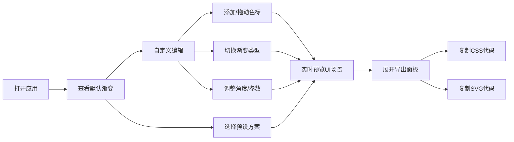

## 1. 产品概述

在线渐变色彩方案设计与实时预览应用，帮助平面设计师和前端开发者在不同设备上直观预览和微调网页或PPT中的渐变色方案。

- 核心用途：通过可视化界面定制渐变色方案，实时预览在多种UI场景下的效果，并导出可用的CSS和SVG代码
- 目标用户：平面设计师、前端开发者、UI设计人员
- 产品价值：解决现有工具难以直观对比不同渐变类型和色标位置效果的痛点，提升渐变设计效率

## 2. 核心功能

### 2.1 用户角色
| 角色 | 注册方式 | 核心权限 |
|------|----------|----------|
| 普通用户 | 无需注册 | 使用所有渐变编辑、预览和导出功能 |

### 2.2 功能模块
1. **渐变编辑器**：色带展示、色标管理（添加/删除/拖动）、颜色拾取器
2. **渐变类型控制**：线性/径向/锥形三种渐变类型切换，相关参数调整（角度、形状、中心点）
3. **实时UI场景预览**：按钮、卡片、迷你页面背景、文字四种预设场景预览
4. **导出面板**：CSS代码和SVG代码生成与一键复制
5. **预设样式管理**：6种预设渐变色方案快速切换

### 2.3 页面详情
| 页面名称 | 模块名称 | 功能描述 |
|----------|----------|----------|
| 主页 | 渐变编辑器 | 色带（600x40px）显示当前渐变色，点击添加色标，拖动调整色标位置，点击色标弹出颜色拾取器 |
| 主页 | 渐变类型控制 | 三种渐变类型按钮组切换，角度滑块（0-360度），径向渐变形状和中心点设置 |
| 主页 | 实时预览区域 | 按钮、卡片、迷你页面、文字四种UI场景实时展示渐变效果 |
| 主页 | 导出面板 | 展示CSS和SVG代码，提供复制按钮及成功动画反馈 |
| 主页 | 预设样式 | 6个预设渐变色方案快速切换（日落橙、海洋蓝、极光绿、晚霞紫、金属银、荧光粉） |

## 3. 核心流程

用户打开应用 → 查看默认渐变效果 → 可选择预设方案或自定义编辑 →
添加/拖动/修改色标 → 切换渐变类型和调整参数 → 实时查看四种UI场景预览 →
满意后展开导出面板 → 复制CSS或SVG代码使用

## 4. 用户界面设计

### 4.1 设计风格
- **主色调**：深色主题，背景色 #0F172A，面板背景 #1E293B
- **强调色**：通过鲜艳的渐变色作为视觉亮点
- **按钮风格**：40px高度，选中时底部2px高亮条，圆角设计
- **字体**：使用现代无衬线字体，等宽字体用于代码展示（12px）
- **布局风格**：左右分栏布局（桌面端），上下布局（移动端），卡片式面板
- **图标风格**：使用 lucide-react 图标库，简洁线性风格

### 4.2 页面设计概述
| 页面名称 | 模块名称 | UI元素 |
|----------|----------|--------|
| 主页 | 左侧编辑器区域 | 固定宽度380px，包含色带、色标列表、类型按钮组、角度滑块、预设色块（40x40px圆角8px） |
| 主页 | 右侧预览区域 | 宽度自适应，四种预览控件垂直排列间距24px，悬浮时上移4px增强阴影 |
| 主页 | 右下角导出面板 | 可折叠（折叠时显示齿轮图标），展开宽300px，代码区背景 #0F172A，水平滚动 |

### 4.3 响应式设计
- 桌面端（≥900px）：左右布局，编辑器固定宽度380px，预览区自适应
- 移动端（<900px）：上下布局，编辑器宽度100%，预览控件改为两列网格布局
- 所有交互元素支持触摸操作，色标拖动适配触摸事件

### 4.4 动画与交互
- 所有交互使用平滑过渡：transition: all 0.2s ease
- 色标拖动时色带实时更新（延迟≤50ms）
- 复制按钮点击反馈：文字变为"已复制"，伴随0.3秒缩放动画
- 预设切换时预览区域100ms内完成更新
- 预览控件悬浮效果：上移4px + 阴影增强
