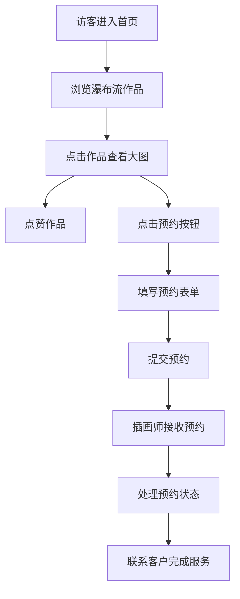

## 1. 产品概述
ArtConnect 是一个为独立插画师和设计师打造的在线作品集展示与客户咨询预约平台，帮助创作者展示作品、与潜在客户建立联系。

- **核心目标**：为插画师提供简洁美观的作品展示空间，为客户提供便捷的浏览和预约咨询渠道
- **目标用户**：独立插画师、设计师（内容创作者），以及需要插画/设计服务的客户（访客）
- **市场价值**：填补垂直领域作品集平台的空白，专注于插画师群体的个性化展示需求

## 2. 核心功能

### 2.1 用户角色
| 角色 | 注册方式 | 核心权限 |
|------|----------|----------|
| 访客 | 无需注册 | 浏览作品、查看画集、点赞作品、提交预约咨询 |
| 插画师 | 登录/注册 | 管理作品、管理画集、查看和处理预约 |

### 2.2 功能模块
1. **首页**：瀑布流作品展示、导航栏、登录/注册入口
2. **画集详情页**：画集信息展示、作品网格列表
3. **大图预览页**：作品详情展示、点赞、预约按钮
4. **管理面板**：作品管理（增删改）、预约管理（状态处理）

### 2.3 页面详情
| 页面名称 | 模块名称 | 功能描述 |
|----------|----------|----------|
| 首页 | 导航栏 | 品牌Logo（带动画画笔图标）、登录/注册按钮、渐变背景 |
| 首页 | 瀑布流作品墙 | 多列瀑布流布局、作品卡片hover效果、标题和点赞数显示 |
| 画集详情页 | 侧边栏 | 画集封面、名称、作品数量统计 |
| 画集详情页 | 作品网格 | 4列网格布局、卡片hover上移动画、标题和点赞数 |
| 大图预览页 | 模态层 | 半透明背景、作品大图淡入效果、作品信息展示 |
| 大图预览页 | 交互区 | 点赞按钮（弹跳动画）、预约按钮（渐变背景）、标签展示 |
| 预约模态框 | 表单区 | 服务类型选择、日期选择器、需求描述、提交动画 |
| 管理面板 | 作品管理 | 作品列表、上传新作品、编辑、删除确认弹窗 |
| 管理面板 | 预约管理 | 预约列表、状态标签、展开详情、状态修改操作 |

## 3. 核心流程

### 3.1 访客浏览流程
访客进入首页 → 瀑布流浏览最新作品 → 点击作品查看大图 → 点赞/预约 → 提交预约表单 → 等待联系

### 3.2 插画师管理流程
插画师登录 → 进入管理面板 → 上传/编辑/删除作品 → 查看预约列表 → 处理预约状态

### 3.3 核心流程图

## 4. 用户界面设计

### 4.1 设计风格
- **主色调**：#F472B6（粉色），辅助色：#FCE7F3（浅粉），文字色：#4A0E3B（深紫褐）
- **配色主题**：粉白渐变，柔美优雅，符合艺术创作平台的气质
- **按钮风格**：圆角设计，粉色渐变背景，悬停阴影加深，点击波纹效果
- **字体**：使用优雅的无衬线字体，标题加粗，正文清晰易读
- **布局风格**：卡片式设计，圆角、阴影、平滑过渡动画
- **图标风格**：使用线性图标，点赞使用红色心形图标

### 4.2 页面设计概述
| 页面名称 | 模块名称 | UI元素 |
|----------|----------|----------|
| 首页 | 导航栏 | 高度60px，渐变背景#F472B6→#EC4899，画笔图标2秒周期摆动动画 |
| 首页 | 瀑布流 | 每列320px，间距20px，卡片圆角12px，hover放大1.05倍+渐变遮罩 |
| 画集详情页 | 侧边栏 | 宽度280px，背景#FFF1F2，封面圆角16px |
| 画集详情页 | 作品网格 | 4列布局，间距16px，卡片高280px，hover上移4px |
| 大图预览 | 模态层 | 背景rgba(0,0,0,0.75)，淡入0.3秒，图片max90vw/80vh |
| 预约模态框 | 表单 | 宽度480px，圆角16px，阴影0 10px 30px rgba(0,0,0,0.15) |
| 管理面板 | 列表 | 状态标签颜色区分，点击展开详情，操作按钮组 |

### 4.3 响应式设计
- **桌面端**（>1024px）：瀑布流多列展示，侧边栏正常显示
- **平板端**（768px-1024px）：瀑布流改为2列，网格布局自适应
- **手机端**（<768px）：瀑布流1列，侧边栏隐藏改为上拉菜单，最小宽度320px
- **触控优化**：按钮最小点击区域44px，hover效果适配为点击反馈

### 4.4 交互动效
- **页面切换**：内容淡入，列表项从下方滑入（0.3秒）
- **图片加载**：淡入效果0.3秒ease-out
- **点赞动画**：scale 0.8→1.2→1.0，0.4秒弹跳效果
- **按钮悬停**：阴影加深，背景色微变
- **提交加载**：旋转动画1秒一圈
- **卡片hover**：上移4px，阴影增加，过渡0.2秒
