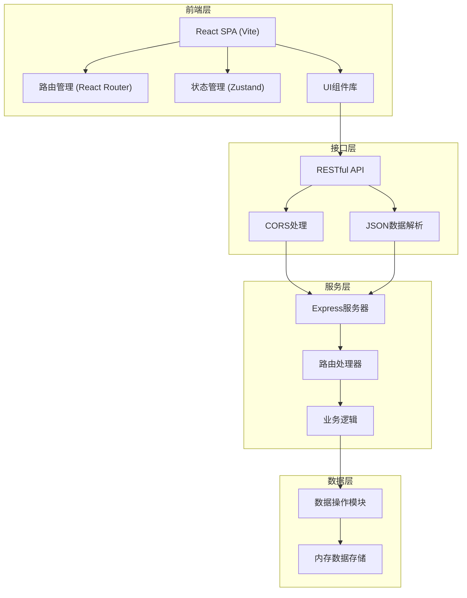
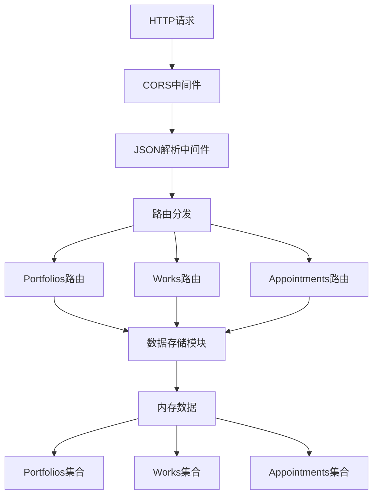
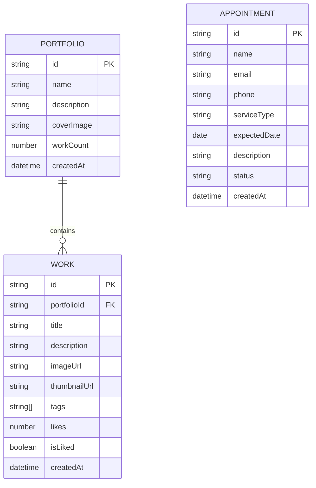

## 1. 架构设计



## 2. 技术描述

- **前端**：React 18 + TypeScript + Vite
  - 路由：React Router DOM
  - 状态管理：Zustand
  - 样式：Tailwind CSS 3
  - HTTP客户端：Fetch API
- **后端**：Express 4 + TypeScript
  - CORS跨域处理
  - 内存数据存储（开发阶段）
- **构建工具**：Vite 5
  - React插件支持
  - 开发服务器代理配置
  - HMR热更新

## 3. 路由定义

| 路由 | 页面组件 | 用途 |
|------|----------|------|
| `/` | HomePage | 首页瀑布流展示所有作品 |
| `/portfolio/:id` | PortfolioPage | 画集详情页，展示特定画集作品 |
| `/work/:id` | WorkDetailPage | 作品大图预览页 |
| `/admin` | AdminPage | 管理面板，作品和预约管理 |
| `/api/portfolios` | - | REST API - 画集CRUD |
| `/api/works` | - | REST API - 作品CRUD |
| `/api/appointments` | - | REST API - 预约CRUD |

## 4. API 定义

### 4.1 类型定义
```typescript
interface Portfolio {
  id: string;
  name: string;
  description: string;
  coverImage: string;
  workCount: number;
  createdAt: string;
}

interface Work {
  id: string;
  portfolioId: string;
  title: string;
  description: string;
  imageUrl: string;
  thumbnailUrl: string;
  tags: string[];
  likes: number;
  isLiked: boolean;
  createdAt: string;
}

interface Appointment {
  id: string;
  name: string;
  email: string;
  phone: string;
  serviceType: 'illustration' | 'commercial' | 'other';
  expectedDate: string;
  description: string;
  status: 'pending' | 'contacted' | 'completed';
  createdAt: string;
}
```

### 4.2 API 接口

| 方法 | 路径 | 请求体 | 响应 | 用途 |
|------|------|--------|------|------|
| GET | `/api/portfolios` | - | Portfolio[] | 获取所有画集 |
| GET | `/api/portfolios/:id` | - | Portfolio | 获取单个画集 |
| GET | `/api/works` | - | Work[] | 获取所有作品 |
| GET | `/api/works?portfolioId=:id` | - | Work[] | 获取指定画集的作品 |
| GET | `/api/works/:id` | - | Work | 获取单个作品 |
| POST | `/api/works` | Partial<Work> | Work | 上传新作品 |
| PUT | `/api/works/:id` | Partial<Work> | Work | 更新作品信息 |
| DELETE | `/api/works/:id` | - | {success: boolean} | 删除作品 |
| POST | `/api/works/:id/like` | - | {likes: number, isLiked: boolean} | 点赞/取消点赞 |
| GET | `/api/appointments` | - | Appointment[] | 获取所有预约 |
| POST | `/api/appointments` | Partial<Appointment> | Appointment | 创建预约 |
| PUT | `/api/appointments/:id` | {status: string} | Appointment | 更新预约状态 |

## 5. 服务器架构



## 6. 数据模型

### 6.1 ER图



### 6.2 初始数据

系统启动时将加载示例数据，包括：
- 3个画集：人物插画、风景水彩、商业海报
- 每个画集包含3-5张示例作品
- 2-3条示例预约记录
- 使用占位图片URL（picsum.photos）
