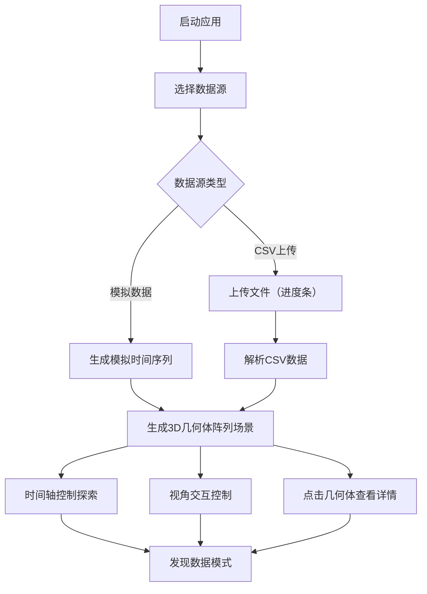

## 1. 产品概述

交互式3D数据雕塑应用，将抽象的时间序列数据（股票价格、传感器读数等）映射为可交互的三维几何形态并实时演变，解决传统二维图表难以直观展示数据随时间变化的空间形态和多维特征的问题。

- 面向数据分析师、科研人员和可视化爱好者，提供沉浸式数据探索体验
- 通过空间化展示和交互控制，帮助用户发现数据中的隐藏模式和趋势

## 2. 核心功能

### 2.1 功能模块

1. **数据加载模块**：内置模拟数据源生成、CSV文件上传（含进度条）、数据解析
2. **3D场景渲染模块**：几何体阵列生成、网格平面、光照系统、相机控制
3. **时间控制模块**：时间轴拖拽、数据平滑过渡动画、时间戳显示
4. **交互模块**：视角旋转缩放、预设视角切换、几何体点击选中、详情弹窗
5. **UI界面模块**：顶部导航栏、底部时间轴控件、玻璃态样式组件

### 2.2 功能详情

| 模块名称 | 子功能 | 功能描述 |
|-----------|-------------|---------------------|
| 数据加载 | 模拟数据生成 | 自动生成包含时间、数值、类别三列的模拟时间序列数据 |
| 数据加载 | CSV上传 | 支持用户上传CSV文件，上传过程显示进度条动画 |
| 3D渲染 | 几何体阵列 | 根据数据点生成数百个彩色立方体/球体，高度映射数值，颜色映射类别 |
| 3D渲染 | 网格平面 | 半透明网格平面承载几何体，网格线具有微弱呼吸光效 |
| 3D渲染 | 漂浮动画 | 几何体在数据未变化时有微弱上下漂浮动画（振幅0.02，周期2秒） |
| 时间控制 | 时间轴 | 滑块或拖拽控件控制时间进度，拖动时几何体高度平滑过渡（0.3秒，缓出曲线） |
| 时间控制 | 时间戳标签 | 场景边缘显示当前时间戳，标签字体有发光描边效果 |
| 视角控制 | 自由交互 | 鼠标拖拽旋转视角，滚轮缩放 |
| 视角控制 | 预设视角 | 三个预设视角按钮（俯视45度、正面、侧面），相机平滑移动（1秒，缓入缓出） |
| 视角控制 | 指引光带 | 视角切换时短暂显示从相机原点到目标点的动态指引光带 |
| 交互 | 选中高亮 | 点击几何体放大1.2倍高亮显示 |
| 交互 | 详情弹窗 | 显示时间、数值、类别、排名，毛玻璃背景，径向渐变入场动画 |
| 交互 | 弹窗关闭 | 点击空白处或关闭按钮，弹窗以模糊淡出方式消失 |
| UI | 导航栏 | 顶部包含Logo、数据源切换按钮、预设视角按钮 |
| UI | 时间轴 | 底部时间轴控件 |
| UI | 玻璃态样式 | 所有控件采用半透明毛玻璃背景、柔和投影 |

## 3. 核心流程

用户打开应用 → 选择数据源（模拟/CSV上传）→ 数据加载完成生成3D场景 → 通过时间轴探索数据演变 → 旋转/缩放/切换视角观察空间形态 → 点击几何体查看详细数据

## 4. 用户界面设计

### 4.1 设计风格
- **主色调**：深空蓝 #0B0D17
- **高亮色**：霓虹蓝 #2AF5FF、亮紫 #A855F7
- **整体风格**：科技感沉浸氛围，深空背景配合霓虹发光效果
- **控件样式**：玻璃态（毛玻璃半透明背景、柔和投影、发光边框）
- **按钮风格**：圆角玻璃按钮，hover时有霓虹发光效果
- **字体**：现代无衬线字体，数字使用等宽字体增强科技感

### 4.2 页面设计

| 页面 | 模块 | UI元素 |
|-----------|-------------|-------------|
| 主界面 | 顶部导航栏 | Logo（发光文字）、数据源切换下拉、三个预设视角按钮 |
| 主界面 | 3D场景 | 深空背景、半透明网格平面、彩色几何体阵列、时间戳标签 |
| 主界面 | 底部控制栏 | 时间轴滑块、播放/暂停按钮、时间进度显示 |
| 主界面 | 详情弹窗 | 毛玻璃背景卡片、径向渐变遮罩、数据信息展示 |
| 主界面 | 上传进度条 | 居中显示，霓虹蓝发光进度动画 |

### 4.3 响应式设计
- 桌面端优先设计
- 控件位置根据分辨率自适应调整
- 时间轴和导航栏在小屏幕上重新布局
- 触摸设备支持手势旋转和缩放

### 4.4 3D场景设计
- **环境**：纯深空背景，无HDRI，突出几何体发光效果
- **光照**：环境光 + 点光源组合，营造柔和立体感，几何体自发光材质增强视觉
- **相机**：PerspectiveCamera，初始俯视45度视角
- **后处理**：Bloom发光效果、轻微色差增强科技感
- **性能优化**：数据点>500时自动启用LOD降低远处几何体面数
