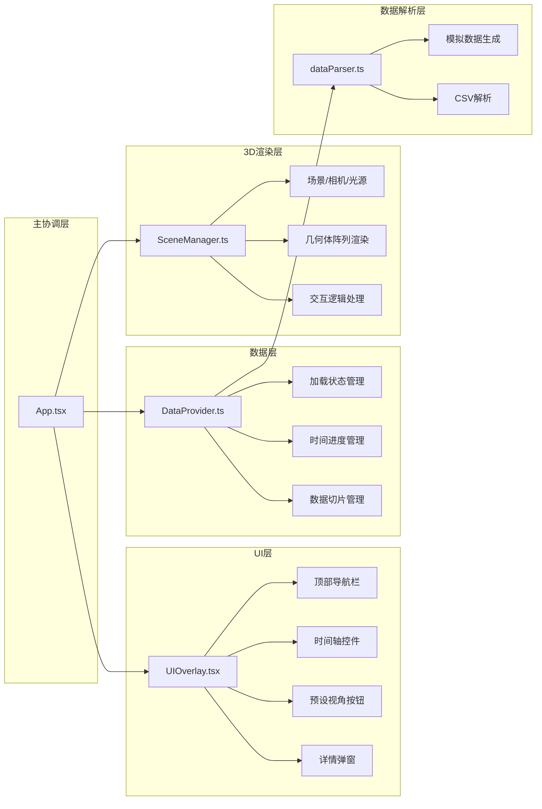

## 1. 架构设计



## 2. 技术栈说明

- **前端框架**：React@18 + TypeScript
- **构建工具**：Vite@5 + @vitejs/plugin-react
- **3D渲染**：three@0.160 + @react-three/fiber@8 + @react-three/drei@9
- **数据解析**：papaparse@5
- **状态管理**：React Hooks（useState、useRef、useCallback）
- **样式方案**：内联样式 + CSS变量，玻璃态效果

## 3. 项目结构

```
auto19/
├── package.json              # 依赖配置
├── vite.config.ts            # Vite构建配置（路径别名@指向src）
├── tsconfig.json             # TypeScript配置（严格模式）
├── index.html                # 入口页面
└── src/
    ├── types.ts              # 类型定义（DataPoint、VisualConfig等）
    ├── dataParser.ts         # 数据解析模块
    ├── DataProvider.ts       # 数据状态管理模块
    ├── SceneManager.ts       # 3D场景渲染模块
    ├── UIOverlay.tsx         # UI组件模块
    └── App.tsx               # 主应用组件
```

## 4. 核心数据模型

### 4.1 类型定义

```typescript
// 数据点类型
interface DataPoint {
  time: string;      // 时间戳
  value: number;     // 数值
  category: string;  // 类别
  index: number;     // 索引位置
}

// 视觉配置
interface VisualConfig {
  baseHeight: number;       // 基础高度
  heightScale: number;      // 高度缩放系数
  gridSize: number;         // 网格大小
  geometryType: 'box' | 'sphere';
}

// 预设视角
interface CameraPreset {
  name: string;
  position: [number, number, number];
  target: [number, number, number];
}

// 选中数据点详情
interface SelectedDataDetail {
  point: DataPoint;
  rank: number;
  position: { x: number; y: number };
}
```

## 5. 模块职责与调用关系

### 5.1 types.ts
- 定义所有共享类型接口
- 被所有其他模块引用

### 5.2 dataParser.ts
- `generateMockData(count: number, categories: string[]): DataPoint[]` - 生成模拟数据
- `parseCSV(content: string): DataPoint[]` - 解析CSV数据
- 被 DataProvider.ts 调用

### 5.3 DataProvider.ts
- 管理数据加载状态（loading/error/loaded）
- 管理时间进度和当前数据切片
- 提供数据加载、时间控制的方法和状态
- 被 App.tsx 调用，内部调用 dataParser.ts

### 5.4 SceneManager.ts
- 创建Three.js场景、相机、光源
- 渲染几何体阵列（支持LOD）
- 处理点击交互和视角切换动画
- 被 App.tsx 调用，接收 DataProvider 的数据切片

### 5.5 UIOverlay.tsx
- 渲染顶部导航栏（Logo、数据源切换）
- 渲染底部时间轴滑块控件
- 渲染预设视角按钮
- 渲染几何体详情弹窗
- 渲染上传进度条
- 被 App.tsx 调用，通过props接收数据和回调

### 5.6 App.tsx
- 整合所有模块
- 协调数据流和事件传递
- 管理全局状态

## 6. 性能优化方案

1. **LOD细节层次**：数据点>500时自动启用，远处几何体使用低面数模型
2. **requestAnimationFrame驱动**：所有动画使用RAF确保流畅
3. **几何体实例化**：使用InstancedMesh渲染大量重复几何体
4. **材质复用**：相同类别的几何体共享材质实例
5. **帧速率控制**：目标30fps以上，交互操作时优先响应
