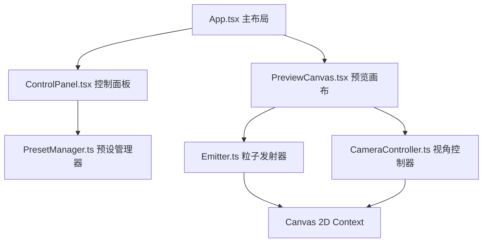

## 1. 架构设计



## 2. 技术描述

- **前端**：React 18 + TypeScript + Vite
- **渲染**：Canvas 2D API
- **状态管理**：React useState/useEffect（轻量级）
- **存储**：localStorage（预设持久化）
- **构建工具**：Vite
- **包管理器**：npm

## 3. 文件结构

```
src/
├── main.tsx              # 应用入口
├── App.tsx               # 主布局组件
├── components/
│   ├── ControlPanel.tsx  # 参数控制面板
│   └── PreviewCanvas.tsx # 预览画布组件
└── engine/
    ├── Emitter.ts        # 粒子发射器类
    ├── PresetManager.ts  # 预设管理器类
    └── CameraController.ts # 视角控制器类
```

## 4. 核心模块设计

### 4.1 Emitter 粒子发射器
- **职责**：维护粒子池，执行发射、物理更新、渲染
- **数据流向**：接收参数对象 → 每帧 update(dt) + render(ctx)
- **粒子属性**：位置、速度、生命周期、大小、颜色
- **物理模拟**：速度、重力、生命周期衰减
- **渲染**：Canvas 2D 径向渐变粒子

### 4.2 PresetManager 预设管理器
- **职责**：localStorage 存储，CRUD 操作，JSON 导出
- **方法**：save(name, params), load(name), list(), delete(name), exportJSON()
- **数据结构**：{ name: string, params: ParticleParams, createdAt: number }

### 4.3 CameraController 视角控制器
- **职责**：绑定 canvas 事件，维护旋转角度和缩放
- **事件**：mousedown, mousemove, mouseup, wheel
- **约束**：Y轴 0-360度，X轴 -30到60度，缩放 0.5-3倍
- **输出**：视图变换参数供渲染使用

### 4.4 参数接口定义
```typescript
interface ParticleParams {
  emissionRate: number;    // 发射速率 10-200
  lifetime: number;        // 粒子寿命 0.5-4s
  speed: number;           // 粒子速度 50-300
  size: number;            // 粒子大小 2-20px
  spreadAngle: number;     // 扩散角度 5-60度
  gravity: number;         // 重力影响 -200到200
}
```

## 5. 性能指标

- 滑块拖动时帧率 ≥ 55 FPS
- 粒子峰值（发射速率200，寿命4秒）≤ 1200个
- 峰值时预览画布帧率 ≥ 30 FPS
- 使用 requestAnimationFrame 驱动渲染循环
- 粒子对象池复用，避免频繁 GC

## 6. 交互流程

1. 组件挂载 → 初始化 Emitter、CameraController、PresetManager
2. 滑块变化 → 更新参数 → Emitter 实时响应
3. 鼠标拖拽 → CameraController 更新视角 → 渲染时应用变换
4. 保存预设 → PresetManager 写入 localStorage → 列表刷新
5. 加载预设 → 参数平滑过渡（0.5s） → 预览更新
6. 导出配置 → 生成 JSON → 复制到剪贴板 → 显示提示
