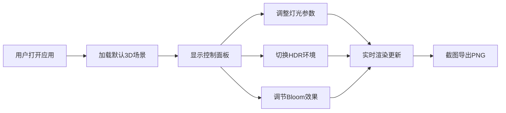

## 1. 产品概述

3D场景灯光可视化编辑器 - 面向游戏关卡设计师的专业工具，用于快速评估不同灯光方案对场景氛围的影响，实现灯光参数与材质反射效果的实时预览。

- 解决传统灯光调整工具无法实时呈现材质反射和阴影视觉效果的痛点
- 目标用户：游戏关卡设计师、3D美术师、灯光设计师
- 市场价值：提升灯光设计效率，缩短场景迭代周期

## 2. 核心功能

### 2.1 用户角色
| 角色 | 注册方式 | 核心权限 |
|------|----------|----------|
| 设计师用户 | 无需注册，直接使用 | 完整使用所有灯光编辑和预览功能 |

### 2.2 功能模块
1. **3D场景画布**：标准测试场景渲染，包含球体、立方体、环面结和地面网格
2. **灯光管理面板**：添加/删除/调整聚光灯、点光源、平行光
3. **环境设置模块**：环境光强度调节、HDR环境贴图切换
4. **材质参数控制**：粗糙度/金属度实时调整
5. **Bloom后处理**：泛光效果开关与强度调节
6. **高清截图工具**：一键导出1500x1500 PNG

### 2.3 页面详情
| 页面名称 | 模块名称 | 功能描述 |
|----------|----------|----------|
| 主编辑页 | 3D场景画布 | 实时渲染测试场景，支持OrbitControls相机控制，阴影实时计算 |
| 主编辑页 | 灯光卡片列表 | 卡片形式展示已添加光源，支持展开/折叠查看详细参数 |
| 主编辑页 | 添加光源按钮 | 下拉选择聚光灯/点光源/平行光类型并添加到场景 |
| 主编辑页 | 光源参数面板 | 颜色拾取、强度滑块、位置/方向/锥角/衰减等专属参数 |
| 主编辑页 | 环境设置区 | HDR贴图下拉选择（studio/sunset/forest/night）、环境光强度滑块 |
| 主编辑页 | 后处理控制 | Bloom开关及强度调节（0-1步长0.05） |
| 主编辑页 | 截图按钮 | 相机图标，点击导出1500x1500高清PNG |

## 3. 核心流程

用户打开应用 → 默认场景加载（含3个测试物体+地面+默认光源）→ 通过控制面板添加/删除/调整光源参数 → 实时预览场景反射和阴影变化 → 切换HDR环境贴图观察氛围变化 → 开启Bloom增强视觉效果 → 满意后点击截图导出PNG。

## 4. 用户界面设计

### 4.1 设计风格
- **主色调**：深灰背景#1F2937（场景区），浅灰背景#F9FAFB（面板区）
- **强调色**：#6366F1（按钮、滑块手柄），#4B5563（功能按钮）
- **按钮风格**：圆角设计，hover有缩放和阴影微交互
- **字体**：微软雅黑，标题14px加粗#374151
- **布局风格**：左右两栏（桌面），抽屉式面板（移动端）
- **图标风格**：简洁几何图标（锥形/球体/斜线代表光源类型）

### 4.2 页面设计概述
| 页面名称 | 模块名称 | UI元素 |
|----------|----------|--------|
| 主编辑页 | 3D场景画布 | 深灰背景#1F2937，占75%宽度，OrbitControls交互 |
| 主编辑页 | 控制面板 | 浅灰背景#F9FAFB，左侧边框#E5E7EB，元素间距16px，占25%宽度 |
| 主编辑页 | 光源卡片 | 圆角8px，白底，阴影0 1px 3px rgba(0,0,0,0.1)，可展开/折叠 |
| 主编辑页 | 滑块组件 | 轨道高6px圆角3px#D1D5DB，圆形滑块16px#6366F1，hover#4F46E5 |
| 主编辑页 | 添加光源按钮 | 圆角#6366F1白底字，hover放大1.05倍+阴影 |
| 主编辑页 | 删除按钮 | 红色X，hover深红，带确认提示遮罩 |
| 主编辑页 | 截图按钮 | 相机图标#4B5563，hover#6B7280，按下缩放0.95 |
| 主编辑页 | 汉堡菜单 | 三条横线白色图标，<900px显示，切换抽屉面板 |

### 4.3 响应式设计
- **桌面端（≥900px）**：左右两栏布局，场景75% / 面板25%
- **移动端（<900px）**：场景占100%，面板从右侧滑入抽屉（0.3秒ease-out动画）
- **触控优化**：滑块和按钮增大触控区域，支持手势旋转场景

### 4.4 3D场景指南
- **环境/HDRI**：4种预设（studio工作室、sunset日落、forest森林、night夜景），切换带0.5秒透明度渐变
- **灯光设置**：聚光灯（锥角、目标点）、点光源（衰减距离）、平行光（方向向量），所有光源投射阴影
- **相机设置**：PerspectiveCamera，OrbitControls支持旋转/缩放/平移
- **构图焦点**：三个测试物体在网格上均匀分布（X轴-2、0、+2位置），Y轴坐落于地面之上
- **交互动画**：光源参数变化即时响应，HDR切换0.5秒线性过渡，Bloom强度平滑过渡
- **后处理**：Bloom效果（泛光），可调节强度0-1
- **资源与性能**：纯程序化几何体无需外部模型，维持50FPS+（i5-12400/GTX1660配置下4光源+Bloom+阴影）
