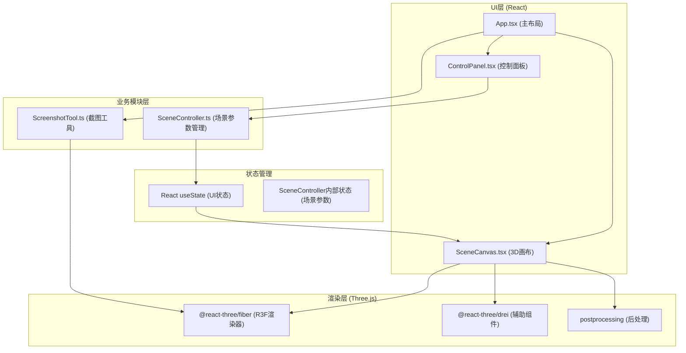

## 1. 架构设计



**数据流向说明：**
1. 用户通过ControlPanel交互 → 调用SceneController方法 → 更新React state
2. State变化触发SceneCanvas重新渲染 → R3F更新Three.js场景
3. App组件触发截图 → ScreenshotTool调用Canvas渲染器 → 导出Blob下载

## 2. 技术栈说明

- **前端框架**：React 18 + TypeScript
- **3D渲染引擎**：three.js
- **React-Three.js桥接**：@react-three/fiber, @react-three/drei
- **后处理**：postprocessing
- **构建工具**：Vite
- **状态管理**：React useState + 自定义Controller类（轻量级场景参数管理）
- **无后端**：纯前端应用，无需服务器

## 3. 项目文件结构

```
d:\Pro\tasks\auto192\
├── package.json
├── index.html
├── tsconfig.json
├── vite.config.js
└── src/
    ├── main.tsx              # React入口
    ├── App.tsx               # 主组件（布局+状态）
    ├── modules/
    │   ├── SceneController.ts   # 场景参数管理模块
    │   └── ScreenshotTool.ts    # 截图导出模块
    └── components/
        ├── ControlPanel.tsx     # 控制面板UI
        └── SceneCanvas.tsx      # 3D场景画布
```

## 4. 核心数据模型

### 4.1 光源类型定义
```typescript
type LightType = 'spot' | 'point' | 'directional';

interface BaseLight {
  id: string;
  type: LightType;
  color: string;
  intensity: number;
  position: { x: number; y: number; z: number };
}

interface SpotLight extends BaseLight {
  type: 'spot';
  target: { x: number; y: number; z: number };
  angle: number; // 锥角度数 10-90
}

interface PointLight extends BaseLight {
  type: 'point';
  distance: number; // 衰减距离 1-20
}

interface DirectionalLight extends BaseLight {
  type: 'directional';
  direction: { x: number; y: number; z: number };
}

type SceneLight = SpotLight | PointLight | DirectionalLight;
```

### 4.2 环境配置
```typescript
interface EnvConfig {
  ambientIntensity: number; // 0-5
  hdrPreset: 'studio' | 'sunset' | 'forest' | 'night';
  bloomEnabled: boolean;
  bloomIntensity: number; // 0-1
}
```

### 4.3 场景状态
```typescript
interface SceneState {
  lights: SceneLight[];
  env: EnvConfig;
}
```

## 5. 模块接口定义

### 5.1 SceneController
```typescript
class SceneController {
  constructor(initialState?: Partial<SceneState>);
  getState(): SceneState;
  subscribe(callback: (state: SceneState) => void): () => void;
  addLight(type: LightType): SceneLight;
  updateLight(id: string, patch: Partial<SceneLight>): void;
  removeLight(id: string): void;
  updateEnv(patch: Partial<EnvConfig>): void;
}
```

### 5.2 ScreenshotTool
```typescript
interface CaptureOptions {
  width?: number;  // 默认1500
  height?: number; // 默认1500
  filename?: string;
}

class ScreenshotTool {
  static capture(gl: THREE.WebGLRenderer, scene: THREE.Scene, camera: THREE.Camera, options?: CaptureOptions): Promise<void>;
}
```

## 6. 性能优化策略

1. **阴影优化**：使用PCFSoftShadowMap，shadowMapSize限制在1024x1024
2. **光源数量控制**：建议用户不超过4-5个光源同时投射阴影
3. **后处理性能**：Bloom使用低分辨率pass（1/2像素比）
4. **状态更新防抖**：滑块拖动使用requestAnimationFrame合并更新
5. **HDR纹理**：使用压缩纹理格式，预加载4种预设
6. **几何体复用**：测试物体使用BufferGeometry，不重复创建
