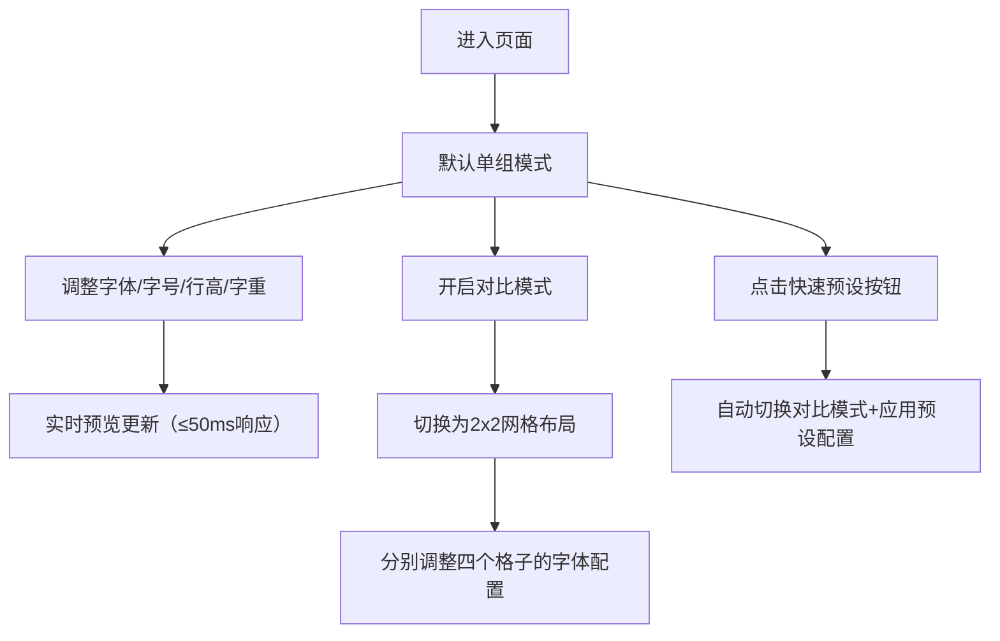

## 1. 产品概述
在线字体排版预览与对比工具，帮助设计师快速浏览不同字体在不同字号和行高下的排版效果，支持同时对比最多四个字体组合的标题、正文和引用三段文本的渲染差异。
- 主要用途：字体选型、排版效果预览、多字体横向对比
- 目标用户：UI设计师、前端开发者、排版编辑
- 产品价值：提升字体选型效率，直观对比字体差异，减少设计迭代成本

## 2. 核心功能

### 2.2 功能模块
1. **字体参数控制面板**：字体选择、字号调节、行高调节、字重选择、对比模式开关、快速预设按钮
2. **排版预览区**：单组模式预览（标题+正文+引用）、对比模式预览（2x2网格四组对比）
3. **预设配置系统**：四套字体组合预设（Serif组合、Sans-Serif组合、混搭组合、系统默认）

### 2.3 页面详情
| 页面名称 | 模块名称 | 功能描述 |
|-----------|-------------|---------------------|
| 首页 | 字体参数控制面板 | 左侧320px宽度面板，包含字体下拉菜单（6种系统字体）、字号滑块（12-72px，步长2）、行高滑块（1.0-2.0，步长0.1）、字重选择、对比模式开关、快速预设按钮组 |
| 首页 | 单组预览模式 | 从上到下显示标题（h1，#1F2937）、正文段落（p，#4B5563，最多三行自动换行）、引用块（blockquote，左侧4px#3B82F6竖线，斜体） |
| 首页 | 对比预览模式 | 2x2网格布局，每个格子左上角显示字体名称标签（白字半透明黑底圆角），四种字体配置同时展示，淡入动画0.3秒 |
| 首页 | 快速预设功能 | 四个预设按钮，点击自动填充四格字体配置并切换到对比模式，按钮有0.1秒scale 0.95按下动效 |

## 3. 核心流程
用户打开工具后，默认显示单组预览模式。可通过左侧面板调整字体参数实时预览效果；开启对比模式后切换到2x2网格对比视图；点击快速预设按钮可一键应用预设的字体组合方案。

## 4. 用户界面设计

### 4.1 设计风格
- 主色调：#1F2937（深灰）、#F9FAFB（浅灰背景）
- 点缀色：#3B82F6（蓝色，用于活跃元素）
- 卡片阴影：0 1px 3px rgba(0,0,0,0.1)
- 面板圆角：12px
- 滑块样式：轨道#E5E7EB，圆形按钮#3B82F6
- 整体风格：极简主义，留白充足，层次清晰

### 4.2 页面设计概述
| 页面名称 | 模块名称 | UI元素 |
|-----------|-------------|-------------|
| 首页 | 控制面板 | 320px固定宽度，#F9FAFB背景，12px圆角，细微阴影，内部垂直排布控件 |
| 首页 | 预览区 | 白色背景，自适应剩余宽度，三段文本垂直居中排布 |
| 首页 | 对比网格 | 2行2列等宽等高网格，格子间16px间距，每个格子独立显示三段文本 |
| 首页 | 字体标签 | 格子左上角绝对定位，半透明黑底，白色文字，圆角，内边距 |

### 4.3 响应性
- Desktop-first设计，桌面端左右分栏布局
- 文本区域自适应容器宽度，自动换行
- 字号和行高变化采用CSS transition平滑过渡（0.2秒）
- 模式切换采用opacity淡入动画（0.3秒）
