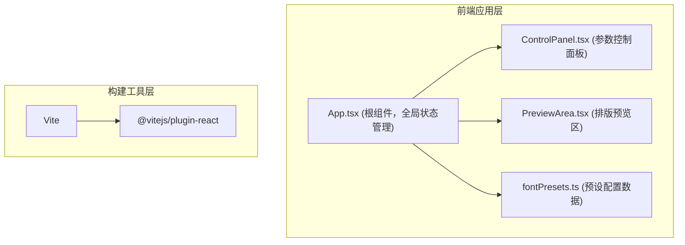

## 1. 架构设计
纯前端React应用，采用组件化分层设计，状态提升至App根组件统一管理。



## 2. 技术描述
- 前端：React 18 + TypeScript（严格模式）
- 构建工具：Vite 5 + @vitejs/plugin-react
- 样式方案：内联CSS + CSS变量，不引入额外UI框架以保持轻量化
- 状态管理：React useState Hook，状态提升至App组件
- 依赖包：react, react-dom, typescript, vite, @vitejs/plugin-react

## 3. 文件结构说明
| 文件 | 职责 |
|------|------|
| package.json | 项目依赖与脚本配置 |
| index.html | 入口HTML页面，挂载root容器 |
| tsconfig.json | TypeScript严格模式配置 |
| vite.config.js | Vite构建配置，启用React插件 |
| src/App.tsx | 主应用组件，左右布局组合，持有全局字体参数状态 |
| src/ControlPanel.tsx | 参数控制面板组件，渲染滑块和选择器，触发回调 |
| src/PreviewArea.tsx | 排版预览区组件，支持单组/对比两种模式 |
| src/fontPresets.ts | 预设配置数据模块，导出4个预设组合 |

## 4. 类型定义

### FontConfig 类型
```typescript
interface FontConfig {
  fontFamily: string;
  fontSize: number;
  lineHeight: number;
  fontWeight: 'normal' | 'bold';
}
```

### 预置系统字体列表
- Arial
- Georgia
- Helvetica
- Times New Roman
- Courier New
- Verdana

### 预设组合
1. Serif组合：Georgia / Times New Roman / Garamond(降级到Georgia) / Cambria(降级到Georgia)
2. Sans-Serif组合：Arial / Helvetica / Verdana / Tahoma(降级到Arial)
3. 混搭组合：Helvetica标题 + Georgia正文 + Arial引用 + Courier New代码
4. 系统默认：全部使用系统默认字体栈
