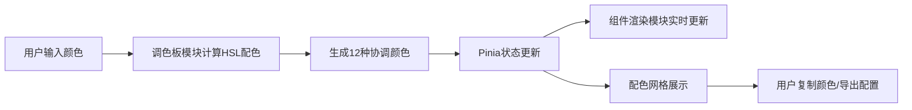

## 1. 产品概述

品牌色智能调色板与组件预览应用，帮助前端开发者和设计师快速从品牌主色生成完整的协调配色方案，并实时预览在常见UI组件上的效果。

- 目标用户：前端开发者、UI设计师、产品经理
- 核心价值：将设计师提供的品牌色快速转化为可直接使用的完整配色方案和组件样式

## 2. 核心特性

### 2.1 功能模块

1. **颜色输入区**：支持颜色选择器、HEX/RGB输入，最多5个颜色，支持拖拽排序
2. **配色方案生成**：基于HSL自动生成12种协调颜色（浅色、深色、柔和色、对比色、邻近色等）
3. **组件预览区**：实时预览按钮、卡片、输入框、导航栏、标签页五种UI组件
4. **复制功能**：单个颜色复制、CSS变量批量复制、Tailwind色标导出

### 2.2 页面详情

| 页面名称 | 模块名称 | 功能描述 |
|---------|---------|----------|
| 主应用 | 颜色输入区 | 颜色选择器、文本输入、色块预览、拖拽排序、增删颜色 |
| 主应用 | 配色网格 | 12色网格展示、色块悬停显示色值、标注用途、单色块复制 |
| 主应用 | 组件预览 | 按钮、卡片、输入框、导航栏、标签页实时渲染，带0.3s过渡动画 |
| 主应用 | 导出功能 | 复制CSS变量按钮、导出Tailwind色标弹窗、Toast提示 |

## 3. 核心流程

用户输入品牌颜色 → 系统计算生成12种协调配色 → 配色实时应用到UI组件预览 → 用户复制单个颜色或批量导出CSS/Tailwind配置

## 4. 用户界面设计

### 4.1 设计风格
- **主题**：深色专业主题
- **主背景**：#1A1B2E，面板背景：#25273D，边框：#3C3F5E，文字：#E2E8F0
- **布局**：左右两栏布局，左栏380px固定宽度带垂直滚动，右栏弹性宽度
- **字体**：Inter字体，简洁无装饰
- **动效**：所有交互0.3s ease过渡，色块悬停放大1.05倍，复制成功绿色Toast

### 4.2 页面设计概览

| 模块名称 | UI元素 |
|---------|--------|
| 颜色输入区 | 颜色选择器+文本输入框组合、20x20px预览色块、拖拽手柄、添加/删除按钮 |
| 配色网格 | 每行4个色块，80x80px圆角8px，1px半透明边框，悬停放大显示tooltip |
| 组件预览 | 五个组件纵向排列间隔24px，每个组件上方14px标签文字#94A3B8，导航栏和标签页全宽 |
| Toast提示 | 固定顶部居中，绿色背景，3s自动消失 |

### 4.3 响应式
桌面端优先，保证在1280px及以上宽度完美展示，支持窗口缩放自适应。
