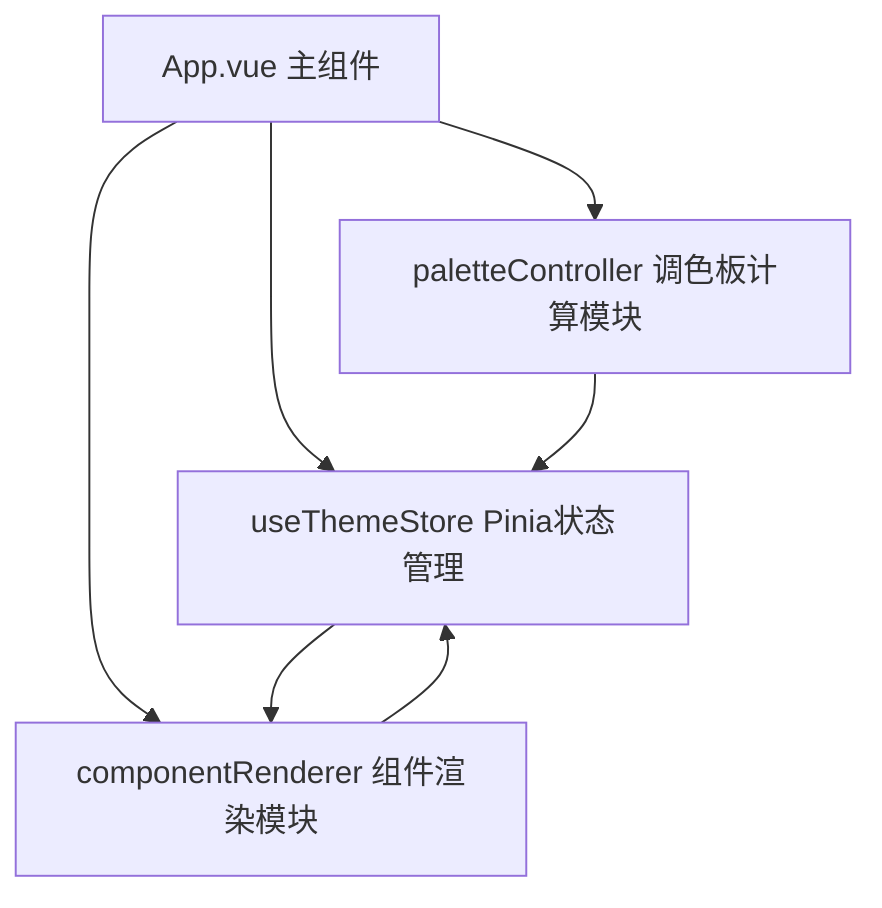

## 1. 架构设计



## 2. 技术说明
- **前端框架**：Vue 3 + TypeScript + Vite
- **状态管理**：Pinia
- **工具库**：chroma-js（颜色计算）、lodash（工具函数）
- **样式**：原生CSS变量 + scoped样式

## 3. 文件结构与职责

```
src/
├── App.vue                          # 主组件，左右两栏布局，数据流转中枢
├── palette/
│   └── paletteController.ts         # 调色板计算模块，HSL配色生成算法
├── renderer/
│   └── componentRenderer.vue        # 组件渲染模块，UI组件预览
└── store/
    └── useThemeStore.ts             # Pinia状态管理
```

### 数据流向
1. App.vue 接收用户颜色输入 → 写入 useThemeStore
2. paletteController.ts 从 store 读取颜色 → 计算12色调色板 → 写回 store
3. componentRenderer.vue 从 store 读取配色方案 → 实时渲染UI组件

## 4. 核心数据类型

```typescript
interface ColorItem {
  id: string
  hex: string
  name?: string
}

interface GeneratedPalette {
  primaryLight: string
  primary: string
  primaryDark: string
  primarySoft: string
  secondaryLight: string
  secondary: string
  secondaryDark: string
  secondarySoft: string
  accentLight: string
  accent: string
  accentDark: string
  contrast: string
}

interface TailwindShade {
  50: string
  100: string
  200: string
  300: string
  400: string
  500: string
  600: string
  700: string
  800: string
  900: string
}
```

## 5. 性能约束
- 颜色调整到组件重新渲染延迟 ≤ 50ms
- 复制操作完成并显示Toast ≤ 200ms
