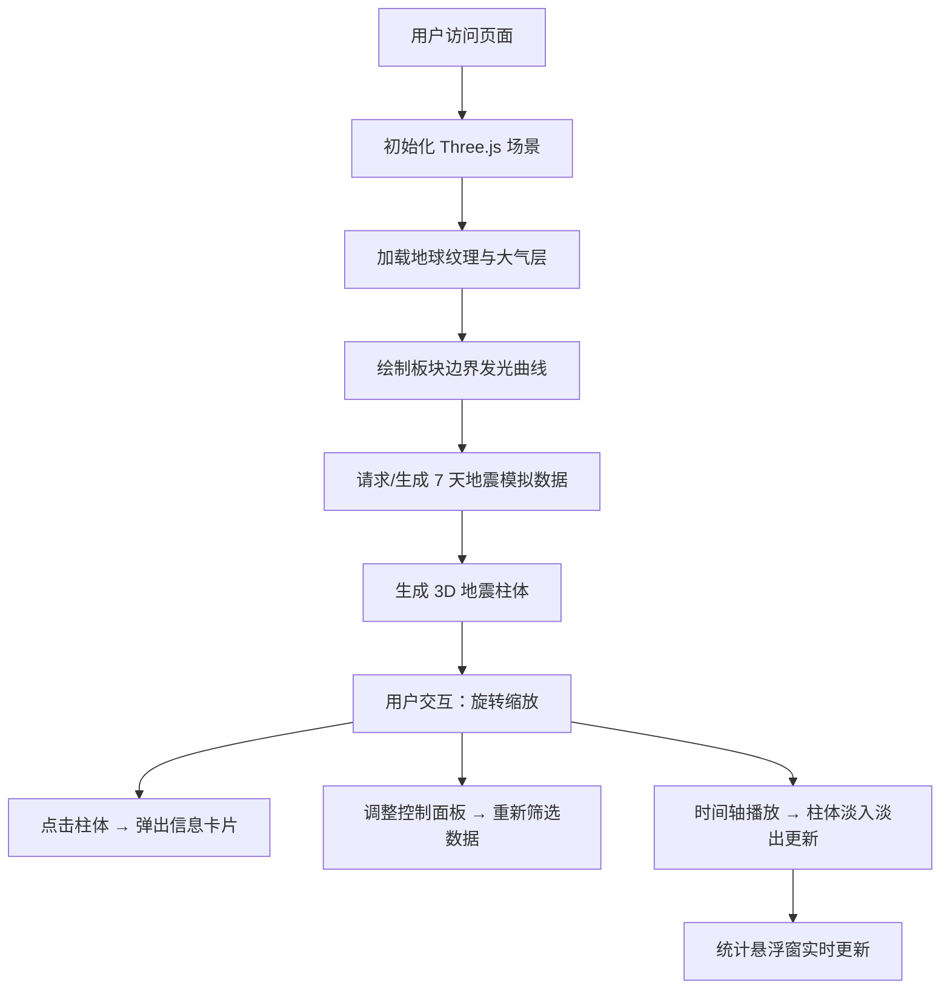

## 1. 产品概述

全球地震事件三维可视化探索器，基于 Three.js 构建交互式地球仪，直观展示实时地震震源深度与板块俯冲带的空间关系，支持历史地震序列回溯。

- 面向地质研究者、教育工作者与科普爱好者，解决传统二维地图难以呈现震源深度分布的问题
- 提供沉浸式的深空风格 3D 交互体验，将地震数据与板块构造以艺术化方式呈现

## 2. 核心功能

### 2.1 功能模块

1. **3D 地球场景**：高精度地球模型 + 大气层效果 + 板块边界发光曲线 + 地震柱体标记
2. **视角交互**：鼠标拖拽旋转、滚轮缩放、点击拾取地震柱体
3. **控制面板**：时间筛选、震级筛选、板块边界显示开关，可自由拖拽
4. **时间轴播放**：日期刻度、滑块选择、自动播放地震时间序列
5. **统计悬浮窗**：实时显示事件总数、最大震级、震级分布饼图

### 2.2 页面详情

| 页面名称 | 模块名称 | 功能描述 |
|-----------|-------------|---------------------|
| 主界面 | 3D 地球场景 | 8K 纹理地球、蓝色大气层、#FF6B35 发光板块边界线、3D 地震柱体 |
| 主界面 | 信息卡片 | 点击地震柱体后弹出毛玻璃卡片，显示震级/时间/深度/最近城市 |
| 主界面 | 控制面板 | 三折叠区域：时间筛选（7/30天/全部）、震级双滑块、板块边界开关，可拖拽移动 |
| 主界面 | 时间轴 | 60px 高度渐变背景、7 天刻度、播放/暂停、自动播放动画 |
| 主界面 | 统计窗 | 事件总数、最大震级（24px #FF3366）、Canvas 饼图（4-5绿/5-6黄/6-7橙/7+红） |

## 3. 核心流程

用户进入页面 → 加载 3D 地球与模拟地震数据 → 鼠标拖拽旋转/缩放浏览 → 点击地震柱体查看详情 → 调整控制面板筛选条件 → 拖动时间轴或播放查看时间序列演变 → 右下角统计实时更新。

## 4. 用户界面设计

### 4.1 设计风格

- **色彩体系**：深空蓝主题，主背景 `#0A0A23`，面板 `#1A1A2E`，强调色 `#E94560` / `#FF6B35`，文字 `#E0E0E0`
- **视觉效果**：毛玻璃 backdrop-filter、发光边框 box-shadow 0 0 15px rgba(233,69,96,0.3)
- **按钮交互**：hover 时 0.2s 过渡 + translateY(-2px) 位移
- **字体**：使用 Space Grotesk 类科技感字体（自定义字体），数字使用等宽字体
- **板块边界**：`#FF6B35` 半透明发光曲线
- **地震柱体**：低震级 `#00FFAA` → 高震级 `#FF0055` 渐变，顶端闪烁频率随震级加快

### 4.2 页面设计概览

| 组件 | 位置 | UI 元素 |
|-----------|-------------|-------------|
| 3D 地球 | 全屏居中 | 球体 + 8K 纹理 + 蓝色大气层（半径 1.02×，透明度 0.25） |
| 控制面板 | 左侧 300px（可拖拽） | 圆角 16px、2px #E94560 边框、三折叠区域、标签按钮、双滑块 |
| 信息卡片 | 柱体上方跟随 | 毛玻璃 blur(16px)、边缘发光与柱体同色、震级/时间/深度/城市 |
| 时间轴 | 底部 100% × 60px | 渐变 #16213E → #0F3460、日刻度、18px 圆形滑块、播放按钮 |
| 统计悬浮窗 | 右下角 | 圆角 12px、rgba(22,33,62,0.85) 背景、12px 内边距、Canvas 饼图 |

### 4.3 响应式

- **1440px** 桌面：控制面板左侧固定 300px，可自由拖拽
- **768px** 平板/移动：面板折叠为底部抽屉式，时间轴高度缩减，统计窗位置自适应
- 所有交互元素支持触摸操作

### 4.4 3D 场景指导

- **环境**：纯黑深空背景，无额外 HDRI，营造宇宙感
- **光照**：AmbientLight + 一个 DirectionalLight（太阳方向）制造明暗对比
- **相机**：PerspectiveCamera，OrbitControls 启用阻尼，缩放距离 1000km - 10000km
- **大气效果**：外层半透明球体 + Fresnel 边缘发光，独立慢于地球自转
- **后处理**：柱体与板块边界使用 Bloom 发光效果
- **资源**：使用在线 8K 地球纹理（Unsplash / Pixabay CDN），地震数据前端模拟
- **性能**：BufferGeometry + 合并几何体，requestAnimationFrame 增量更新，目标 60FPS
