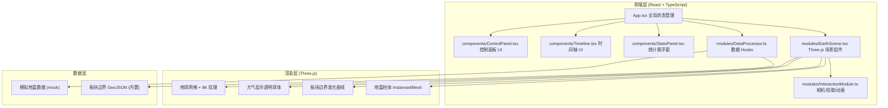

## 1. 架构设计



## 2. 技术描述

- **前端框架**：React 18 + TypeScript 5 + Vite 5
- **3D 引擎**：three.js 0.160 + @react-three/fiber 8 + @react-three/drei 9
- **初始化工具**：vite-init (react-ts 模板)
- **状态管理**：React useState/useReducer（组件内部）+ props 向下传递
- **样式方案**：CSS-in-JS 内联样式（style 属性），确保毛玻璃与发光边框效果
- **数据**：前端模拟 USGS 地震数据，内置板块边界坐标数组

## 3. 目录结构

```
src/
├── App.tsx                        # 主组件，组合所有模块
├── modules/
│   ├── EarthScene.tsx             # Three.js 场景（地球/大气/板块/柱体）
│   ├── InteractionModule.ts       # OrbitControls / Raycaster / 动画循环
│   └── DataProcessor.ts           # useEarthquakeData / useFilteredData Hooks
├── components/
│   ├── ControlPanel.tsx           # 左侧可拖拽控制面板
│   ├── Timeline.tsx               # 底部时间轴播放条
│   ├── StatsPanel.tsx             # 右下角统计悬浮窗
│   └── EarthquakeCard.tsx         # 地震信息弹出卡片
├── data/
│   ├── plateBoundaries.ts         # 板块边界坐标数据
│   └── mockEarthquakes.ts         # 模拟地震数据生成器
├── types/
│   └── index.ts                   # TypeScript 类型定义
└── utils/
    └── colorUtils.ts              # 震级到颜色/闪烁频率转换
```

## 4. 类型定义

```typescript
interface EarthquakeEvent {
  id: string;
  magnitude: number;      // 0-10
  latitude: number;       // -90 ~ 90
  longitude: number;      // -180 ~ 180
  depth: number;          // km
  time: number;           // timestamp ms
  nearestCity: string;
}

interface FilterParams {
  timeRange: '7d' | '30d' | 'all';
  magnitudeMin: number;   // 0-10 step 0.5
  magnitudeMax: number;
  showPlateBoundaries: boolean;
}

interface PlateBoundary {
  name: string;
  coordinates: [number, number][]; // [lon, lat]
}
```

## 5. 核心数据流向

1. `App.tsx` 调用 `useEarthquakeData()` 获取全部模拟地震数组
2. 用户在 `ControlPanel` 操作 → 更新 FilterParams → `useFilteredData()` 计算可见地震
3. `Timeline` 选择日期 → App 过滤当日数据 → 传给 `EarthScene`
4. `EarthScene` 接收 filteredData → 更新 InstancedMesh 矩阵与材质颜色
5. `InteractionModule` 的 Raycaster 捕获点击 → 返回 userData → App 控制 `EarthquakeCard` 显示
6. `StatsPanel` 订阅 filteredData → 实时计算总数/最大震级/饼图分布

## 6. 性能优化策略

| 优化点 | 方案 |
|--------|------|
| 柱体渲染 | 使用 `InstancedMesh` 合并所有地震柱体为一个 Draw Call |
| 几何体 | `CylinderBufferGeometry`（底面 0.02，顶面 0.01，高度段 1） |
| 更新策略 | 数据变化时只更新 `instanceMatrix` 和 `instanceColor`，不重建 Mesh |
| 闪烁动画 | `requestAnimationFrame` 统一更新所有柱体的材质 uniform |
| 大气层旋转 | 独立于地球，每帧按 0.0002 rad 增量旋转 |
| 响应式 | `window.resize` 监听，更新相机 aspect 与 renderer size |
