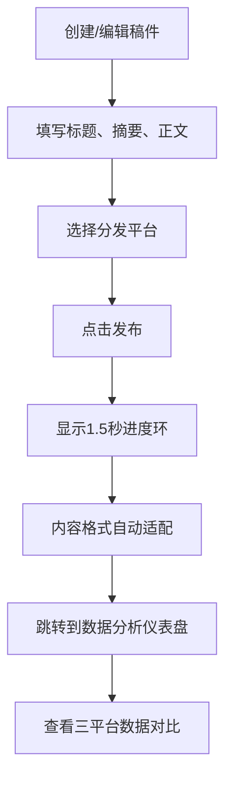

## 1. 产品概述
面向个人博客、独立播客等小型内容创作者的多平台内容一键分发与数据分析工具，解决跨平台内容发布繁琐、数据分散统计困难的痛点。
- 目标用户：个人内容创作者、独立博主、播客主播
- 核心价值：一次创作多平台适配分发，统一数据仪表盘洞察各平台表现

## 2. 核心功能

### 2.1 用户角色
| 角色 | 注册方式 | 核心权限 |
|------|----------|----------|
| 内容创作者 | 无需注册（本地模拟） | 创建稿件、一键分发多平台、查看数据分析仪表盘 |

### 2.2 功能模块
1. **内容管理器**：双栏布局，左栏草稿列表，右栏Markdown编辑器
2. **平台分发引擎**：根据平台类型自动适配内容格式
3. **数据分析仪表盘**：三平台数据对比，小时级更新折线图

### 2.3 页面详情
| 页面名称 | 模块名称 | 功能描述 |
|----------|----------|----------|
| 内容管理器 | 草稿列表 | 显示标题、最后修改日期、状态，#F9FAFB背景，悬停左侧5px蓝色#3B82F6指示条 |
| 内容管理器 | Markdown编辑器 | textarea富文本编辑，顶部工具条（加粗、斜体、标题、列表、图片），#E5E7EB背景，圆角8px，按钮点击0.1秒缩小回弹动画 |
| 发布模态框 | 进度加载 | 1.5秒加载动画，渐变进度环#3B82F6到#8B5CF6 |
| 数据分析仪表盘 | 数据卡片 | 三个平台总阅读/点赞/评论数，200px×120px卡片，底部渐变色块（博客蓝#3B82F6，Newsletter紫#8B5CF6，社交媒体粉#EC4899） |
| 数据分析仪表盘 | 折线图表 | 三图并排380px×240px，白底浅灰#E5E7EB网格，数据点圆点标记，hover阴影tooltip |

## 3. 核心流程

用户在内容管理器创建或编辑稿件 → 填写标题、摘要、Markdown正文 → 勾选分发平台 → 点击发布按钮 → 显示1.5秒加载动画 → 自动跳转仪表盘 → 查看三平台数据对比折线图

## 4. 用户界面设计

### 4.1 设计风格
- 主色调：蓝色#3B82F6（博客）、紫色#8B5CF6（Newsletter）、粉色#EC4899（社交媒体）
- 中性色：背景#F9FAFB、工具条#E5E7EB、网格线#E5E7EB
- 按钮风格：圆角矩形，点击transform: scale(0.95) 0.1秒回弹动画
- 字体：采用现代无衬线字体，标题加粗，正文清晰可读
- 布局风格：卡片式布局，双栏编辑器，三栏数据图表
- 动画风格：微交互流畅自然，进度环旋转1.5秒一周

### 4.2 页面设计概述
| 页面名称 | 模块名称 | UI元素 |
|----------|----------|--------|
| 内容管理器 | 双栏布局 | 左栏30%宽度草稿列表，右栏70%宽度编辑器，顶部导航栏切换路由 |
| 内容管理器 | 编辑器工具条 | #E5E7EB背景，圆角8px，按钮横向排列，点击动画反馈 |
| 发布模态框 | 进度环 | 中心旋转圆环，渐变#3B82F6→#8B5CF6，1.5秒/周 |
| 仪表盘 | 数据卡片 | 200px×120px，大号数字，底部半透明渐变色块，hover轻微上浮 |
| 仪表盘 | 折线图 | 380px×240px，白色画布，浅灰网格，圆点数据点，阴影tooltip |

### 4.3 响应式
- 桌面端优先设计，适配1280px以上屏幕
- 编辑器双栏布局在小屏幕转为上下堆叠
- 图表三栏布局在平板转为两栏，移动端单栏堆叠

### 4.4 性能要求
- 200个数据点折线图保持60fps渲染
- Markdown编辑器输入延迟≤50ms
- 页面切换动画流畅无卡顿
